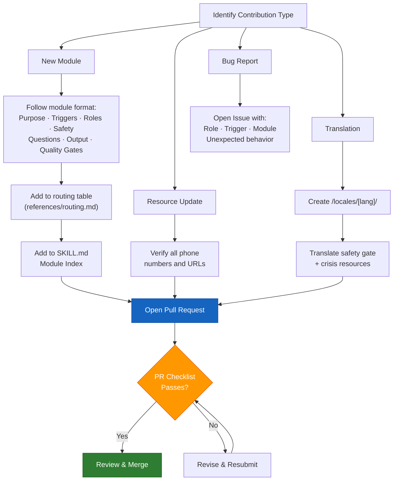

# Contributing to Access To Peace

Thank you for your interest in contributing. Access To Peace is an open-source civic
technology project. All contributions must preserve the platform's core values:
trauma-informed, conflict-neutral, and person-centered.

---

## Core Standards for All Contributions

### Tone & Voice
- **Trauma-informed:** Language must be calm, non-shaming, and non-blaming.
- **Conflict-neutral:** No advocacy content. No side-taking. No political positioning.
- **Person-centered:** User's dignity and autonomy are primary.
- **Plain language:** Write for a 6th-grade reading level in user-facing content.

### What We Will Not Accept
- Content that takes sides in a conflict
- Content that could be used to harass, stalk, or harm another person
- Content that fabricates legal statutes, case citations, or clinical standards
- Content that contradicts safety gate protocols
- Inflammatory, accusatory, or shame-based language

---

## How to Contribute

### Module Contributions
- Each module lives in `modules/MOD-XX-name.md`
- Follow the format: Purpose, Triggers, Roles, Safety Level, Question Set, Output Format, Quality Gates, Disclaimer
- All new modules must be added to the routing table in `references/routing.md`
- All new modules must be added to `SKILL.md` Module Index

### Resource Updates (crisis-resources.md)
- Verify all phone numbers and URLs before submitting
- Include date verified in PR description
- State-specific resources should note the state clearly

### Translation / Localization
- Translations go in `/locales/[language-code]/`
- Safety gate text and crisis resources must be translated accurately
- Crisis line numbers must be updated to the appropriate country/region

### Bug Reports
- Open an issue with: role, trigger, module, and the unexpected behavior
- Include the artifact output if relevant (redact any PII first)

---

## Pull Request Checklist

- [ ] All new content passes neutrality check (no accusatory language)
- [ ] Trauma-informed principles followed (see `references/trauma-informed.md`)
- [ ] Safety gate logic preserved or improved — never weakened
- [ ] Crisis resources preserved in all safety-level outputs
- [ ] Educational disclaimer blocks present where required
- [ ] No fabricated legal or clinical references
- [ ] Module index and routing table updated if new module added

---

## License
By contributing, you agree that your contributions will be licensed under the MIT License.

---

## Contact
Doug DeVitre · dougdevitre@gmail.com · cotrackpro.com
