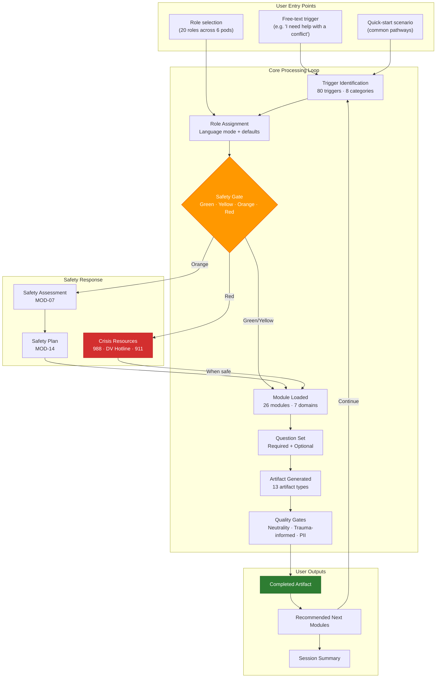
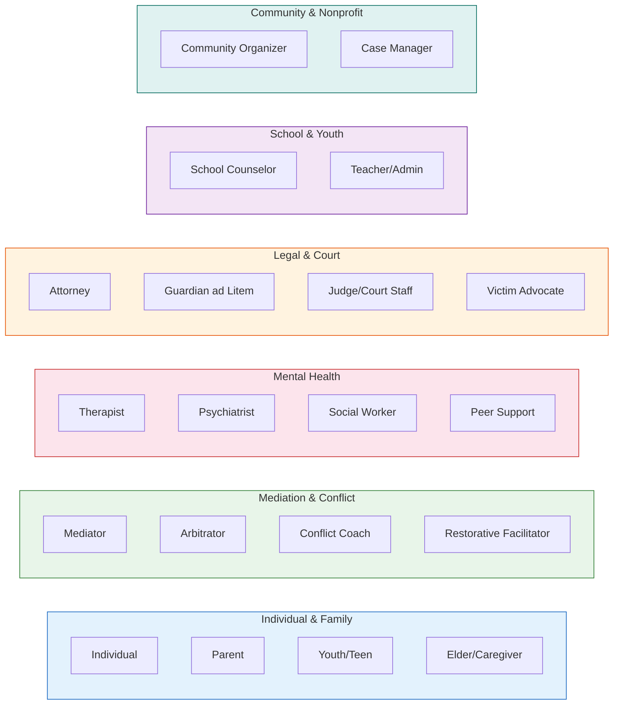
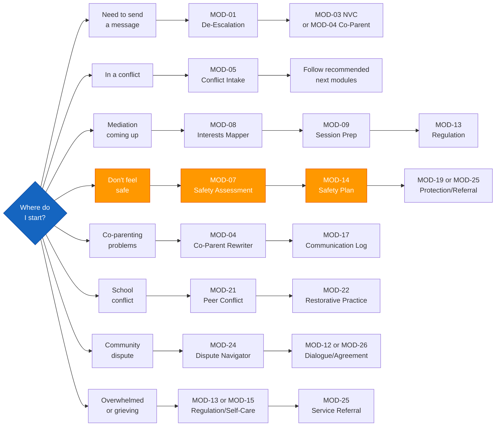

# Access To Peace

> A trauma-informed, open-source platform for conflict resolution, mediation, mental wellness,
> co-parenting de-escalation, restorative practices, and community peace-building.

[](LICENSE)
[](https://dougdevitre.github.io/access-projects)
[]()

---

## Platform Architecture



---

## What Is Access To Peace?

Access To Peace is one pillar of the [Access To](https://dougdevitre.github.io/access-projects)
civic technology initiative — a family of open-source platforms designed to democratize access
to essential services across justice, education, housing, health, and safety.

**Access To Peace** specifically addresses the gap between conflict and resolution. It serves
individuals, families, clinicians, mediators, attorneys, courts, schools, and community
organizations who need structured, trauma-informed tools for navigating conflict — without
requiring expensive professional services at every step.

---

## Core Principles

- **Trauma-informed first.** Every interaction assumes the user may be in or near crisis.
- **Conflict-neutral.** Artifacts document facts. The platform does not take sides.
- **Role-aware.** Language, depth, and outputs adjust automatically by role.
- **Safety always first.** A safety gate runs on every session. Crisis resources are always one step away.
- **Educational framing.** Legal and clinical content is for informational purposes only.
- **Open source.** Free to use, fork, and deploy. Reference implementation targets Missouri.

---

## Who This Serves



| Pod | Roles |
|-----|-------|
| Individual & Family | Individuals, Parents (co-parenting), Youth/Teens, Elders/Caregivers |
| Mediation & Conflict | Mediators, Arbitrators, Conflict Coaches, Restorative Practices Facilitators |
| Mental Health | Therapists, Psychiatrists, Social Workers, Peer Support Specialists |
| Legal & Court | Family Law Attorneys, GALs, Judges/Court Staff, Victim Advocates |
| School & Youth | School Counselors, Teachers/Administrators |
| Community & Nonprofit | Community Organizers, Nonprofit Case Managers |

---

## Platform Modules (26)

### Communication & De-escalation
- De-Escalation Message Rewriter
- Active Listening Guide
- Nonviolent Communication (NVC) Framework
- Co-Parenting Communication Rewriter

### Conflict Assessment
- Conflict Intake & Triage
- Conflict History Timeline
- Power & Safety Assessment
- Interests vs. Positions Mapper

### Mediation & Resolution
- Mediation Session Prep
- Peace Agreement Builder
- Restorative Circle Prep
- Community Dialogue Facilitator

### Mental Wellness & Regulation
- Emotional Regulation Plan
- Safety Plan Builder
- Trauma-Informed Self-Care Plan
- Grief & Loss Navigation

### Legal & Court Support
- Parenting Plan Communication Log
- Court Preparation Checklist
- Protective Order Navigation *(educational only)*
- Case Documentation Summary

### School & Youth
- Peer Conflict Resolution Guide
- School Restorative Practice Template
- Youth Emotional Check-In

### Community & Systems
- Neighborhood Dispute Navigator
- Service Referral Builder
- Community Peace Agreement

---

## Repo Structure

```
access-to-peace/
├── SKILL.md                    # Claude skill root — triggers, roles, routing, quick-start scenarios
├── README.md                   # This file
├── LICENSE
├── CONTRIBUTING.md
├── references/                 # Core reference materials
│   ├── routing.md              # Trigger → module → artifact routing table
│   ├── roles.md                # 20 role definitions, language modes, defaults
│   ├── triggers.md             # 80-trigger catalog with safety levels
│   ├── artifacts.md            # 13 artifact definitions and quality gates
│   ├── nvc-framework.md        # Nonviolent Communication language patterns
│   ├── trauma-informed.md      # Trauma-informed principles and language guide
│   ├── legal-disclaimer.md     # 8 standard disclaimer blocks by context
│   └── crisis-resources.md     # Crisis lines and local service finders
├── modules/                    # 26 modules — each with triggers, questions, output, pathways, examples
│   ├── MOD-01-deescalation-rewriter.md
│   ├── MOD-02-active-listening.md
│   ├── MOD-03-nvc-framework.md
│   ├── MOD-04-coparenting-rewriter.md
│   ├── MOD-05-conflict-intake.md
│   ├── MOD-06-conflict-timeline.md
│   ├── MOD-07-power-safety-assessment.md
│   ├── MOD-08-interests-positions.md
│   ├── MOD-09-mediation-session-prep.md
│   ├── MOD-10-peace-agreement-builder.md
│   ├── MOD-11-restorative-circle-prep.md
│   ├── MOD-12-community-dialogue.md
│   ├── MOD-13-emotional-regulation.md
│   ├── MOD-14-safety-plan-builder.md
│   ├── MOD-15-self-care-plan.md
│   ├── MOD-16-grief-loss-navigation.md
│   ├── MOD-17-parenting-plan-log.md
│   ├── MOD-18-court-prep-checklist.md
│   ├── MOD-19-protective-order-nav.md
│   ├── MOD-20-case-documentation.md
│   ├── MOD-21-peer-conflict-guide.md
│   ├── MOD-22-school-restorative.md
│   ├── MOD-23-youth-checkin.md
│   ├── MOD-24-neighborhood-dispute.md
│   ├── MOD-25-service-referral.md
│   └── MOD-26-community-peace-agreement.md
├── workflows/                  # End-to-end workflow guides
│   ├── all-workflows.md
│   └── individual-conflict-nav.md
├── templates/                  # Fillable artifact templates
│   ├── all-templates.md
│   └── peace-agreement.md
├── checklists/                 # Pre-built checklists for key workflows
│   └── all-checklists.md
├── schemas/                    # Data schemas for structured outputs
│   ├── data-schemas.md         # JSON + CSV schemas
│   └── airtable-schema.md      # Airtable base design for case tracking
├── artifacts/                  # Dashboard and tracker concepts
│   └── peace-dashboard.md
└── routines/                   # Recurring workflow patterns
    └── all-routines.md
```

---

## Quick Start

### As a Claude Skill
1. Copy `SKILL.md`, `references/`, and `modules/` to your Claude skill directory.
2. Add the skill description to your Claude Code `CLAUDE.md` or skill registry.
3. Trigger with any conflict, mediation, peace, or de-escalation request.

### As a Standalone Tool
1. Clone this repo.
2. Open `SKILL.md` and paste into any Claude conversation as a system prompt.
3. Start with: *"I need help with a conflict"* or identify your role directly.

### Reference Implementation
Missouri is the reference deployment. Roles, statutes referenced (educational only),
and service resources are calibrated for Missouri — but all modules are state-agnostic
by default. Fork and localize `references/crisis-resources.md` for your region.

---

## Common Pathways



Not sure where to start? Here are the most common user journeys:

| Situation | Start With | Then |
|-----------|-----------|------|
| Need to send a message without escalating | MOD-01 De-Escalation Rewriter | MOD-03 NVC or MOD-04 Co-Parenting |
| In a conflict, don't know what to do | MOD-05 Conflict Intake | Follow recommended next modules |
| Mediation coming up | MOD-08 Interests Mapper → MOD-09 Session Prep | MOD-13 Emotional Regulation |
| Don't feel safe | MOD-07 Safety Assessment | MOD-14 Safety Plan → MOD-19 or MOD-25 |
| Co-parenting communication problems | MOD-04 Co-Parenting Rewriter | MOD-17 Communication Log |
| School conflict with students | MOD-21 Peer Conflict Guide | MOD-22 Restorative Practice |
| Community/neighborhood dispute | MOD-24 Dispute Navigator | MOD-12 Dialogue or MOD-26 Agreement |
| Overwhelmed, burned out, grieving | MOD-13 Regulation or MOD-15 Self-Care | MOD-25 Service Referral |

Every module includes **Recommended Next Modules** so users are always guided to the next step.

---

## Safety & Disclaimers

Access To Peace is a **documentation and support tool only**.

- It is **not** a substitute for emergency services. If anyone is in immediate danger, call 911.
- It is **not** legal advice. Consult a licensed attorney for legal guidance.
- It is **not** clinical care. Consult a licensed mental health professional for diagnosis or treatment.
- Crisis resources are embedded throughout and always accessible regardless of current module.

**Crisis lines:**
- **988** — Suicide & Crisis Lifeline (call or text)
- **1-800-799-7233** — National Domestic Violence Hotline
- **Text HOME to 741741** — Crisis Text Line

---

## Contributing

See [CONTRIBUTING.md](CONTRIBUTING.md). All contributions must maintain the platform's
trauma-informed, conflict-neutral voice. No advocacy content. No side-taking.

---

## License

MIT License. See [LICENSE](LICENSE).

---

## Part of the Access To Initiative

| Platform | Focus |
|----------|-------|
| [access-to-justice](https://github.com/dougdevitre/access-to-justice) | Legal navigation |
| [access-to-education](https://github.com/dougdevitre/access-to-education) | K-12 support |
| [access-to-housing](https://github.com/dougdevitre/access-to-housing) | Housing & Fair Housing |
| [access-to-health](https://github.com/dougdevitre/access-to-health) | Public health |
| [access-to-safety](https://github.com/dougdevitre/access-to-safety) | Community safety |
| [access-to-services](https://github.com/dougdevitre/access-to-services) | Social services |
| [access-to-jobs](https://github.com/dougdevitre/access-to-jobs) | Workforce |
| [access-to-business](https://github.com/dougdevitre/access-to-business) | Small business |
| **access-to-peace** | Conflict resolution & peace |

---

*Built with care by [Doug DeVitre](https://linkedin.com/in/dougdevitre) · [CoTrackPro](https://cotrackpro.com) · St. Louis, MO*
