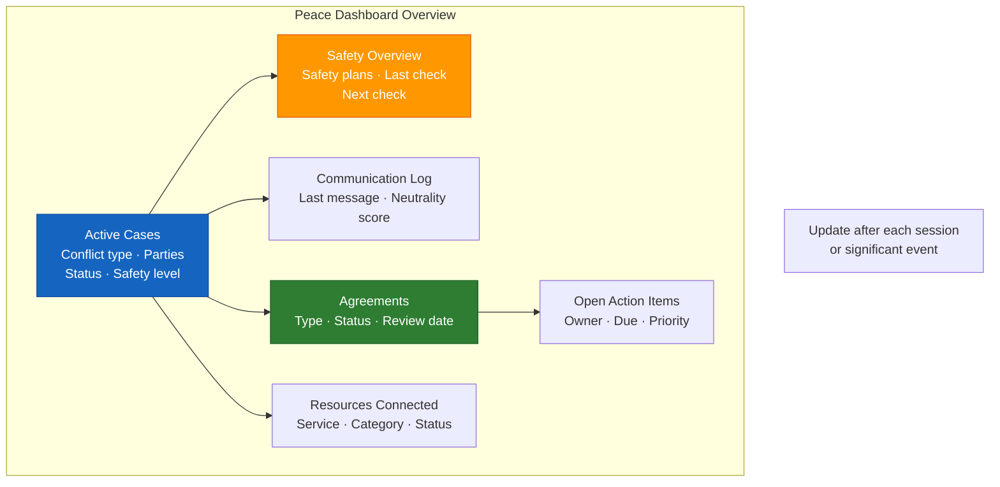
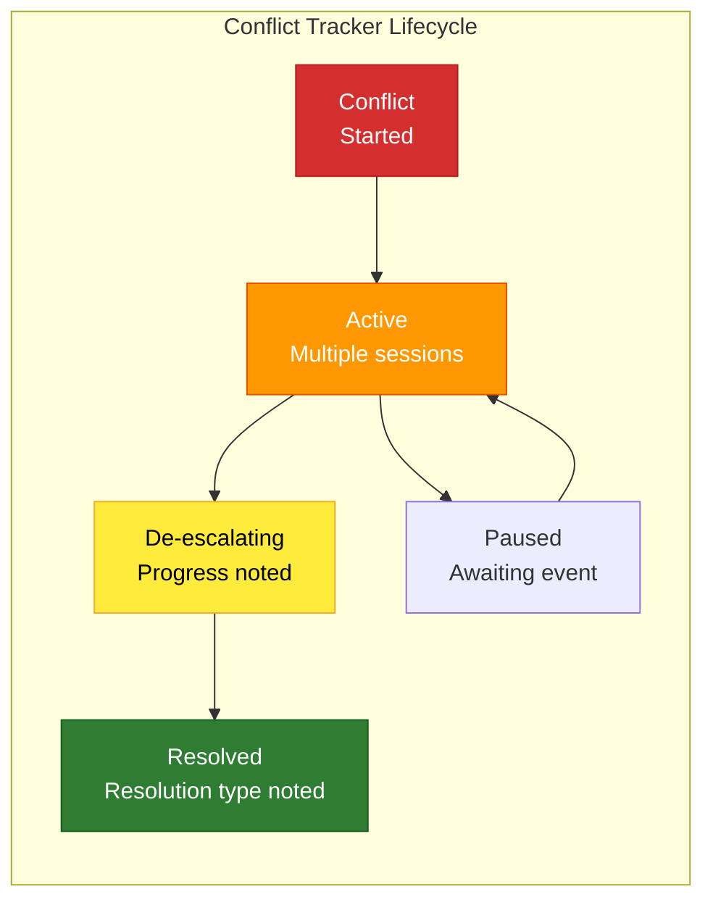

# Peace Dashboard
## Master Status Board — Access To Peace

*Produced by: any session. Updated by: user or facilitator.*

---

## Active Cases / Situations

| ID | Conflict Type | Parties | Status | Last Activity | Safety Level | Next Step |
|----|--------------|---------|--------|--------------|-------------|-----------|
| [001] | [type] | [A / B] | [Active / Resolved / Paused] | [date] | [Green/Yellow/Orange] | [module or action] |

---

## Safety Overview

| Case ID | Safety Level | Safety Plan? | Last Safety Check | Next Check |
|---------|-------------|-------------|------------------|-----------|
| | | | | |

---

## Communication Log Summary

| Case ID | Last Message | Sent By | Response Received | Neutrality Score |
|---------|-------------|---------|------------------|-----------------|
| | | | | |

---

## Agreements

| Case ID | Agreement Type | Date | Status | Review Date |
|---------|--------------|------|--------|------------|
| | | | | |

---

## Open Action Items

| Action | Owner | Due | Priority |
|--------|-------|-----|---------|
| | | | |

---

## Resources Connected

| Case ID | Service / Organization | Category | Referral Date | Status |
|---------|----------------------|---------|--------------|--------|
| | | | | |

---

*Dashboard is a working document. Update after each session or significant event.*

---
---

# Conflict Tracker
## Ongoing Conflict Monitoring Tool

*Use this to track an ongoing conflict over time across multiple sessions.*

---

## Conflict Overview

**Conflict ID:** _______________
**Conflict type:** _______________
**Parties:** [Party A] / [Party B] / [Others]
**Start date (approximate):** _______________
**Current status:** Active / De-escalating / Resolved / Paused

---

## Session Log

| Date | Module Used | Artifact Produced | Key Outcome | Safety Level | Next Step |
|------|------------|------------------|-------------|-------------|-----------|
| | | | | | |

---

## Pattern Tracker

**Escalation trend:** ↑ Escalating / → Stable / ↓ De-escalating

**Communication quality over time:**
| Period | Neutrality Score (avg) | Notable Events |
|--------|----------------------|---------------|
| | | |

**Safety level history:**
| Date | Level | Trigger |
|------|-------|---------|
| | | |

---

## Agreements Reached

| Date | Agreement Type | Status | Review Date |
|------|--------------|--------|------------|
| | | | |

---

## Resolution Notes

**Resolved on:** _______________
**Resolution type:** Mediated agreement / Peace agreement / Court order / Informal / Ongoing
**Key factors in resolution:** _______________
**Lessons noted:** _______________
