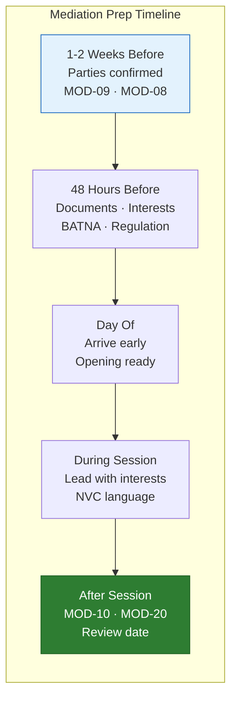
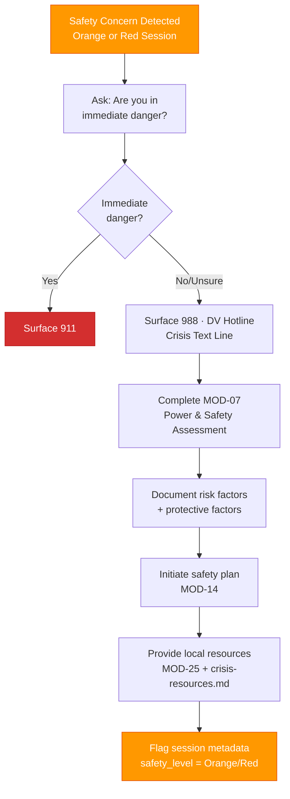
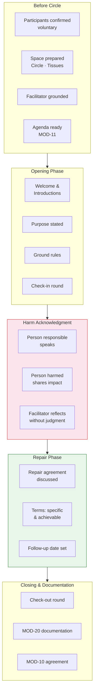
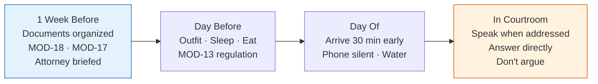
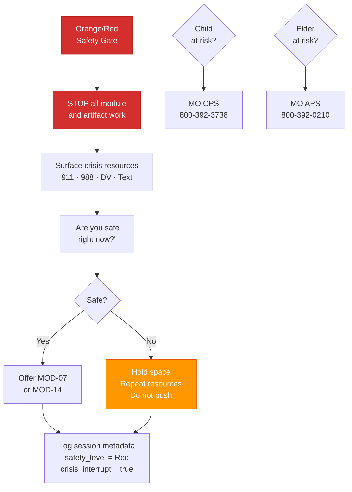

# Mediation Prep Checklist
## Use: Before any mediation session (MED, ARB, ATT, IND)

### 1–2 Weeks Before
- [ ] Both parties confirmed and voluntary
- [ ] Mediator confirmed and neutral
- [ ] Location / platform confirmed (in-person / video)
- [ ] Ground rules drafted
- [ ] MOD-09 completed for each party (separately)
- [ ] MOD-08 (interests map) complete for each party

### 48 Hours Before
- [ ] Documents organized (3 copies of each if in-person)
- [ ] Review your interests (not your position)
- [ ] Review your BATNA — what will you do if no agreement?
- [ ] Regulation check: use MOD-13 if activated

### Day Of
- [ ] Arrive early / log in early
- [ ] Bring water, notepad, pen
- [ ] Phone on silent
- [ ] Opening statement ready (if applicable — see MOD-09)
- [ ] Reminder: goal is to understand, not to win

### During Session
- [ ] Lead with interests, not positions
- [ ] Use NVC language (see MOD-03)
- [ ] If overwhelmed: request a break
- [ ] Take notes on what they say they need

### After Session
- [ ] Finalize agreement → MOD-10
- [ ] Document → MOD-20
- [ ] Set review date

---

# Safety Assessment Checklist
## Use: Any Orange or Red session, or any session involving safety concerns

- [ ] Safety gate question asked: "Are you in immediate danger?"
- [ ] 911 surfaced if immediate danger indicated
- [ ] 988, DV Hotline, Crisis Text Line surfaced
- [ ] MOD-07 (power & safety assessment) completed
- [ ] Risk factors documented
- [ ] Protective factors documented
- [ ] Safety plan initiated → MOD-14
- [ ] Local resources provided → MOD-25 + crisis-resources.md
- [ ] Child welfare flagged if minor involved
- [ ] Elder abuse resources provided if elder involved
- [ ] Session metadata flagged: safety_level = Orange or Red

---

# Restorative Circle Day Checklist
## Use: Day of a restorative circle (RPF, SCL, TCH)

### Before Circle
- [ ] All participants confirmed voluntary
- [ ] Space prepared: chairs in circle, no barriers, tissues available
- [ ] Facilitator grounded and regulated
- [ ] Agenda printed / accessible → MOD-11
- [ ] Opening and closing rituals chosen
- [ ] Harm repair plan template ready → templates/peace-agreement.md

### Opening Phase
- [ ] Welcome and introductions complete
- [ ] Purpose of circle stated clearly and neutrally
- [ ] Ground rules established (co-created or presented)
- [ ] Check-in round complete

### Harm Acknowledgment Phase
- [ ] Person responsible for harm given opportunity to speak
- [ ] Person(s) harmed given opportunity to share impact
- [ ] No interruptions during sharing
- [ ] Facilitator reflects back without judgment

### Repair Phase
- [ ] Repair agreement discussed and drafted
- [ ] Terms are specific and achievable
- [ ] Follow-up date set
- [ ] All parties acknowledge agreement

### Closing
- [ ] Check-out round complete
- [ ] Appreciation expressed
- [ ] Next steps clear to all

### Documentation
- [ ] MOD-20 case documentation complete
- [ ] Repair agreement finalized → MOD-10
- [ ] Follow-up calendar reminder set

---

# Court Prep Checklist
## Use: Before any hearing, deposition, or court proceeding

### 1 Week Before
- [ ] Know the date, time, courtroom number, and parking
- [ ] Organize all documents (3 copies: yours, opposing, judge)
- [ ] MOD-18 (court prep checklist) completed
- [ ] Communication log printed → MOD-17
- [ ] Attorney briefed (if applicable)

### Day Before
- [ ] Outfit chosen: professional and neutral
- [ ] Sleep
- [ ] Eat
- [ ] Regulation plan reviewed → MOD-13

### Day Of
- [ ] Arrive 30 minutes early
- [ ] Phone on silent (airplane mode in courtroom)
- [ ] Bring water, notepad
- [ ] Support person in waiting room if allowed
- [ ] Review your goal: what you can control, not what you can't

### In the Courtroom
- [ ] Speak only when addressed by judge or attorney
- [ ] Answer directly — do not volunteer extra information
- [ ] "I don't understand the question" if confused — don't guess
- [ ] Do not argue with opposing counsel
- [ ] Address the judge, not the other party

---

# Crisis Response Checklist
## Use: Any session with safety gate level Orange or Red

- [ ] All module/artifact work STOPPED immediately
- [ ] Crisis resources surfaced (911 / 988 / DV Hotline / Crisis Text Line)
- [ ] "Are you safe right now?" asked once
- [ ] If not safe: hold space, do not push for information, repeat resources
- [ ] If safe: offer MOD-07 or MOD-14
- [ ] Session metadata: safety_level = Red, crisis_interrupt = true
- [ ] If child is at risk: Missouri CPS 1-800-392-3738 surfaced
- [ ] If elder is at risk: Missouri APS 1-800-392-0210 surfaced
- [ ] No artifact produced until safety confirmed
- [ ] No follow-up module loaded until safety confirmed
