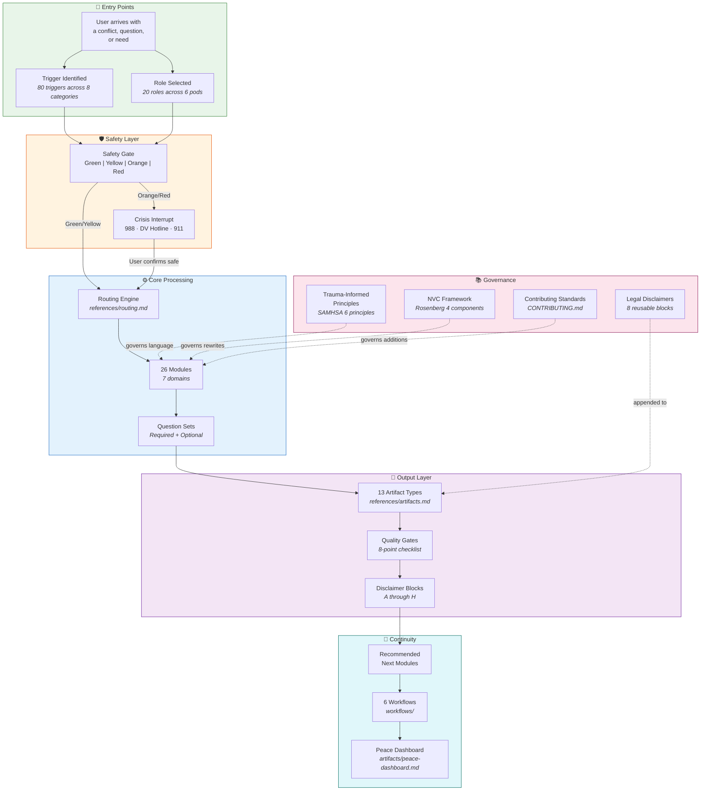

# Access To Peace — Onboarding Guide

> Visual guide to the platform architecture, session flow, safety systems,
> roles, modules, workflows, and data model. Start here if you're new.

---

## How To Read These Diagrams

All diagrams use [Mermaid](https://mermaid.js.org/) syntax and render natively on GitHub,
in VS Code (with the Mermaid extension), and in most modern markdown viewers.

---

## Table of Contents

| Diagram | File | What It Answers |
|---------|------|----------------|
| [Platform Overview](#platform-overview) | This file | What is Access To Peace and how does it fit together? |
| [Session Flow](session-flow.md) | session-flow.md | What happens from the moment a user starts to the final artifact? |
| [Safety Gate Decision Tree](safety-gates.md) | safety-gates.md | How does the safety system work? When does it intervene? |
| [Role Selection & Pods](role-pods.md) | role-pods.md | Who uses this platform? How do roles map to modules? |
| [Module Pathways](module-pathways.md) | module-pathways.md | How do the 26 modules connect across 7 domains? |
| [Workflow Sequences](workflow-sequences.md) | workflow-sequences.md | What are the 6 end-to-end workflows and how do they chain modules? |
| [Data Flow & Persistence](data-flow.md) | data-flow.md | How is session data structured, stored, and visualized? |
| [NVC & Trauma-Informed Framework](language-framework.md) | language-framework.md | How do the communication and language rules work? |
| [Quality Gates & Disclaimers](quality-gates.md) | quality-gates.md | What checks run before every artifact is produced? |
| [Quick-Start Decision Tree](quick-start.md) | quick-start.md | I'm a new user — where do I begin? |

---

## Platform Overview

### Key Concepts

| Concept | What It Means |
|---------|--------------|
| **Trigger** | What the user says or needs — mapped to a module via `references/routing.md` |
| **Role** | Who the user is — determines language depth, default modules, and artifact types |
| **Safety Gate** | Runs on every session — escalates if harm indicators are detected |
| **Module** | A structured question-and-answer flow that produces an artifact |
| **Artifact** | The output document — rewritten message, safety plan, agreement, etc. |
| **Quality Gate** | 8-point checklist that runs before any artifact is released |
| **Pathway** | Every module recommends next modules — users are never left at a dead end |

### File Map

```mermaid
graph LR
    subgraph ROOT["Root"]
        SKILL["SKILL.md<br/><i>Skill entry point</i>"]
        README["README.md<br/><i>Project overview</i>"]
        CONTRIBUTING["CONTRIBUTING.md<br/><i>Standards</i>"]
    end

    subgraph REFS["references/"]
        R1["routing.md"]
        R2["roles.md"]
        R3["triggers.md"]
        R4["artifacts.md"]
        R5["nvc-framework.md"]
        R6["trauma-informed.md"]
        R7["legal-disclaimer.md"]
        R8["crisis-resources.md"]
    end

    subgraph MODS["modules/"]
        M1["MOD-01 to MOD-04<br/><i>Communication</i>"]
        M2["MOD-05 to MOD-08<br/><i>Assessment</i>"]
        M3["MOD-09 to MOD-12<br/><i>Resolution</i>"]
        M4["MOD-13 to MOD-16<br/><i>Wellness</i>"]
        M5["MOD-17 to MOD-20<br/><i>Legal</i>"]
        M6["MOD-21 to MOD-23<br/><i>School</i>"]
        M7["MOD-24 to MOD-26<br/><i>Community</i>"]
    end

    subgraph SUPPORT["Supporting Files"]
        W["workflows/"]
        T["templates/"]
        C["checklists/"]
        S["schemas/"]
        A["artifacts/"]
        RO["routines/"]
    end

    SKILL --> REFS
    SKILL --> MODS
    REFS --> MODS
    MODS --> SUPPORT

    style ROOT fill:#fff9c4,stroke:#f57f17
    style REFS fill:#e8f5e9,stroke:#2e7d32
    style MODS fill:#e3f2fd,stroke:#1565c0
    style SUPPORT fill:#f3e5f5,stroke:#6a1b9a
```

