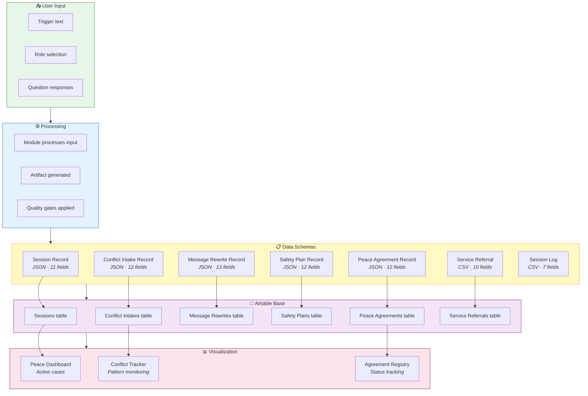
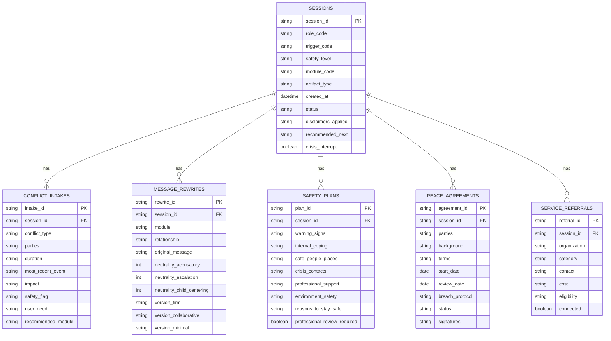
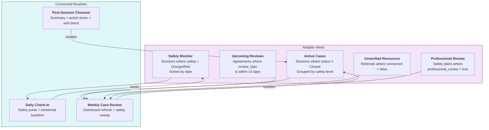
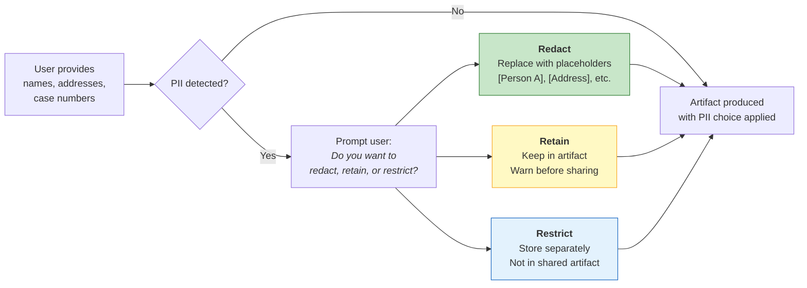

# Data Flow & Persistence

> How session data is structured, stored, and visualized. From raw user input
> to JSON schemas, Airtable bases, and the Peace Dashboard.

---

## End-to-End Data Flow

---

## Schema Relationships

---

## Airtable Views for Case Management

---

## PII Handling Flow

