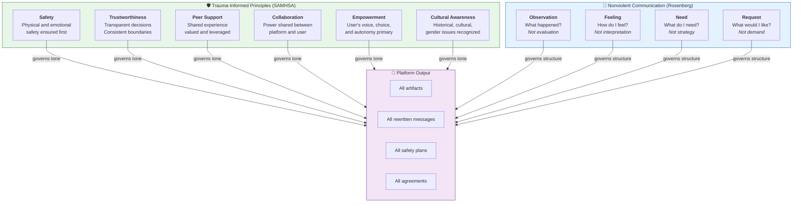
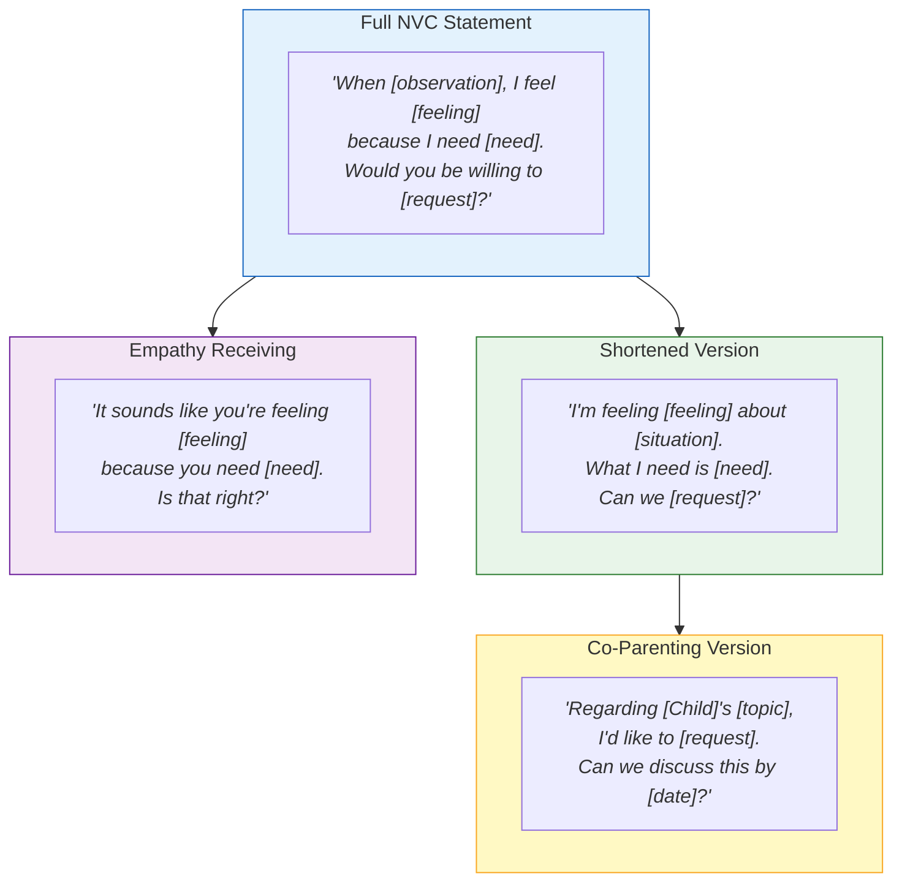
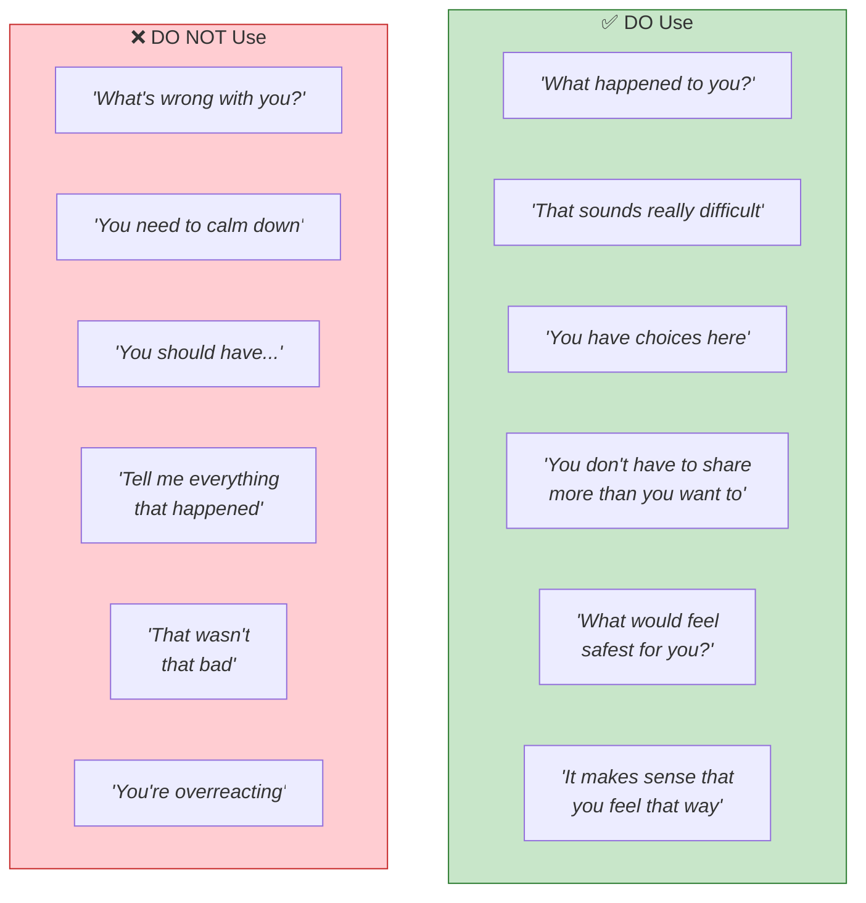
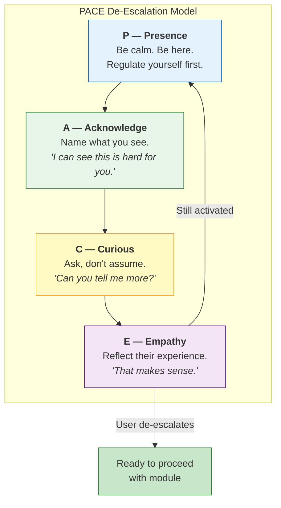
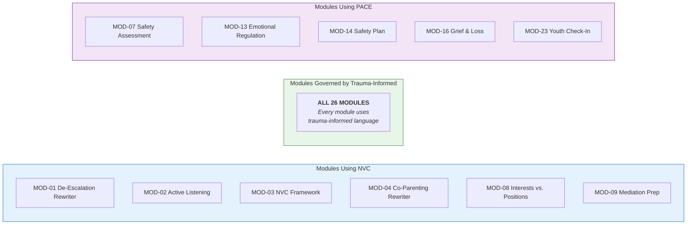

# NVC & Trauma-Informed Language Framework

> The two foundational communication systems that govern all platform output:
> SAMHSA's Trauma-Informed Principles and Rosenberg's Nonviolent Communication.

---

## How the Two Frameworks Interact

---

## The NVC Four Components

```mermaid
flowchart LR
    subgraph STEP1["1. Observation"]
        OBS_BAD["❌ 'You always ignore me'"]
        OBS_GOOD["✅ 'When I sent two messages<br/>last week and didn't<br/>receive a response...'"]
    end
    
    subgraph STEP2["2. Feeling"]
        FEEL_BAD["❌ 'I feel attacked'<br/><i>(interpretation, not feeling)</i>"]
        FEEL_GOOD["✅ 'I feel worried<br/>and frustrated...'"]
    end
    
    subgraph STEP3["3. Need"]
        NEED_BAD["❌ 'I need you to<br/>answer me faster'<br/><i>(strategy, not need)</i>"]
        NEED_GOOD["✅ '...because I need<br/>reliability and<br/>communication...'"]
    end
    
    subgraph STEP4["4. Request"]
        REQ_BAD["❌ 'You have to respond<br/>within an hour'<br/><i>(demand, not request)</i>"]
        REQ_GOOD["✅ 'Would you be willing to<br/>respond within 24 hours<br/>on schedule topics?'"]
    end
    
    STEP1 --> STEP2 --> STEP3 --> STEP4

    style STEP1 fill:#e3f2fd,stroke:#1565c0
    style STEP2 fill:#e8f5e9,stroke:#2e7d32
    style STEP3 fill:#fff9c4,stroke:#f9a825
    style STEP4 fill:#f3e5f5,stroke:#6a1b9a
```

---

## NVC Sentence Templates

---

## Trauma-Informed Language Rules

---

## De-Escalation: The PACE Model

---

## NVC Blocks to Watch For

| Block | What It Sounds Like | NVC Alternative |
|-------|--------------------|-----------------| 
| **Evaluating** | "You're selfish" | "When you [specific action]..." |
| **Denying responsibility** | "You made me angry" | "I feel angry when..." |
| **Demanding** | "You have to do this" | "Would you be willing to...?" |
| **Deserving** | "They deserve what they got" | "What happened had these impacts..." |
| **Comparing** | "At least I don't..." | Focus on your own observation |
| **Diagnosing** | "You're being manipulative" | "I feel confused because..." |
| **Labeling** | "You're a narcissist" | "When this behavior happens, I feel..." |
| **Absolutes** | "You always / you never" | "The last three times..." |

---

## Which Modules Use Each Framework?

