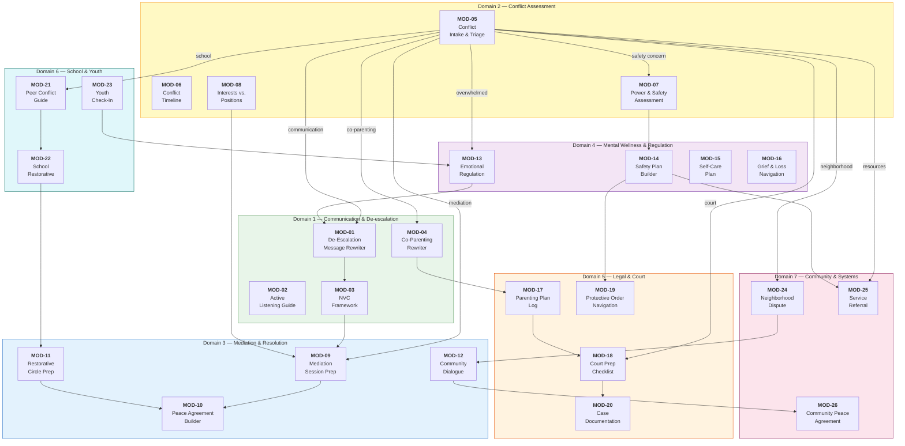
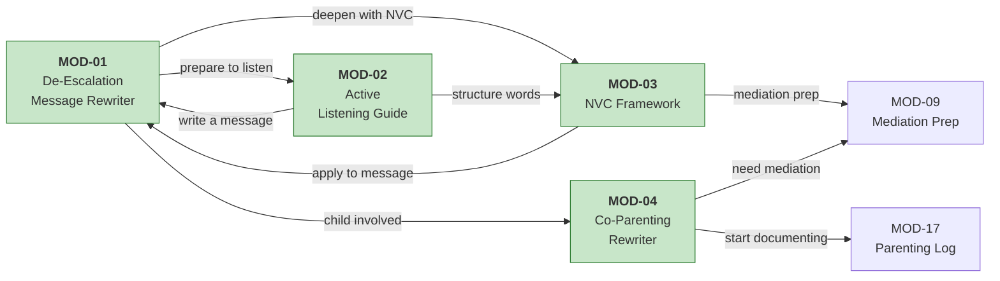
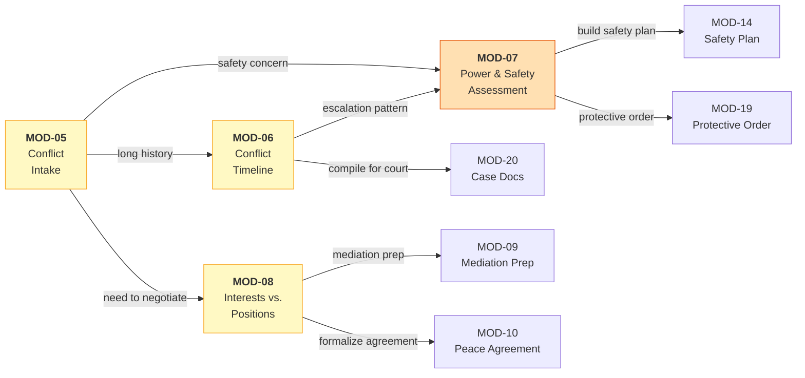
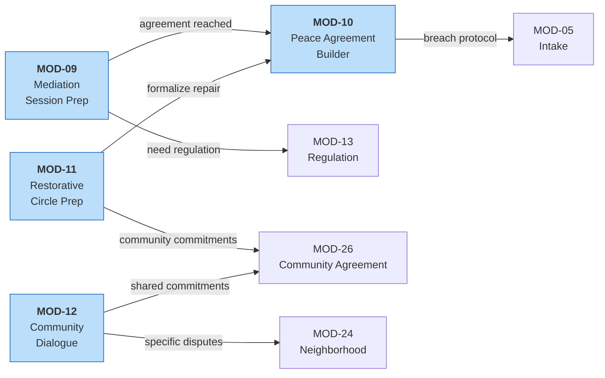
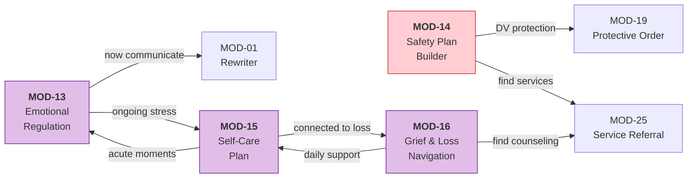
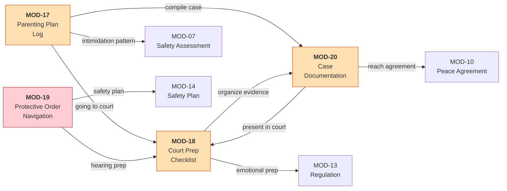
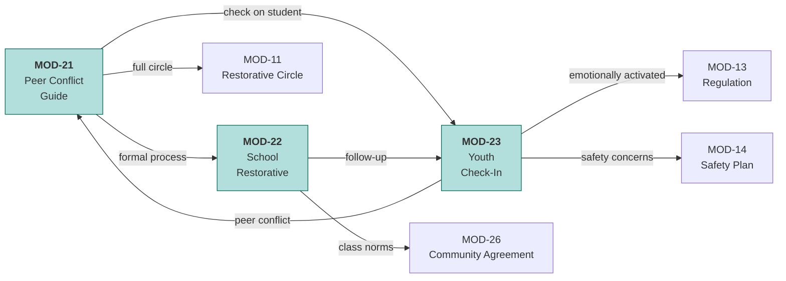
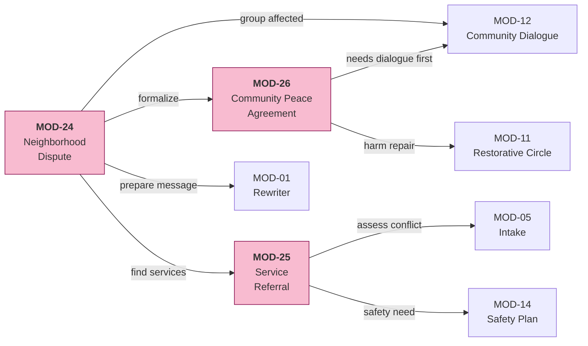
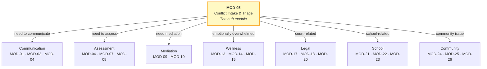

# Module Pathways

> How the 26 modules connect across 7 domains. Every module recommends next steps —
> users are never left at a dead end.

---

## Master Pathway Map

---

## Domain 1 — Communication & De-escalation

---

## Domain 2 — Conflict Assessment

---

## Domain 3 — Mediation & Resolution

---

## Domain 4 — Mental Wellness & Regulation

---

## Domain 5 — Legal & Court

---

## Domain 6 — School & Youth

---

## Domain 7 — Community & Systems

---

## The Hub Module: MOD-05 Conflict Intake

MOD-05 is the primary entry point for most users. It routes to every other domain:

