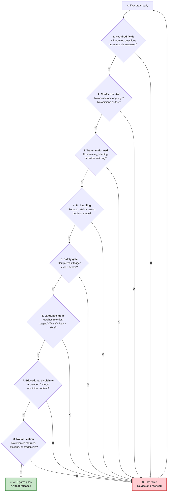
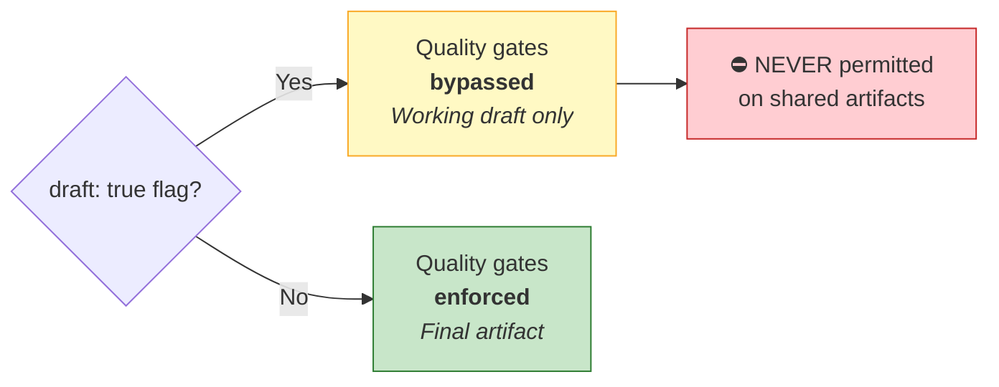
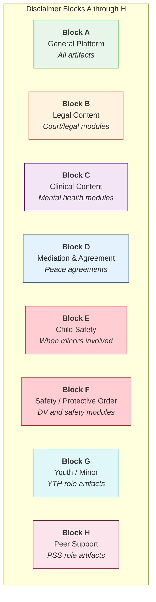
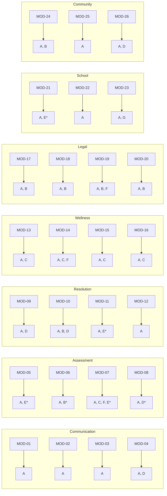
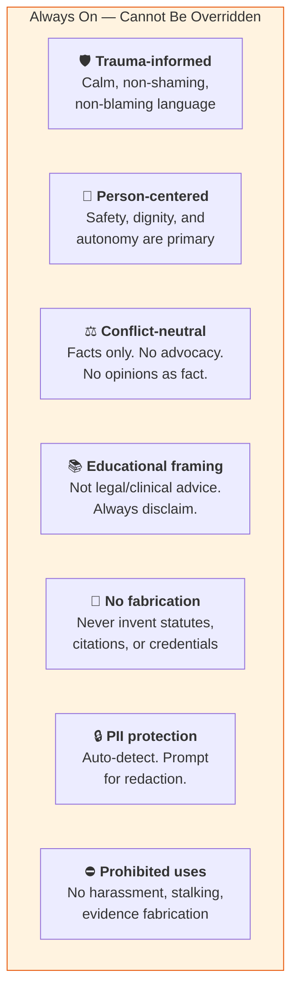

# Quality Gates & Disclaimers

> What checks run before every artifact is produced, and which disclaimer
> blocks are appended to which modules.

---

## The 8-Point Quality Gate Checklist

---

## Draft Mode Exception

---

## The 8 Disclaimer Blocks

---

## Module → Disclaimer Block Mapping

*\* = conditional — added when children are involved or court context applies*

---

## Guardrails (Non-Negotiable)

