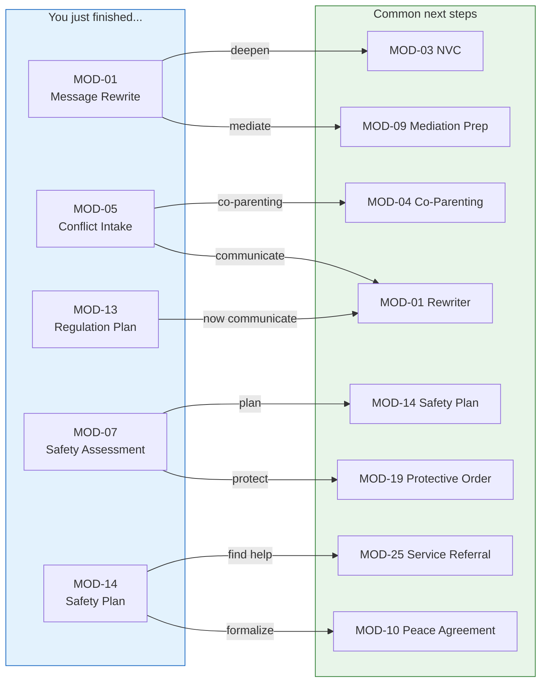

# Quick-Start Decision Tree

> I'm a new user — where do I begin? Follow the tree based on your situation.

---

## What Do You Need Right Now?

```mermaid
flowchart TD
    START(["🟢 What brings you here today?"])
    
    Q1{"Are you or someone<br/>you know in danger<br/>right now?"}
    
    CRISIS["🔴 <b>CRISIS</b><br/>Call 911 if in danger<br/>Call/text 988 for crisis<br/>Call 1-800-799-7233 for DV<br/>Text HOME to 741741"]
    
    Q2{"What's your<br/>primary need?"}
    
    COMMUNICATE["💬 I need to<br/>communicate<br/>with someone"]
    CONFLICT["⚡ I'm in a<br/>conflict and<br/>need help"]
    SAFE["🛡️ I have<br/>safety<br/>concerns"]
    MEDIATE["⚖️ I have a<br/>mediation or<br/>court date"]
    FEEL["💙 I'm<br/>overwhelmed<br/>or struggling"]
    SCHOOL["🏫 There's a<br/>school/youth<br/>issue"]
    COMMUNITY["🏘️ There's a<br/>community<br/>dispute"]
    
    %% Communication branch
    Q_COMM{"Who do you need<br/>to communicate with?"}
    COMM_COPAR["Co-parent"]
    COMM_OTHER["Neighbor, colleague,<br/>family, other"]
    COMM_LISTEN["I need to<br/>listen better"]
    
    MOD04["→ <b>MOD-04</b><br/>Co-Parenting Rewriter"]
    MOD01["→ <b>MOD-01</b><br/>De-Escalation Rewriter"]
    MOD02["→ <b>MOD-02</b><br/>Active Listening Guide"]
    
    %% Conflict branch
    MOD05["→ <b>MOD-05</b><br/>Conflict Intake & Triage<br/><i>This will route you to<br/>the right module</i>"]
    
    %% Safety branch
    Q_SAFE{"What kind of<br/>safety concern?"}
    SAFE_DV["DV / threats /<br/>I don't feel safe"]
    SAFE_PLAN["I want to<br/>plan ahead"]
    SAFE_PO["I need a<br/>protective order"]
    
    MOD07["→ <b>MOD-07</b><br/>Power & Safety Assessment"]
    MOD14["→ <b>MOD-14</b><br/>Safety Plan Builder"]
    MOD19["→ <b>MOD-19</b><br/>Protective Order Nav"]
    
    %% Mediation / Court branch
    Q_MED{"What's coming up?"}
    MED_MEDIATION["Mediation session"]
    MED_COURT["Court hearing"]
    MED_AGREE["We reached<br/>an agreement"]
    
    MOD08["→ <b>MOD-08</b><br/>Interests vs. Positions"]
    MOD09["→ <b>MOD-09</b><br/>Mediation Session Prep"]
    MOD18["→ <b>MOD-18</b><br/>Court Prep Checklist"]
    MOD10["→ <b>MOD-10</b><br/>Peace Agreement Builder"]
    
    %% Overwhelmed branch
    Q_FEEL{"What's closest<br/>to your experience?"}
    FEEL_REG["I can't calm<br/>down right now"]
    FEEL_BURN["I'm burned out<br/>or exhausted"]
    FEEL_GRIEF["I'm dealing<br/>with loss"]
    
    MOD13["→ <b>MOD-13</b><br/>Emotional Regulation"]
    MOD15["→ <b>MOD-15</b><br/>Self-Care Plan"]
    MOD16["→ <b>MOD-16</b><br/>Grief & Loss Navigation"]
    
    %% School branch
    Q_SCH{"What happened?"}
    SCH_FIGHT["Student conflict<br/>or bullying"]
    SCH_CHECKIN["Need to check<br/>on a student"]
    SCH_RESTORE["Want to do a<br/>restorative practice"]
    
    MOD21["→ <b>MOD-21</b><br/>Peer Conflict Guide"]
    MOD23["→ <b>MOD-23</b><br/>Youth Check-In"]
    MOD22["→ <b>MOD-22</b><br/>School Restorative"]
    
    %% Community branch
    Q_COMMU{"What's the scope?"}
    COMMU_NEIGH["Specific neighbor<br/>or landlord dispute"]
    COMMU_GROUP["Group tension<br/>or community issue"]
    COMMU_AGREE["Need a<br/>group agreement"]
    
    MOD24["→ <b>MOD-24</b><br/>Neighborhood Dispute"]
    MOD12["→ <b>MOD-12</b><br/>Community Dialogue"]
    MOD26["→ <b>MOD-26</b><br/>Community Agreement"]
    
    %% Flow
    START --> Q1
    Q1 -->|"YES"| CRISIS
    Q1 -->|"NO"| Q2
    
    Q2 --> COMMUNICATE
    Q2 --> CONFLICT
    Q2 --> SAFE
    Q2 --> MEDIATE
    Q2 --> FEEL
    Q2 --> SCHOOL
    Q2 --> COMMUNITY
    
    COMMUNICATE --> Q_COMM
    Q_COMM --> COMM_COPAR --> MOD04
    Q_COMM --> COMM_OTHER --> MOD01
    Q_COMM --> COMM_LISTEN --> MOD02
    
    CONFLICT --> MOD05
    
    SAFE --> Q_SAFE
    Q_SAFE --> SAFE_DV --> MOD07
    Q_SAFE --> SAFE_PLAN --> MOD14
    Q_SAFE --> SAFE_PO --> MOD19
    
    MEDIATE --> Q_MED
    Q_MED --> MED_MEDIATION --> MOD08
    MOD08 --> MOD09
    Q_MED --> MED_COURT --> MOD18
    Q_MED --> MED_AGREE --> MOD10
    
    FEEL --> Q_FEEL
    Q_FEEL --> FEEL_REG --> MOD13
    Q_FEEL --> FEEL_BURN --> MOD15
    Q_FEEL --> FEEL_GRIEF --> MOD16
    
    SCHOOL --> Q_SCH
    Q_SCH --> SCH_FIGHT --> MOD21
    Q_SCH --> SCH_CHECKIN --> MOD23
    Q_SCH --> SCH_RESTORE --> MOD22
    
    COMMUNITY --> Q_COMMU
    Q_COMMU --> COMMU_NEIGH --> MOD24
    Q_COMMU --> COMMU_GROUP --> MOD12
    Q_COMMU --> COMMU_AGREE --> MOD26

    style START fill:#c8e6c9,stroke:#2e7d32
    style CRISIS fill:#ffcdd2,stroke:#c62828
    style MOD04 fill:#e3f2fd,stroke:#1565c0
    style MOD01 fill:#e3f2fd,stroke:#1565c0
    style MOD02 fill:#e3f2fd,stroke:#1565c0
    style MOD05 fill:#fff9c4,stroke:#f9a825
    style MOD07 fill:#ffe0b2,stroke:#e65100
    style MOD14 fill:#ffe0b2,stroke:#e65100
    style MOD19 fill:#ffe0b2,stroke:#e65100
    style MOD08 fill:#e3f2fd,stroke:#1565c0
    style MOD09 fill:#e3f2fd,stroke:#1565c0
    style MOD18 fill:#fff3e0,stroke:#e65100
    style MOD10 fill:#e3f2fd,stroke:#1565c0
    style MOD13 fill:#f3e5f5,stroke:#6a1b9a
    style MOD15 fill:#f3e5f5,stroke:#6a1b9a
    style MOD16 fill:#f3e5f5,stroke:#6a1b9a
    style MOD21 fill:#e0f7fa,stroke:#00695c
    style MOD23 fill:#e0f7fa,stroke:#00695c
    style MOD22 fill:#e0f7fa,stroke:#00695c
    style MOD24 fill:#fce4ec,stroke:#880e4f
    style MOD12 fill:#fce4ec,stroke:#880e4f
    style MOD26 fill:#fce4ec,stroke:#880e4f
```

---

## After Your First Module

Every module recommends **3-5 next modules**. Here are the most common "what's next" paths:

---

## Role-Based Starting Points

| If you are... | Start here | Then... |
|--------------|-----------|---------|
| An **individual** in conflict | MOD-05 Conflict Intake | Follow recommended next modules |
| A **parent** co-parenting | MOD-04 Co-Parenting Rewriter | MOD-17 Parenting Log |
| A **youth / teen** | MOD-23 Youth Check-In | MOD-21 Peer Conflict if needed |
| A **mediator** | MOD-09 Mediation Session Prep | MOD-10 Peace Agreement |
| A **therapist / counselor** | MOD-14 Safety Plan Builder | MOD-13 Regulation Plan |
| A **social worker** | MOD-25 Service Referral | MOD-05 Conflict Intake |
| An **attorney** | MOD-17 Parenting Plan Log | MOD-20 Case Documentation |
| A **school counselor** | MOD-21 Peer Conflict Guide | MOD-22 Restorative Practice |
| A **community organizer** | MOD-24 Neighborhood Dispute | MOD-12 Community Dialogue |
| A **victim advocate** | MOD-14 Safety Plan Builder | MOD-19 Protective Order Nav |

---

## Resources Always Available

No matter where you are in the platform, these are always one step away:

- **988** — Suicide & Crisis Lifeline (call or text)
- **1-800-799-7233** — National Domestic Violence Hotline
- **Text HOME to 741741** — Crisis Text Line
- **911** — Emergency
- **MOD-25** — Service Referral Builder (find local help)
