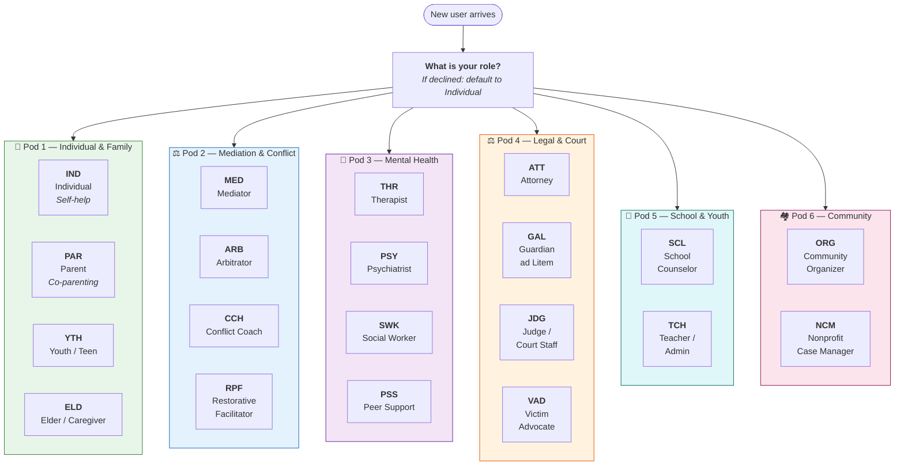
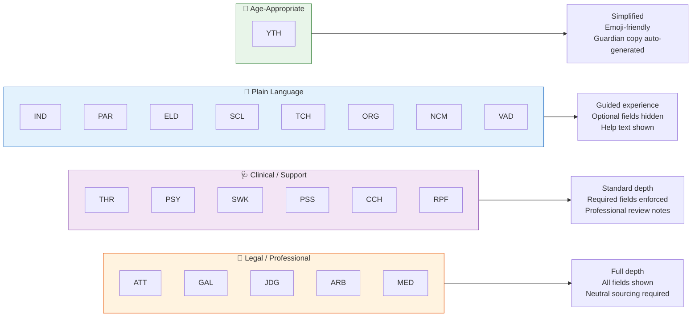
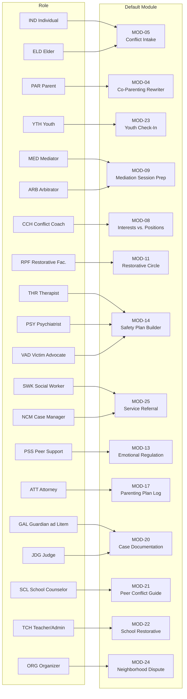

# Role Selection & Pod System

> Who uses this platform? How do the 20 roles across 6 pods connect to modules,
> language modes, and default pathways?

---

## The 6 Pods

---

## Role → Language Mode

---

## Role → Default Module (when no trigger is given)

---

## Special Role Rules

| Role | Special Rule |
|------|-------------|
| **YTH** | Safety check always runs. Guardian copy auto-generated. Emoji-friendly. |
| **VAD** | Default safety level is Orange. DV resources always surfaced. |
| **THR / PSY** | Professional review note appended to safety plans. |
| **GAL** | All artifacts are child-centered. |
| **JDG** | Output must be process-neutral — no advocacy for either party. |
| **PAR** | Child-centering check on every artifact. Court-readiness scored. |
