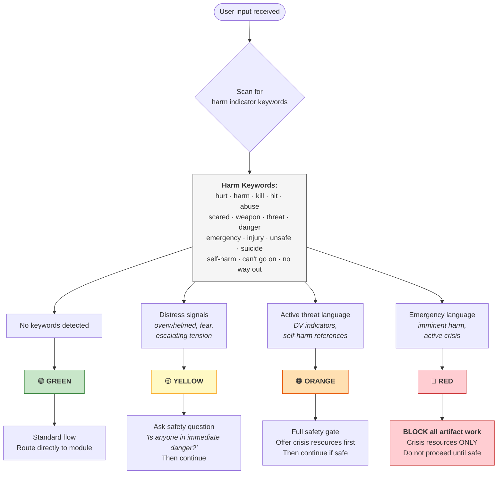
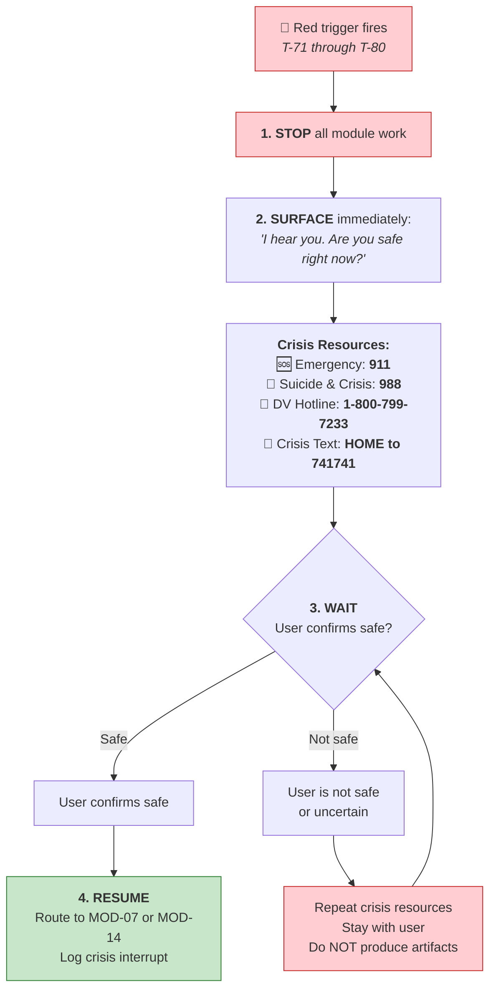
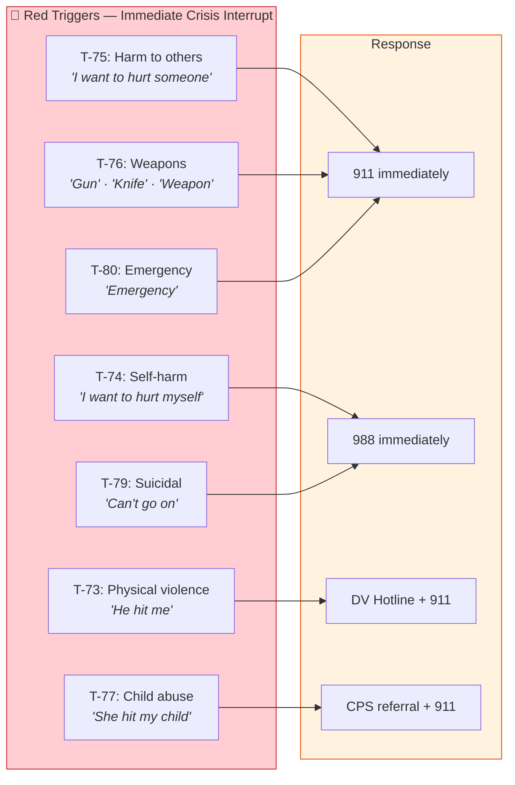

# Safety Gate Decision Tree

> How the safety system works. When it intervenes. What happens at each level.

---

## Safety Level Classification

---

## Crisis Interrupt Protocol (Red-Level Triggers T-71 through T-80)

---

## Red-Level Trigger Catalog

---

## Safety Gate by Module

| Module | Default Safety Level | Can Escalate To |
|--------|---------------------|----------------|
| MOD-01 De-Escalation Rewriter | Green | Yellow (T-06, T-07) |
| MOD-04 Co-Parenting Rewriter | Green | Yellow |
| MOD-05 Conflict Intake | Green | Yellow |
| MOD-07 Power & Safety Assessment | **Orange** | Red |
| MOD-13 Emotional Regulation | **Yellow** | Orange |
| MOD-14 Safety Plan Builder | **Orange** | Red |
| MOD-16 Grief & Loss | **Yellow** | Orange |
| MOD-19 Protective Order Nav | **Orange** | Red |
| MOD-21 Peer Conflict Guide | Green | Yellow (bullying) |
| MOD-23 Youth Check-In | Green/Yellow | Orange |
| All others | Green | Yellow (if harm keywords appear) |
