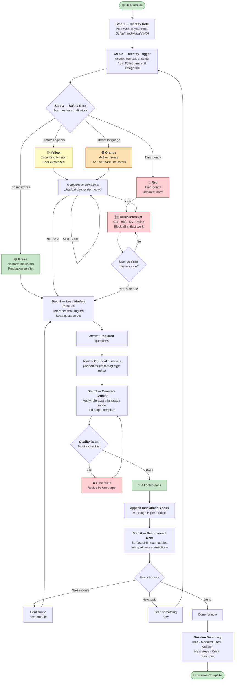
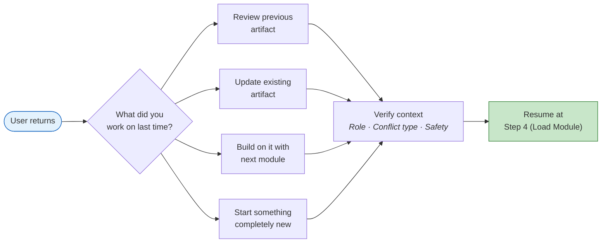

# Session Flow

> What happens from the moment a user starts to the final artifact and beyond.

---

## Complete Session Lifecycle

---

## Returning User Flow

---

## Key Rules

| Rule | Detail |
|------|--------|
| **Role carries forward** | Once identified, role persists across all modules in a session |
| **Safety gate always runs** | Even on Green sessions, harm keywords trigger re-assessment |
| **Quality gates are mandatory** | No artifact leaves without passing the 8-point checklist |
| **Next module is always offered** | Users are never left at a dead end |
| **Session summary at close** | Includes modules used, artifacts produced, and crisis resources |
