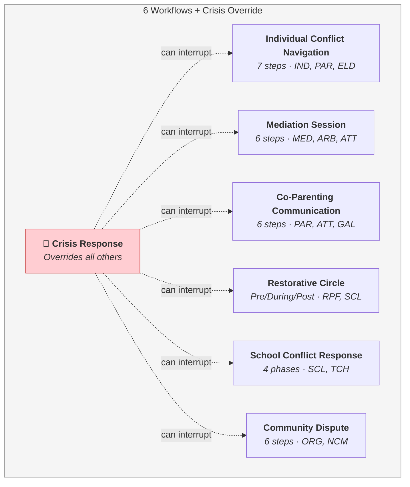
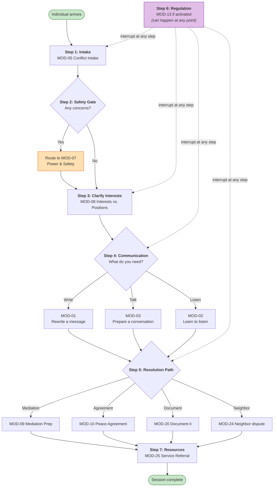
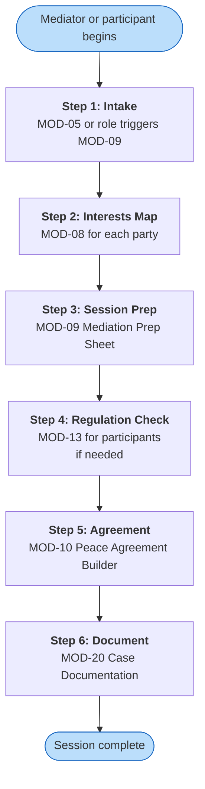
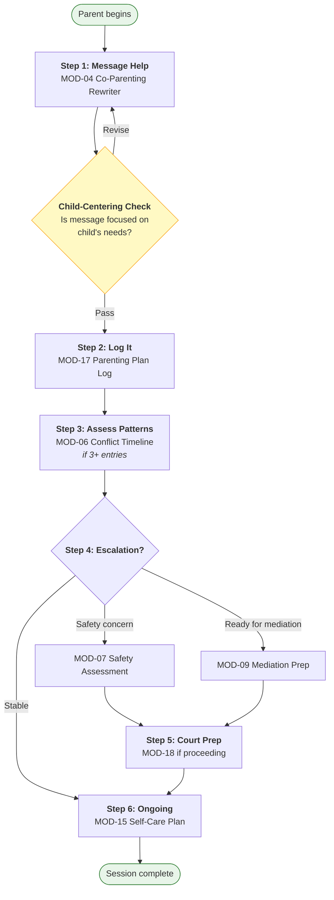
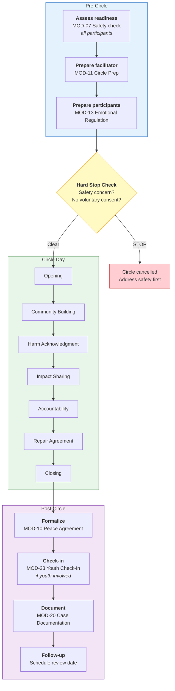
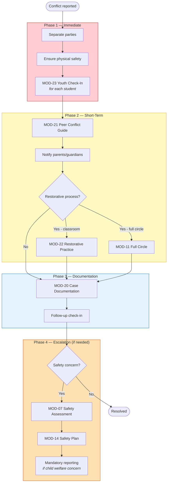
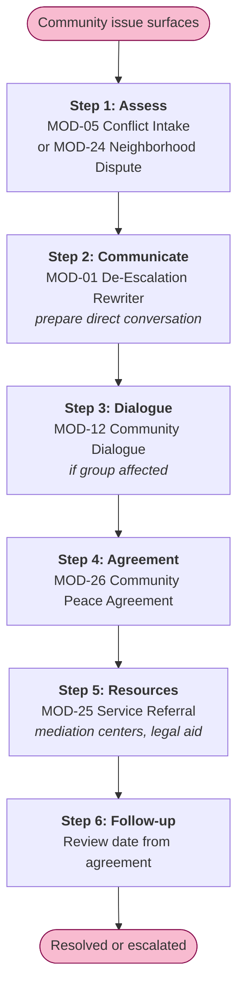
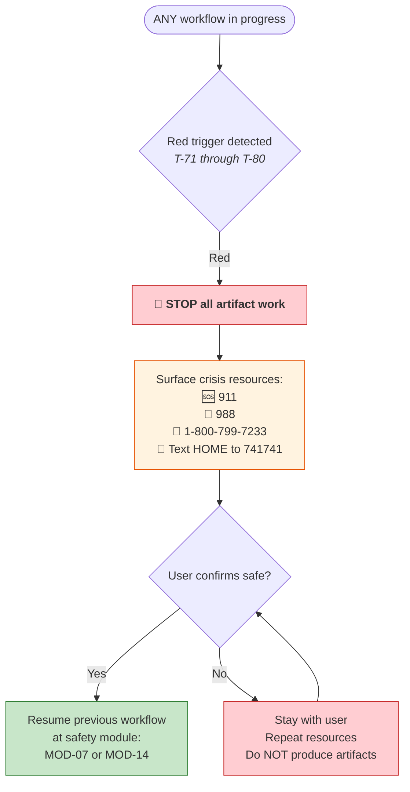

# Workflow Sequences

> The 6 end-to-end workflows that chain modules together for complete user journeys,
> plus the Crisis Response override.

---

## All Workflows at a Glance

---

## Workflow 1 — Individual Conflict Navigation

---

## Workflow 2 — Mediation Session

---

## Workflow 3 — Co-Parenting Communication

---

## Workflow 4 — Restorative Circle

---

## Workflow 5 — School Conflict Response

---

## Workflow 6 — Community Dispute

---

## Crisis Response Override

