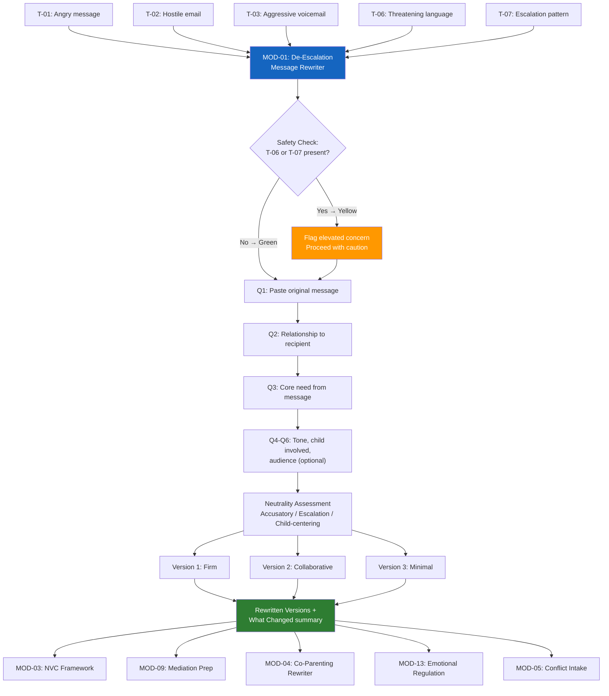

# MOD-01 — De-Escalation Message Rewriter

## Purpose
Rewrite a user-provided message (text, email, voicemail script, in-person statement) into
three trauma-informed, conflict-neutral, de-escalated versions.

## Triggers
T-01, T-02, T-03, T-06, T-07

## Roles
All

## Safety Level
Green (standard) / Yellow if T-06 or T-07

---

## Question Set

**Required:**
1. What is the message you want to send? (paste or describe)
2. What is your relationship to the recipient? (co-parent, neighbor, colleague, family member, other)
3. What is the core thing you need from this message? (response, agreement, acknowledgment, boundary, information)

**Optional:**
4. What tone is most important to you? (firm / collaborative / minimal)
5. Is there a child involved in this situation? (yes / no)
6. Will this message likely be seen by anyone else? (court, attorney, mediator, teacher)

---

## Output Format

### Neutrality Assessment
Rate the original message 1–10 for:
- Accusatory language (10 = none)
- Emotional escalation (10 = fully calm)
- Child-centering (10 = fully child-centered, or N/A)

### Rewritten Versions

**Version 1 — Firm**
*Clear, direct, boundaried. Non-negotiable points preserved. No emotional escalation.*

**Version 2 — Collaborative**
*Opens dialogue. Uses NVC framing. Invites response.*

**Version 3 — Minimal**
*Shortest version that communicates the core need. Good for high-conflict situations.*

### What Changed
Brief bullet list: specific changes made and why.

---

## Quality Gates
- [ ] All three versions pass neutrality check
- [ ] No accusatory, absolute, or inflammatory language remains
- [ ] Core need of user is preserved in all versions
- [ ] Child-centering applied if children are involved
- [ ] Share-safe placeholder names used unless user opted for named version

## Recommended Next Modules
- **MOD-03** NVC Framework — deepen communication with feelings-and-needs language
- **MOD-09** Mediation Session Prep — if the message is part of preparing for mediation
- **MOD-04** Co-Parenting Communication Rewriter — if children are involved (court-neutral version)
- **MOD-13** Emotional Regulation Plan — if the user is too activated to send yet
- **MOD-05** Conflict Intake — if this message reveals a larger unresolved conflict

---

## Worked Example

**User input:**
> "I want to send this to my neighbor: 'You are the most inconsiderate person alive. Your dog barks ALL NIGHT and you clearly don't care about anyone but yourself. If this doesn't stop I'm calling the cops and filing a complaint with the HOA. Don't test me.'"
>
> Relationship: neighbor. Core need: the barking to stop. Tone: firm.

### Neutrality Assessment
- Accusatory language: 2/10 (heavy — "most inconsiderate," "don't care about anyone")
- Emotional escalation: 2/10 (threat language, absolute language)
- Child-centering: N/A

### Rewritten Versions

**Version 1 — Firm**
> Hi [Neighbor]. I need to bring something up. The barking from your dog has been happening late at night, and it's been affecting my sleep. I'm asking that you address this — whether that's bringing the dog inside at night or another solution. If it continues, I'll need to reach out to the HOA for help resolving this. I'd rather work it out between us.

**Version 2 — Collaborative**
> Hi [Neighbor]. I wanted to reach out about something that's been on my mind. Your dog has been barking late at night, and it's been hard for me to sleep. I'm sure you may not realize how much it carries — would you be open to talking about a solution that works for both of us?

**Version 3 — Minimal**
> Hi [Neighbor]. Your dog has been barking late at night and it's affecting my sleep. Can we find a solution?

### What Changed
- Removed personal attacks ("most inconsiderate person alive," "don't care about anyone")
- Replaced threats with clear, proportional next steps
- Preserved the core need: nighttime barking needs to stop
- Shifted from blaming to describing the impact on the sender

## Disclaimer
Append Block A.
