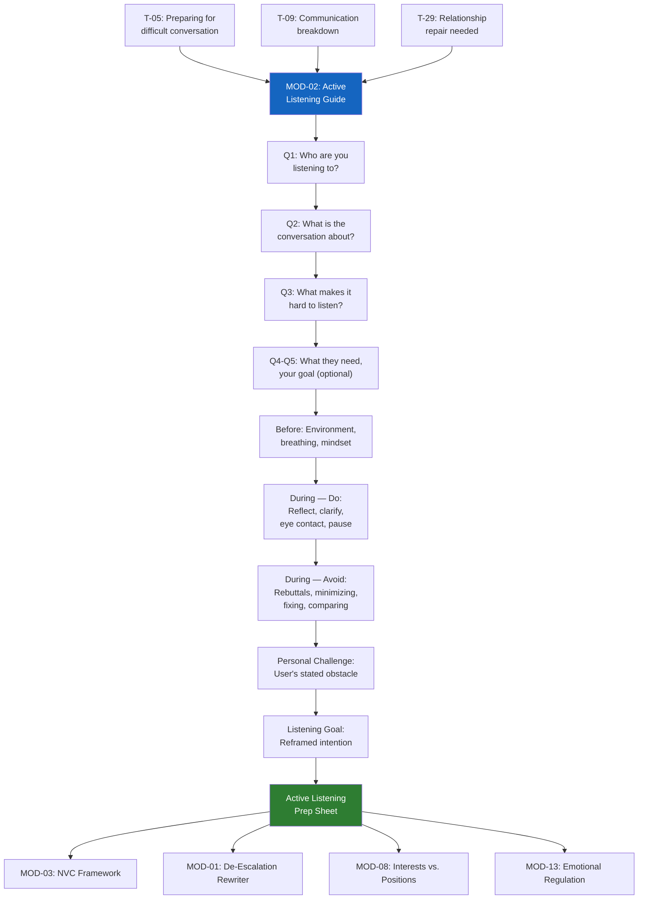

# MOD-02 — Active Listening Guide

## Purpose
Help a user prepare to listen effectively in a high-conflict or emotionally charged
conversation. Produces a personalized active listening guide and conversation prep sheet.

## Triggers
T-05, T-09, T-29

## Roles
All

## Safety Level
Green

---

## Question Set

**Required:**
1. Who are you preparing to listen to? (relationship — not name)
2. What is the conversation about?
3. What makes it hard to listen in this situation? (e.g., I get defensive, I want to fix it, I get angry, I shut down)

**Optional:**
4. What does this person most need from you in this conversation? (to be heard / to solve a problem / to agree on something / I don't know)
5. What is your goal in having this conversation?

---

## Output Format

### Active Listening Prep Sheet

**Before the conversation:**
- [ ] Set aside enough time — don't rush
- [ ] Choose a calm environment (no interruptions)
- [ ] Take 3 slow breaths before starting
- [ ] Remind yourself: *"My job right now is to understand, not to fix or win."*

**During the conversation — what to do:**
- Make eye contact and face the person
- Nod to signal you're following
- Don't interrupt — let them finish each thought
- Reflect back what you heard: *"So what I'm hearing is..."*
- Ask one clarifying question at a time: *"Can you say more about that?"*
- Notice your own body — if you feel defensive, breathe and pause before responding

**During the conversation — what to avoid:**
- Planning your rebuttal while they're talking
- Minimizing: *"It's not that bad"*
- Fixing immediately: *"Here's what you should do"*
- Comparing: *"Well I feel that way too"*
- Checking out: looking at phone, breaking eye contact, sighing

**Empathy phrases to use:**
- *"That sounds really hard."*
- *"I can see why that would feel that way."*
- *"I hear you."*
- *"Tell me more."*
- *"I didn't know that. Thank you for telling me."*

**Your personal challenge in this conversation:**
[User's stated obstacle — personalized note on how to manage it]

**Your goal for this conversation:**
[User's stated goal — reframed as a listening intention, not an outcome demand]

---

## Quality Gates
- [ ] Neutral language — no advice to "win" the conversation
- [ ] User's personal obstacle addressed specifically
- [ ] No clinical labels applied

## Recommended Next Modules
- **MOD-03** NVC Framework — structure your words using observations, feelings, needs, requests
- **MOD-01** De-Escalation Message Rewriter — if you need to write a message after the conversation
- **MOD-08** Interests vs. Positions Mapper — understand what both sides really need
- **MOD-13** Emotional Regulation Plan — if you need to regulate before listening

## Disclaimer
Append Block A.
