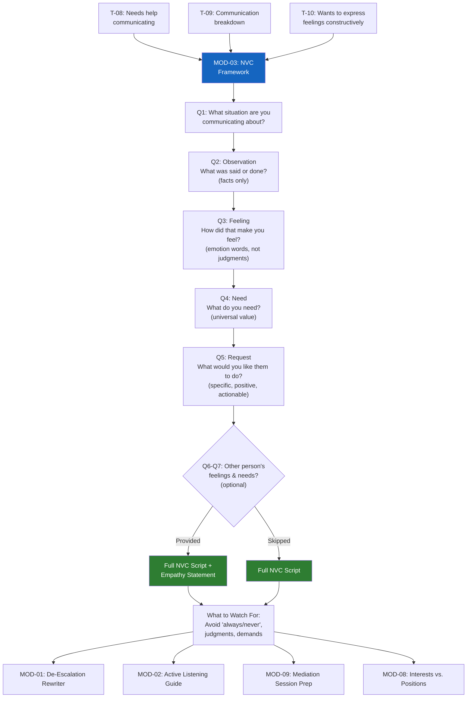

# MOD-03 — Nonviolent Communication (NVC) Framework

## Purpose
Help a user apply NVC (Observations, Feelings, Needs, Requests) to build a specific
communication script for a difficult conversation or message.

## Triggers
T-08, T-09, T-10

## Roles
All

## Safety Level
Green

---

## Question Set

**Required:**
1. What situation are you preparing to communicate about?
2. What did you observe — specifically what was said or done? (No interpretations — just facts)
3. How did that make you feel? (Use feeling words: sad, scared, frustrated, confused, hurt, overwhelmed — not "attacked" or "manipulated")
4. What do you need? (Underlying value: safety, respect, clarity, consistency, support, connection)
5. What would you like to ask the other person to do? (Specific, positive, actionable — something they can actually say yes or no to)

**Optional:**
6. What do you think the other person is feeling?
7. What do you think the other person needs?

---

## Output Format

### Your NVC Statement

**Observation:**
> "When [specific observation — what was said or done] ..."

**Feeling:**
> "... I feel [feeling word] ..."

**Need:**
> "... because I need [universal need] ..."

**Request:**
> "... Would you be willing to [specific request]?"

---

### Full Script (combined)
> [Complete NVC statement in natural, conversational language]

---

### Empathy for the Other Person (if provided)
> "They may be feeling [feeling] because they need [need]."
> *Holding this perspective doesn't mean agreeing — it means understanding.*

---

### What to Watch For
- If you're tempted to say "you always" or "you never" — that's a position, not an observation. Go back to what specifically happened.
- If your "feeling" is "manipulated" or "disrespected" — those are interpretations. Try: frustrated, hurt, confused, scared.
- If your "request" sounds like a demand ("you have to...") — soften to "would you be willing to..."

---

## Quality Gates
- [ ] Observation is specific and factual (no evaluation)
- [ ] Feeling is an emotion, not an interpretation
- [ ] Need is universal (not a strategy)
- [ ] Request is specific, positive, and answerable

## Recommended Next Modules
- **MOD-01** De-Escalation Message Rewriter — apply NVC to a specific message you need to send
- **MOD-02** Active Listening Guide — prepare to listen when the other person responds
- **MOD-09** Mediation Session Prep — use NVC framing in your mediation opening statement
- **MOD-08** Interests vs. Positions Mapper — dig deeper into underlying needs

---

## Worked Example

**User input:**
> Role: Individual (IND). Q1: Late-night noise from a neighbor. Q2: Music has been playing past midnight three times this week. Q3: Frustrated and exhausted. Q4: Rest and respect for shared space. Q5: Would you be willing to keep music at a lower volume after 10 PM? Q6: They might be feeling happy or relaxed — it is their downtime. Q7: They probably need enjoyment and freedom in their own home.

### Your NVC Statement

**Observation:**
> "When music has been playing past midnight three times this week..."

**Feeling:**
> "...I feel frustrated and exhausted..."

**Need:**
> "...because I need rest and respect for our shared space..."

**Request:**
> "...Would you be willing to keep the music at a lower volume after 10 PM?"

---

### Full Script (combined)
> "I wanted to talk with you about something. This week, I've noticed music playing past midnight on three occasions. When that happens, I feel frustrated and exhausted because I need rest to get through my workday, and I value us both being comfortable in our shared space. Would you be willing to keep the music at a lower volume after 10 PM? I'm open to talking about what works for both of us."

---

### Empathy for the Other Person
> "They may be feeling happy or relaxed because they need enjoyment and freedom in their own home. That makes sense — everyone deserves to unwind."
> *Holding this perspective doesn't mean agreeing — it means understanding. Acknowledging their need for enjoyment can make them more willing to hear your need for rest.*

---

### What to Watch For
- If you are tempted to say "you always play music so loud" — that is an evaluation, not an observation. Stick to the specific facts: three times this week, past midnight.
- If your feeling shifts to "disrespected" — that is an interpretation of their intent. Stay with the emotion: frustrated, exhausted, drained.
- If your request starts to sound like "you have to turn it down" — soften to "would you be willing to..." A request leaves room for dialogue; a demand shuts it down.
- Notice if you are making assumptions about why they play music late. You may learn something new in the conversation.

## Disclaimer
Append Block A.
