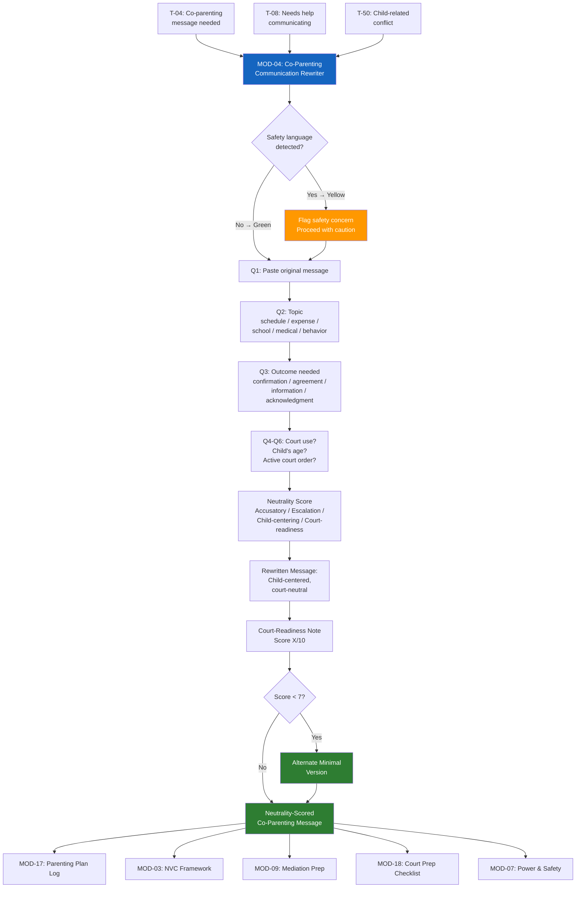

# MOD-04 — Co-Parenting Communication Rewriter

## Purpose
Rewrite a co-parenting message to be child-centered, court-neutral, and de-escalated.
Produces a neutrality score and court-readiness assessment.

## Triggers
T-04, T-08, T-50

## Roles
PAR, ATT, GAL, IND

## Safety Level
Green (standard) / Yellow if conflict language indicates safety concern

---

## Question Set

**Required:**
1. What is the message you want to send? (paste or describe)
2. What is the topic? (schedule change, expense, school, medical, behavior, other)
3. What outcome do you need? (confirmation, agreement, information, acknowledgment)

**Optional:**
4. Will this message be used in court or shared with an attorney? (yes / no / maybe)
5. What is the child's age? (helps calibrate child-centered language)
6. Is there an active court order related to this topic? (yes / no / unsure)

---

## Output Format

### Neutrality Score
Rate original message on:
- Accusatory language (10 = none present)
- Emotional escalation (10 = fully calm)
- Child-centering (10 = fully focused on child's needs)
- Court-readiness (10 = could be filed as exhibit without edits)

**Overall: X/10**

### Rewritten Message
One primary version, child-centered, court-neutral.

### Court-Readiness Note
> "This message scores [X]/10 for court-readiness. [Specific note on what to watch for.]"

### Alternate Version (if score < 7)
A shorter, more minimal version for high-conflict situations.

---

## Quality Gates
- [ ] [Parent A] / [Parent B] / [Child] placeholders used (unless named version opted in)
- [ ] No accusatory language
- [ ] Child's needs foregrounded (not adult grievances)
- [ ] Core logistical need addressed
- [ ] Court-readiness score provided

## Recommended Next Modules
- **MOD-17** Parenting Plan Communication Log — log the communication for documentation
- **MOD-03** NVC Framework — deepen co-parenting communication using feelings and needs
- **MOD-09** Mediation Session Prep — if the issue needs a mediation session
- **MOD-18** Court Preparation Checklist — if the communication is heading toward court
- **MOD-07** Power & Safety Assessment — if there are safety concerns in the co-parenting dynamic

---

## Worked Example

**User input:**
> Role: Parent (PAR). Q1: "You NEVER bring him to soccer on time. I'm sick of being the only parent who cares about his activities. Get it together or I'm telling my lawyer." Q2: Schedule/activities. Q3: Agreement on pickup time. Q4: Maybe. Q5: 9 years old. Q6: Unsure.

### Neutrality Score

| Category | Score | Notes |
|----------|-------|-------|
| Accusatory language | 2/10 | "You NEVER," "only parent who cares," and "get it together" are accusatory |
| Emotional escalation | 2/10 | High frustration throughout; legal threat used as leverage |
| Child-centering | 3/10 | Soccer is mentioned but the focus is on the adult conflict |
| Court-readiness | 2/10 | Could not be filed as exhibit — contains blame language and threats |

**Overall: 2/10**

### Rewritten Message

> Hi [Parent B],
>
> I'd like to discuss [Child]'s soccer pickup schedule. [Child] has been arriving late to practice on a few recent occasions, and I want to make sure we're on the same page about timing so [Child] gets the most out of the activity.
>
> Would you be open to confirming a specific pickup time on practice days? I was thinking [proposed time] would allow enough time to get to the field before practice starts at [practice time].
>
> Let me know what works for you. I appreciate us working together on this for [Child].

### Court-Readiness Note

> "This rewritten message scores 9/10 for court-readiness. It focuses on [Child]'s activity schedule, proposes a specific solution, and avoids blame. If this communication were entered as an exhibit, it would reflect a cooperative parenting approach. One area to monitor: avoid referencing the other parent's past behavior in follow-up messages."

### Alternate Version (original score < 7)

> Hi [Parent B],
>
> Can we confirm a pickup time for [Child]'s soccer practices? I want to make sure [Child] arrives on time. Would [proposed time] work on your days?
>
> Thanks.

## Disclaimer
Append Blocks A, D.
