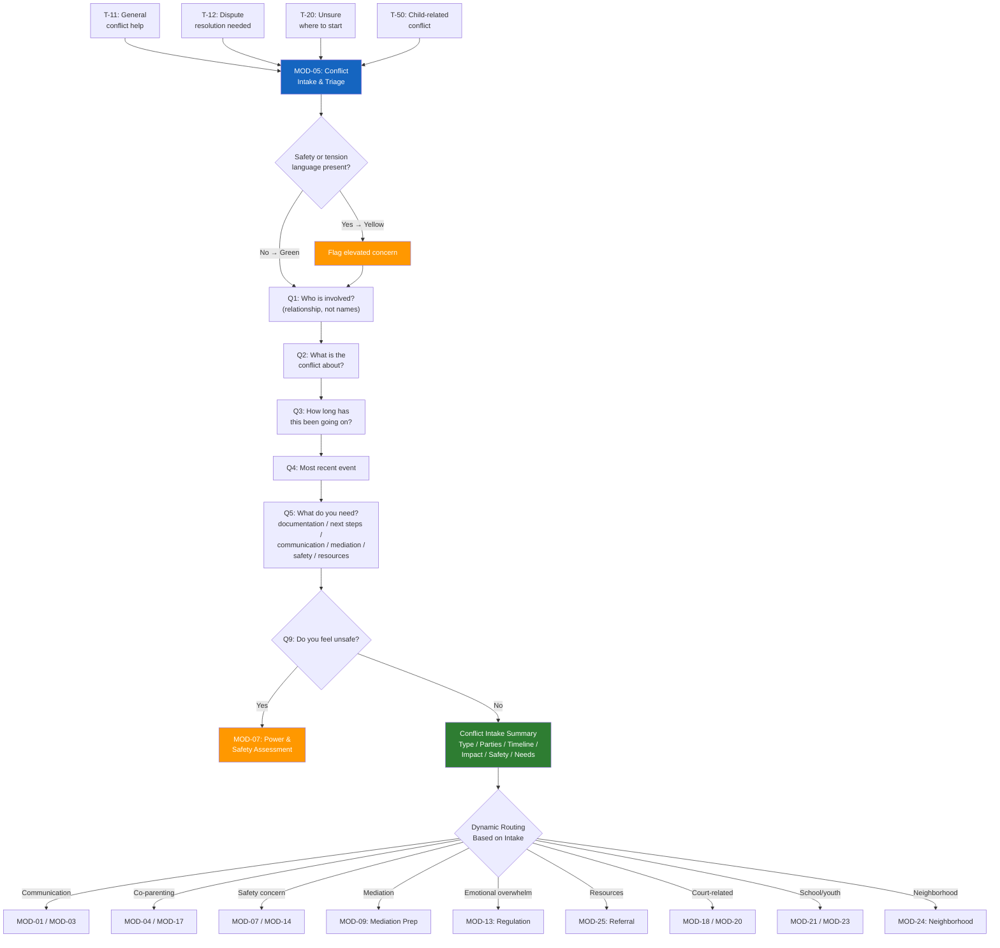

# MOD-05 — Conflict Intake & Triage

## Purpose
Structured intake for any conflict situation. Produces a neutral conflict summary,
identifies safety concerns, and routes to the next appropriate module.

## Triggers
T-11, T-12, T-20, T-50

## Roles
All

## Safety Level
Green (default) / Yellow if tension or safety language present

---

## Question Set

**Required:**
1. Who is involved in this conflict? (relationship, not names — e.g., "my co-parent," "my neighbor," "my employer")
2. What is the conflict about? (brief description in your own words)
3. How long has this been going on?
4. What happened most recently?
5. What do you need most right now? (options: documentation, advice on next steps, help communicating, help preparing for mediation, safety support, resources)

**Optional:**
6. Is a child involved? (yes / no)
7. Is there an active legal case related to this? (yes / no / unsure)
8. Have you tried to resolve this before? What happened?
9. Is there anything that makes you feel unsafe? (yes / no — if yes, route to MOD-07)

---

## Output Format

### Conflict Intake Summary

**Date of intake:** [system date]
**Role:** [user role]
**Conflict type:** [categorized: co-parenting / neighbor / workplace / school / family / community / other]

**Parties involved:**
- [Party A]: [relationship]
- [Party B]: [relationship]
- [Other parties]: [if any]

**Presenting conflict:**
[Neutral, 2–3 sentence summary of what the user described. No editorializing.]

**Timeline:**
- Duration: [X weeks / months / years]
- Most recent incident: [date/approximate + neutral description]

**Current impact:**
[Brief neutral summary of practical, emotional, or relational impact described by user.]

**Safety notes:**
[None identified / See safety flag: [brief note]]

**What the user needs:**
[User's stated need]

**Recommended next module(s):**
- Primary: [module name]
- Secondary: [module name, if applicable]

---

## Quality Gates
- [ ] Neutral language throughout — no advocacy for either party
- [ ] Safety check completed (if any safety language present, MOD-07 flagged)
- [ ] No names — placeholder relationships used
- [ ] Next module recommendation included

## Recommended Next Modules
Dynamically determined by intake — include in every output:
- **Communication** conflict -> MOD-01 (message rewriting) or MOD-03 (NVC)
- **Co-parenting** conflict -> MOD-04 (co-parenting rewriter) or MOD-17 (parenting plan log)
- **Safety concerns** detected -> MOD-07 (power & safety assessment) or MOD-14 (safety plan)
- **Mediation** needed -> MOD-09 (mediation session prep)
- **Emotional overwhelm** -> MOD-13 (emotional regulation)
- **Needs resources** -> MOD-25 (service referral)
- **Court-related** -> MOD-18 (court prep) or MOD-20 (case documentation)
- **School/youth** conflict -> MOD-21 (peer conflict) or MOD-23 (youth check-in)
- **Neighborhood** conflict -> MOD-24 (neighborhood dispute navigator)

---

## Worked Example

**User input:**
> Role: Individual (IND). "I need help with a conflict. My co-parent and I can't agree on anything about our son's school schedule. It's been going on for about 6 months. Last week they didn't bring him to his tutoring session and blamed me for not reminding them. I need help communicating without it turning into a fight every time."
>
> Child involved: yes. Active legal case: no. Feel unsafe: no.

### Conflict Intake Summary

**Date of intake:** 2025-03-15
**Role:** Individual (IND)
**Conflict type:** Co-parenting

**Parties involved:**
- [Parent A]: self (reporting parent)
- [Parent B]: co-parent
- [Child]: son (school-age)

**Presenting conflict:**
[Parent A] and [Parent B] are in ongoing disagreement regarding their son's school schedule and extracurricular activities. Communication about logistics frequently escalates into conflict. Both parents appear to want what's best for [Child] but disagree on responsibilities and communication methods.

**Timeline:**
- Duration: approximately 6 months
- Most recent incident: [Parent B] did not bring [Child] to a scheduled tutoring session; disagreement followed about whose responsibility it was to communicate the schedule

**Current impact:**
The conflict is creating stress around routine school logistics and is affecting the quality of co-parenting communication. [Parent A] reports that most exchanges escalate into arguments.

**Safety notes:**
None identified.

**What the user needs:**
Help communicating without escalation — specifically around schedule logistics.

**Recommended next module(s):**
- Primary: **MOD-04** Co-Parenting Communication Rewriter — rewrite messages for neutral, child-centered communication
- Secondary: **MOD-17** Parenting Plan Communication Log — begin tracking communications for pattern awareness

## Disclaimer
Append Block A. Add Block E if child is involved.
