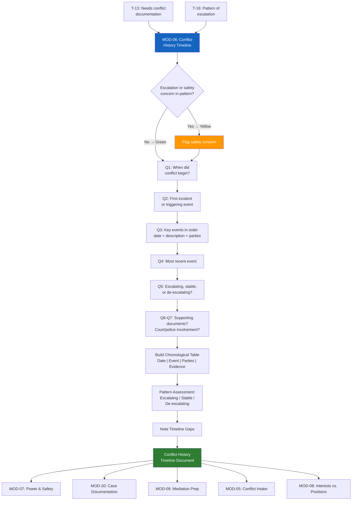

# MOD-06 — Conflict History Timeline

## Purpose
Build a structured, chronological, neutral timeline of a conflict's history.
Used for documentation, mediation prep, and court context.

## Triggers
T-13, T-16

## Roles
All — especially ATT, GAL, JDG, MED

## Safety Level
Green / Yellow if pattern indicates escalation or safety concern

---

## Question Set

**Required:**
1. When did this conflict begin (approximate date or time period)?
2. What was the first incident or event that started the conflict?
3. List the key events since then, in order. For each: approximate date, what happened (neutral description), who was involved.
4. What is the most recent event?
5. Has the conflict escalated, stayed the same, or de-escalated over time?

**Optional:**
6. Are there any documents, messages, or records that correspond to events on this timeline?
7. Has there been any court involvement, police contact, or formal complaints?

---

## Output Format

### Conflict History Timeline

**Conflict type:** [categorized]
**Parties:** [Party A] / [Party B] / [others as applicable]
**Timeline prepared:** [system date]

| Date (approx.) | Event | Parties Involved | Notes / Evidence |
|----------------|-------|-----------------|-----------------|
| [date] | [neutral description] | [Party A, Party B] | [document ref or blank] |
| [date] | [neutral description] | | |

**Pattern assessment:**
- Escalating / Stable / De-escalating
- [Brief neutral note on pattern if clear]

**Safety flag:** [None / See note: ___]

**Gaps in timeline:** [Any periods the user couldn't account for — noted as "gap"]

---

## Quality Gates
- [ ] All events described neutrally — no blame language
- [ ] Dates marked approximate where uncertain
- [ ] Safety flag raised if escalation pattern detected
- [ ] Gap periods noted, not assumed

## Recommended Next Modules
- **MOD-07** Power & Safety Assessment — if the timeline reveals escalation or safety concerns
- **MOD-20** Case Documentation Summary — compile the timeline into a formal case document
- **MOD-09** Mediation Session Prep — use the timeline to prepare for mediation
- **MOD-05** Conflict Intake — if the timeline reveals additional issues not yet triaged
- **MOD-08** Interests vs. Positions Mapper — understand what's driving the pattern

---

## Worked Example

**User input:**
> Role: Individual (IND). Q1: About 8 months ago, around August 2025. Q2: [Person B] (supervisor) reassigned my key project without explanation. Q3: (see events below in order). Q4: Most recent event was a written warning I received last week. Q5: Escalating. Q6: I have emails and one written warning document. Q7: No court or police involvement. I did file an internal HR complaint.

### Conflict History Timeline

**Conflict type:** Workplace — supervisor/employee dispute
**Parties:** [Person A] (employee) / [Person B] (supervisor)
**Timeline prepared:** April 9, 2026

| Date (approx.) | Event | Parties Involved | Notes / Evidence |
|----------------|-------|-----------------|-----------------|
| Aug 2025 | [Person A]'s lead project reassigned to another team member without prior discussion or explanation. | [Person A], [Person B] | Email from [Person B] notifying reassignment |
| Sep 2025 | [Person A] requested a meeting with [Person B] to discuss the reassignment. [Person B] declined, stating the decision was final. | [Person A], [Person B] | Email exchange |
| Nov 2025 | [Person A] received a negative performance review citing "lack of initiative," which [Person A] disputes as inconsistent with prior reviews. | [Person A], [Person B] | Performance review document; prior reviews available for comparison |
| Jan 2026 | [Person A] filed an internal complaint with Human Resources describing a pattern of exclusion and unexplained changes in responsibilities. | [Person A], [Person B], HR | HR complaint record |
| Mar 2026 | [Person B] reassigned [Person A] to a different team without discussion. Workload reduced significantly. | [Person A], [Person B] | Internal transfer notification |
| Apr 2026 | [Person A] received a written warning for "performance issues." [Person A] reports this is the first formal warning and does not reflect prior feedback. | [Person A], [Person B] | Written warning document |

**Pattern assessment:**
- Escalating
- The timeline shows a progression from a single unexplained decision to repeated exclusion, a disputed performance review, and a formal written warning. Each event represents an increase in severity. The pattern accelerated after the HR complaint was filed.

**Safety flag:** None

**Gaps in timeline:**
- October 2025: No specific events reported between the declined meeting (September) and the performance review (November). It may be helpful to note whether any informal interactions, emails, or changes in duties occurred during this period.
- December 2025: No events reported between the performance review and the HR complaint. Any relevant communications from this period could strengthen documentation.

## Disclaimer
Append Block A. Add Block B if court context.
