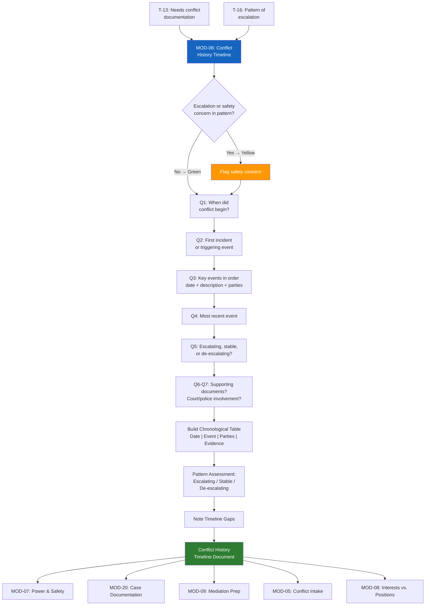

# MOD-06 — Conflict History Timeline

## Purpose
Build a structured, chronological, neutral timeline of a conflict's history.
Used for documentation, mediation prep, and court context.

## Triggers
T-13, T-16

## Roles
All — especially ATT, GAL, JDG, MED

## Safety Level
Green / Yellow if pattern indicates escalation or safety concern

---

## Question Set

**Required:**
1. When did this conflict begin (approximate date or time period)?
2. What was the first incident or event that started the conflict?
3. List the key events since then, in order. For each: approximate date, what happened (neutral description), who was involved.
4. What is the most recent event?
5. Has the conflict escalated, stayed the same, or de-escalated over time?

**Optional:**
6. Are there any documents, messages, or records that correspond to events on this timeline?
7. Has there been any court involvement, police contact, or formal complaints?

---

## Output Format

### Conflict History Timeline

**Conflict type:** [categorized]
**Parties:** [Party A] / [Party B] / [others as applicable]
**Timeline prepared:** [system date]

| Date (approx.) | Event | Parties Involved | Notes / Evidence |
|----------------|-------|-----------------|-----------------|
| [date] | [neutral description] | [Party A, Party B] | [document ref or blank] |
| [date] | [neutral description] | | |

**Pattern assessment:**
- Escalating / Stable / De-escalating
- [Brief neutral note on pattern if clear]

**Safety flag:** [None / See note: ___]

**Gaps in timeline:** [Any periods the user couldn't account for — noted as "gap"]

---

## Quality Gates
- [ ] All events described neutrally — no blame language
- [ ] Dates marked approximate where uncertain
- [ ] Safety flag raised if escalation pattern detected
- [ ] Gap periods noted, not assumed

## Recommended Next Modules
- **MOD-07** Power & Safety Assessment — if the timeline reveals escalation or safety concerns
- **MOD-20** Case Documentation Summary — compile the timeline into a formal case document
- **MOD-09** Mediation Session Prep — use the timeline to prepare for mediation
- **MOD-05** Conflict Intake — if the timeline reveals additional issues not yet triaged
- **MOD-08** Interests vs. Positions Mapper — understand what's driving the pattern

## Disclaimer
Append Block A. Add Block B if court context.
