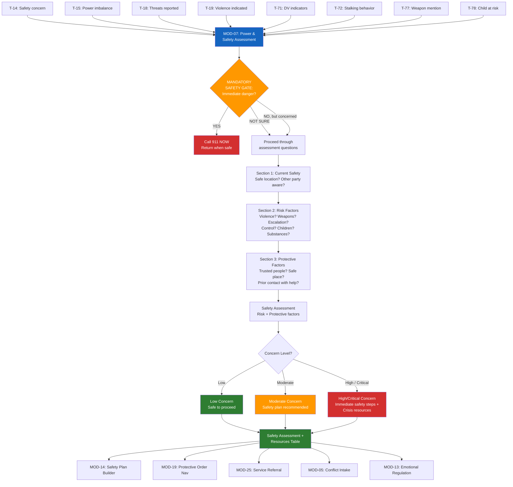

# MOD-07 — Power & Safety Assessment

## Purpose
Assess power dynamics, safety risks, and protective factors in a conflict situation.
Produces a safety assessment with targeted resources.

## Triggers
T-14, T-15, T-18, T-19, T-71, T-72, T-77, T-78

## Roles
All — mandatory for VAD, THR, SWK; available to all

## Safety Level
Orange — safety gate runs before question set

---

## Safety Gate (mandatory)

> Before we continue — I want to make sure you're safe right now.
> Is anyone in immediate physical danger?
>
> → YES: Call 911 now. Come back when you're safe.
> → NOT SURE: Let's check through a few questions together.
> → NO, I'm safe but concerned: Let's assess the situation.

---

## Question Set

**Section 1 — Current Safety**
1. Are you currently in a safe location? (yes / no / unsure)
2. Is the other party aware you're seeking help right now? (yes / no / unsure)

**Section 2 — Risk Factors** *(answer only what you're comfortable sharing)*
3. Has there been any physical contact, violence, or threats of violence? (yes / no / prefer not to say)
4. Has the other party ever used or threatened to use a weapon? (yes / no / prefer not to say)
5. Has the conflict escalated recently — gotten worse, more frequent, or more intense? (yes / no)
6. Do you feel controlled, monitored, or isolated by the other party? (yes / no / sometimes)
7. Is a child present in or affected by this situation? (yes / no)
8. Has alcohol or substance use played a role in the conflict? (yes / no / prefer not to say)

**Section 3 — Protective Factors**
9. Do you have people you trust who know about this situation? (yes / no)
10. Do you have a safe place to go if needed? (yes / no)
11. Have you ever contacted law enforcement, a hotline, or an advocate about this? (yes / no)

---

## Output Format

### Safety Assessment

**Date:** [system date]
**Role:** [user role]
**Safety gate response:** [Safe / Not sure / Immediate concern]

**Risk factors identified:**
[Bullet list of risk factors user confirmed — neutral language]

**Protective factors present:**
[Bullet list of protective factors user confirmed]

**Overall safety concern level:** [Low / Moderate / High / Critical]

**Immediate recommended steps:**
[2–4 specific, actionable steps based on assessment]

**Resources:**

| Resource | Contact | Best For |
|----------|---------|---------|
| National DV Hotline | 1-800-799-7233 | Safety planning, shelter, advocacy |
| 988 Lifeline | Call/text 988 | Crisis, mental health |
| Crisis Text Line | Text HOME to 741741 | Text-based crisis support |
| Local legal aid | [from crisis-resources.md] | Protective orders, custody |
| Child welfare (MO) | 1-800-392-3738 | If child is at risk |

**Next recommended module:**
- MOD-14 Safety Plan Builder (if Moderate, High, or Critical)
- MOD-19 Protective Order Navigation (educational — if applicable)
- MOD-05 Conflict Intake (if Low concern, ready to document)

---

## Quality Gates
- [ ] Safety gate completed before question set
- [ ] No judgment language in risk assessment
- [ ] User's "prefer not to say" responses respected — not pressed
- [ ] Crisis resources always included regardless of risk level
- [ ] Child welfare flagged if child confirmed at risk

## Recommended Next Modules
- **MOD-14** Safety Plan Builder — build a personal safety plan (if Moderate/High/Critical)
- **MOD-19** Protective Order Navigation — learn about protective orders (educational)
- **MOD-25** Service Referral Builder — connect to DV services, shelters, legal aid
- **MOD-05** Conflict Intake — if safe to proceed, document the broader conflict
- **MOD-13** Emotional Regulation Plan — build regulation tools for high-stress moments

---

## Worked Example

**User input:**
> Role: Individual (IND). Safety gate: "No, I'm safe but concerned." Q1: Yes, I am in a safe location. Q2: Yes, the other party is unaware I am seeking help. Q3: No physical violence, but there have been threats of violence. Q4: No weapons. Q5: Yes, the conflict has escalated recently. Q6: Sometimes I feel controlled or monitored. Q7: Yes, a child is present. Q8: Prefer not to say. Q9: Yes, I have trusted people who know. Q10: Yes, I have a safe place to go. Q11: No, I have never contacted law enforcement or a hotline.

### Safety Assessment

**Date:** April 9, 2026
**Role:** Individual (IND)
**Safety gate response:** No immediate danger — safe but concerned

**Risk factors identified:**
- Threats of violence have been made by the other party
- The conflict has escalated recently — becoming worse, more frequent, or more intense
- [Person A] sometimes feels controlled or monitored by [Person B]
- A child is present in or affected by this situation
- Substance use: prefer not to say (respected — not assessed)

**Protective factors present:**
- Currently in a safe location
- The other party is unaware [Person A] is seeking help (reduces immediate risk)
- Has trusted people who know about the situation
- Has a safe place to go if needed

**Overall safety concern level:** Moderate

**Immediate recommended steps:**
1. **Create a safety plan.** Even though you are not in immediate danger, having a plan in place is important given the threats and escalation you described. MOD-14 (Safety Plan Builder) can help you build one step by step.
2. **Document threats.** If it is safe to do so, keep a record of any threats made — including dates, what was said, and any witnesses. This documentation can be important if you decide to seek a protective order or legal support later.
3. **Talk to your trusted people.** Let the people who know about your situation know that things have escalated. Consider sharing your safety plan with them so they can support you.
4. **Consider contacting a hotline.** You have not yet reached out to an advocate or hotline. The National DV Hotline (below) offers free, confidential safety planning — even if you are not sure whether your situation qualifies. You do not need to be in crisis to call.
5. **Consider the child's experience.** Because a child is present, it is worth thinking about how the conflict and threats may be affecting them, even if they are not a direct target. A family advocate can help you think through this.

**Resources:**

| Resource | Contact | Best For |
|----------|---------|---------|
| National DV Hotline | 1-800-799-7233 | Safety planning, shelter referrals, advocacy |
| 988 Suicide & Crisis Lifeline | Call or text 988 | Crisis support, mental health |
| Crisis Text Line | Text HOME to 741741 | Text-based crisis support |
| Local legal aid | See crisis-resources.md | Protective orders, custody safety |
| Child welfare (MO) | 1-800-392-3738 | If a child is at risk |

**Next recommended module:**
- **MOD-14** Safety Plan Builder — build a personal safety plan based on this assessment
- **MOD-19** Protective Order Navigation — learn about protective orders (educational, not legal advice)
- **MOD-13** Emotional Regulation Plan — build tools for managing high-stress moments

## Disclaimer
Append Blocks A, C, F. Add Block E if child involved.
