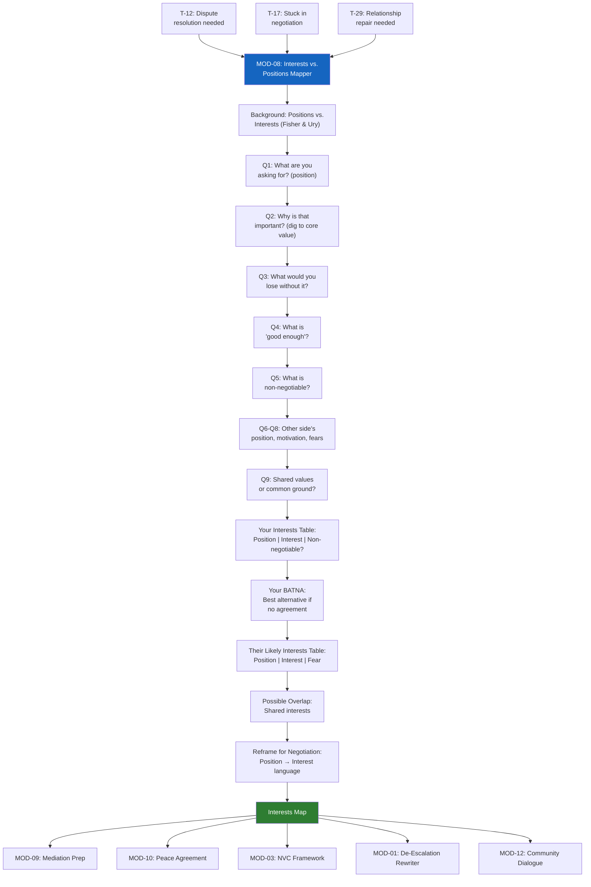

# MOD-08 — Interests vs. Positions Mapper

## Purpose
Help a user distinguish between their stated position (what they're demanding)
and their underlying interest (what they actually need). Essential for mediation
prep, negotiation, and breaking deadlock.

## Triggers
T-12, T-17, T-29

## Roles
All — especially MED, ARB, CCH, ATT, IND

## Safety Level
Green

---

## Background (share with user if unfamiliar)

> **Positions** are what people say they want: "I want full custody."
> **Interests** are why they want it: "I need my child to be stable and safe."
>
> Conflicts often get stuck because people fight over positions.
> Resolution happens when people find ways to meet each other's interests.
> — Based on Fisher & Ury, *Getting to Yes* (1981)

---

## Question Set

**Your side:**
1. What are you asking for? (your position — what you want the outcome to be)
2. Why is that important to you? (keep asking "why" until you reach a core value)
3. What would you lose if you didn't get exactly what you asked for?
4. What would a "good enough" outcome look like — even if not your ideal?
5. What is absolutely non-negotiable for you? Why?

**The other side (to build empathy, not concede):**
6. What do you think they are asking for?
7. Why do you think that matters to them?
8. What might they be afraid of losing?

**Overlap:**
9. Is there anything both parties might actually agree on at a values level — even if you disagree on the solution?

---

## Output Format

### Interests Map

#### Your Interests
| Position (what you said you want) | Underlying Interest (why you want it) | Non-negotiable? |
|----------------------------------|--------------------------------------|----------------|
| [position] | [interest] | Yes / No |

**Your core interests (distilled):**
[2–3 bullet points — the values underneath the position]

**Your BATNA (best alternative if no agreement):**
[What the user said they would do if no resolution]

---

#### Their Likely Interests (your perspective)
| Their Position | Likely Underlying Interest | What They Might Fear Losing |
|---------------|--------------------------|---------------------------|
| [position] | [interest] | [fear] |

---

#### Possible Overlap
[Areas where both parties' core interests could be served — even if the solutions look different]

---

#### Reframe for Negotiation
> Instead of: *"I want [position]"*
> Try: *"What I really need is [interest]. Is there a way we could meet that?"*

---

## Quality Gates
- [ ] Positions and interests are clearly distinguished
- [ ] Other party's interests framed with empathy — not as accusations
- [ ] BATNA noted (even if "I don't know yet")
- [ ] Neutral language throughout

## Recommended Next Modules
- **MOD-09** Mediation Session Prep — take your interests map into mediation preparation
- **MOD-10** Peace Agreement Builder — if both parties are ready to formalize terms
- **MOD-03** NVC Framework — frame your interests using NVC language
- **MOD-01** De-Escalation Message Rewriter — communicate your interests without escalation
- **MOD-12** Community Dialogue Facilitator — if this is a group/community conflict

---

## Worked Example

**User input:**
> Role: Parent (PAR). Q1: I want the children on weekdays. Q2: I want to be involved in their school routine and help with homework. Q3: I would lose daily involvement in their education and feel disconnected from their school life. Q4: Good enough would be having them on most school nights and being the contact for school communications. Q5: Non-negotiable: being able to attend all school events — conferences, performances, games. Q6: I think they want equal time — a 50/50 schedule. Q7: They want to feel like an equal parent and not be sidelined. Q8: They might be afraid of losing time with the children and being seen as a less involved parent. Q9: We both want the children to succeed in school and feel supported by both parents.

### Interests Map

#### Your Interests

| Position (what you said you want) | Underlying Interest (why you want it) | Non-negotiable? |
|----------------------------------|--------------------------------------|----------------|
| Children on weekdays | Daily involvement in school routine and homework | No |
| Be the school contact parent | Connection to children's education and ability to support their learning | No |
| Attend all school events | Presence at conferences, performances, and games — maintaining visible involvement in children's lives | Yes |

**Your core interests (distilled):**
- Being actively involved in your children's day-to-day education
- Maintaining a close connection to their school life and routines
- Being present for meaningful school moments

**Your BATNA (best alternative if no agreement):**
If no agreement is reached, the current arrangement or a court-determined schedule would apply. This may result in less weekday time than desired and less control over school involvement. Reaching a mediated agreement is likely to give both parents more flexibility than a court order.

---

#### Their Likely Interests (your perspective)

| Their Position | Likely Underlying Interest | What They Might Fear Losing |
|---------------|--------------------------|---------------------------|
| Equal (50/50) time | Feeling like an equal, involved parent | Time with the children; being seen as less important or less involved |
| Shared schedule | Fairness and recognition as a capable, engaged parent | Their role in the children's daily life and routines |

---

#### Possible Overlap
- Both parents want the children to succeed in school and feel supported
- Both parents want to be actively involved — neither wants to be sidelined
- Both parents value the children's stability and educational success
- There may be room for a schedule that gives both parents meaningful school-night time while ensuring [Parent A] can attend all school events — and [Parent B] can too

---

#### Reframe for Negotiation
> Instead of: *"I want the children on weekdays."*
> Try: *"What I really need is to be involved in the children's school routine — helping with homework, being available for school communications, and attending every school event. Is there a way we could build a schedule that lets me do that while also making sure you have meaningful time with them during the week?"*

## Disclaimer
Append Block A. Add Block D if mediation or agreement context.
