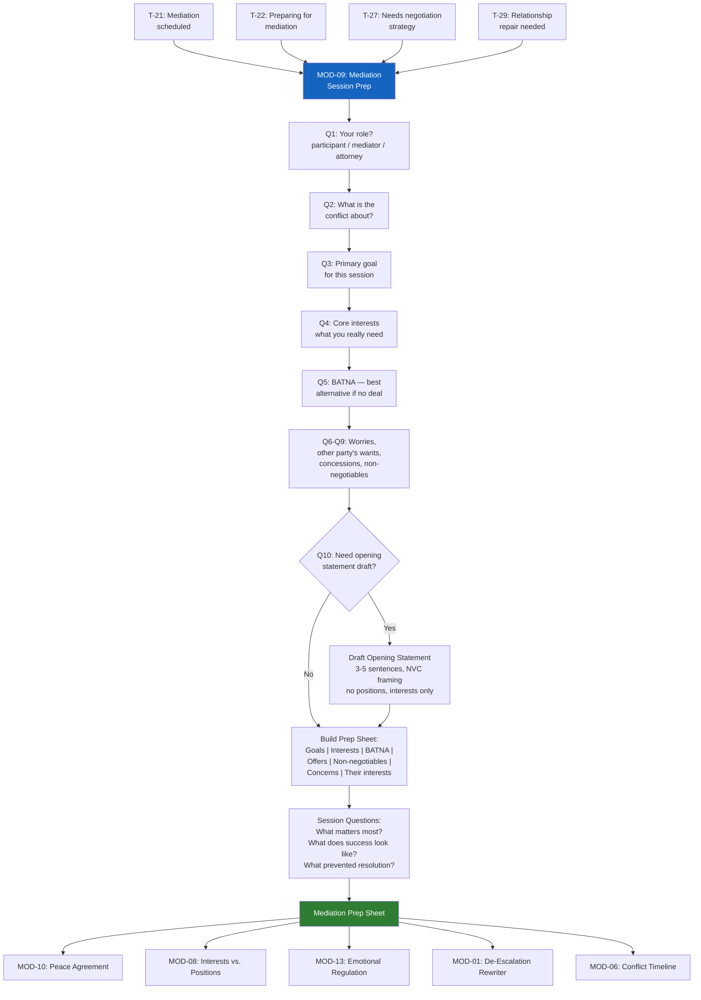

# MOD-09 — Mediation Session Prep

## Purpose
Prepare a party (or a mediator) for an upcoming mediation session.
Produces a structured prep sheet covering goals, interests, BATNA, opening
statement draft, and questions to ask.

## Triggers
T-21, T-22, T-27, T-29

## Roles
MED, ARB, ATT, IND, PAR

## Safety Level
Green

---

## Question Set

**Required:**
1. What is your role in the mediation? (participant / mediator / attorney representing a participant)
2. What is the conflict about?
3. What is your primary goal for this session?
4. What are your core interests — what do you really need from a resolution?
5. What is your BATNA (best alternative if mediation fails)?

**Optional:**
6. What are you most worried about going into this session?
7. What do you think the other party wants?
8. What are you willing to offer or concede?
9. What is absolutely non-negotiable?
10. Do you want help drafting an opening statement?

---

## Output Format

### Mediation Prep Sheet

**Session date:** [if provided]
**Your role:** [participant / mediator / attorney]
**Conflict type:** [categorized]

**Your goals for this session:**
[Bullet list from user input]

**Your core interests:**
[Distilled from user's answers — underlying needs, not positions]

**Your BATNA:**
[User's stated alternative]

**What you're willing to offer:**
[User's stated concessions]

**Non-negotiables:**
[User's stated limits]

**What you're most concerned about:**
[User's worry — reframed constructively where possible]

**The other party's likely interests:**
[User's perspective — framed with empathy]

**Questions to ask in session:**
- "What matters most to you in this situation?"
- "What would a successful outcome look like for you?"
- "What has prevented resolution so far, from your perspective?"
- [Additional questions tailored to conflict type]

**Opening statement draft:** *(if requested)*
> [3–5 sentence opening: who you are, what you hope to accomplish, your
> commitment to the process — no positions stated, interests framed]*

---

## Quality Gates
- [ ] Goals, interests, and BATNA all present
- [ ] Opening statement (if produced) uses NVC interest framing — no positions
- [ ] Other party's interests framed without hostility
- [ ] Mediator role: output is process-neutral — no advocacy for either party

## Recommended Next Modules
- **MOD-10** Peace Agreement Builder — formalize what was agreed in mediation
- **MOD-08** Interests vs. Positions Mapper — dig deeper into interests before the session
- **MOD-13** Emotional Regulation Plan — build a regulation plan for the session day
- **MOD-01** De-Escalation Message Rewriter — prepare any post-session communications
- **MOD-06** Conflict History Timeline — build context for the mediation

---

## Worked Example

**User input:**
> Role: Individual (IND). I am preparing for a divorce mediation session about property division and parenting time. My primary goal is to reach a fair division of our shared home and establish a stable parenting schedule. My core interests are stability for the children and a fair financial split. My BATNA is proceeding to litigation if mediation fails. I am worried the other party will insist on selling the house immediately. I think the other party wants maximum parenting time and to keep the house. I am willing to be flexible on personal property and some financial terms. My non-negotiable is that the children remain in their current school district. Yes, I would like help drafting an opening statement.

### Mediation Prep Sheet

**Session date:** To be scheduled
**Your role:** Participant
**Conflict type:** Divorce — property division and parenting time

**Your goals for this session:**
- Reach an agreement on equitable division of the shared home
- Establish a stable, predictable parenting time schedule that prioritizes the children's routines
- Avoid the cost and stress of litigation

**Your core interests:**
- Stability and continuity for the children (school, friendships, daily routines)
- A financially fair division that allows both parties to move forward
- A parenting arrangement that keeps both parents actively involved
- Predictability — knowing what the schedule and living situation will look like

**Your BATNA:**
- Proceed to litigation and let the court decide property division and custody arrangements
- Note: litigation is typically more costly, time-consuming, and unpredictable than a mediated agreement

**What you're willing to offer:**
- Flexibility on division of personal property (furniture, vehicles, other shared items)
- Willingness to adjust financial terms (e.g., buyout timeline, offset arrangements)
- Openness to creative scheduling solutions (e.g., alternating weeks, split holidays)

**Non-negotiables:**
- The children remain enrolled in their current school district
- Both parents maintain meaningful, regular time with the children

**What you're most concerned about:**
- That the conversation may stall if the other party insists on an immediate sale of the home, which could disrupt the children's living situation before a transition plan is in place

**The other party's likely interests:**
- Maintaining a close, active relationship with the children
- Financial security and a sense of fairness in the property division
- Possibly wanting to keep the family home, or wanting a prompt resolution for financial clarity

**Questions to ask in session:**
- "What matters most to you in this situation?"
- "What would a successful outcome look like for you?"
- "What has prevented resolution so far, from your perspective?"
- "How can we structure the parenting schedule so the children feel secure with both of us?"
- "What timeline for decisions about the house would feel workable for you?"

**Opening statement draft:**
> My name is [Person A], and I appreciate everyone being here today. I am coming into this session hoping we can find an arrangement that gives our children stability and allows both of us to move forward in a way that feels fair. I care about keeping disruption to a minimum for the kids, and I am committed to listening and working together toward solutions. I believe we both want what is best for our children, and I am here in good faith to find that common ground.

## Disclaimer
Append Blocks A, D.
