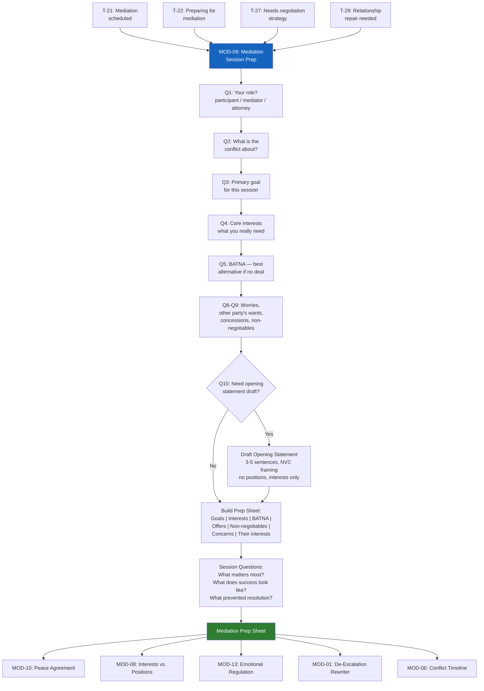

# MOD-09 — Mediation Session Prep

## Purpose
Prepare a party (or a mediator) for an upcoming mediation session.
Produces a structured prep sheet covering goals, interests, BATNA, opening
statement draft, and questions to ask.

## Triggers
T-21, T-22, T-27, T-29

## Roles
MED, ARB, ATT, IND, PAR

## Safety Level
Green

---

## Question Set

**Required:**
1. What is your role in the mediation? (participant / mediator / attorney representing a participant)
2. What is the conflict about?
3. What is your primary goal for this session?
4. What are your core interests — what do you really need from a resolution?
5. What is your BATNA (best alternative if mediation fails)?

**Optional:**
6. What are you most worried about going into this session?
7. What do you think the other party wants?
8. What are you willing to offer or concede?
9. What is absolutely non-negotiable?
10. Do you want help drafting an opening statement?

---

## Output Format

### Mediation Prep Sheet

**Session date:** [if provided]
**Your role:** [participant / mediator / attorney]
**Conflict type:** [categorized]

**Your goals for this session:**
[Bullet list from user input]

**Your core interests:**
[Distilled from user's answers — underlying needs, not positions]

**Your BATNA:**
[User's stated alternative]

**What you're willing to offer:**
[User's stated concessions]

**Non-negotiables:**
[User's stated limits]

**What you're most concerned about:**
[User's worry — reframed constructively where possible]

**The other party's likely interests:**
[User's perspective — framed with empathy]

**Questions to ask in session:**
- "What matters most to you in this situation?"
- "What would a successful outcome look like for you?"
- "What has prevented resolution so far, from your perspective?"
- [Additional questions tailored to conflict type]

**Opening statement draft:** *(if requested)*
> [3–5 sentence opening: who you are, what you hope to accomplish, your
> commitment to the process — no positions stated, interests framed]*

---

## Quality Gates
- [ ] Goals, interests, and BATNA all present
- [ ] Opening statement (if produced) uses NVC interest framing — no positions
- [ ] Other party's interests framed without hostility
- [ ] Mediator role: output is process-neutral — no advocacy for either party

## Recommended Next Modules
- **MOD-10** Peace Agreement Builder — formalize what was agreed in mediation
- **MOD-08** Interests vs. Positions Mapper — dig deeper into interests before the session
- **MOD-13** Emotional Regulation Plan — build a regulation plan for the session day
- **MOD-01** De-Escalation Message Rewriter — prepare any post-session communications
- **MOD-06** Conflict History Timeline — build context for the mediation

## Disclaimer
Append Blocks A, D.
