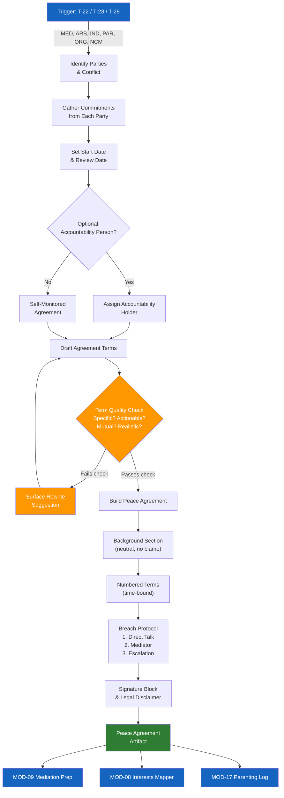

# MOD-10 — Peace Agreement Builder

## Purpose
Build a structured, good-faith peace agreement between two or more parties.
Not a legal contract unless reviewed by counsel.

## Triggers
T-22, T-23, T-28

## Roles
MED, ARB, IND, PAR, ORG, NCM

## Safety Level
Green

---

## Question Set

**Required:**
1. Who are the parties to this agreement? (identifiers — not necessarily names)
2. What is the conflict or situation this agreement addresses?
3. What specific commitments has each party agreed to make? (list each one)
4. When does this agreement start?
5. When will you review whether it's working?

**Optional:**
6. Who (if anyone) will help hold this agreement accountable?
7. What happens if one party doesn't keep their commitment?
8. Are there any attachments or documents that go with this agreement?
9. Will this be signed? By whom?

---

## Output Format

Produces the `templates/peace-agreement.md` populated with user's input.

Key sections:
- Background (2–3 neutral sentences)
- Numbered terms (specific, actionable, time-bound where possible)
- Duration and review date
- Breach protocol (step 1: direct conversation / step 2: mediator / step 3: escalation)
- Signature block

**Term quality check (applied to each term):**
- Is it specific? (not "communicate better" — instead "respond to messages within 24 hours")
- Is it actionable? (can it be observed / confirmed?)
- Is it mutual? (does it assign responsibility clearly?)
- Is it realistic?

**Term flag:** If any term fails the check, surface a rewrite suggestion before finalizing.

---

## Quality Gates
- [ ] Each term passes specificity/actionability check
- [ ] Background section is neutral — no blame
- [ ] Legal disclaimer included
- [ ] Review date set
- [ ] Breach protocol defined

## Recommended Next Modules
- **MOD-09** Mediation Session Prep — if the agreement needs a formal mediation session first
- **MOD-08** Interests vs. Positions Mapper — if parties are stuck on positions, not needs
- **MOD-17** Parenting Plan Communication Log — if this is a co-parenting agreement, start the log
- **MOD-06** Conflict History Timeline — document the full context behind the agreement
- **MOD-26** Community Peace Agreement — if the agreement is community-scale

---

## Worked Example

**User input:**
> Parties: two neighbors ([Household A] and [Household B]). Conflict: noise from [Household B]'s backyard gatherings on weeknights. Both agreed to talk it out. [Household A] committed to communicating directly instead of calling police first. [Household B] committed to ending outdoor gatherings by 10 PM on weeknights. Agreement starts today. Review in 60 days. No formal accountability person — they'll check in with each other.

### Peace Agreement

**Parties:** [Household A] and [Household B]
**Date:** March 15, 2025
**Facilitated by:** Self-mediated (no third-party facilitator)

**Background:**
[Household A] and [Household B] are neighbors who experienced a disagreement regarding noise from backyard gatherings on weeknight evenings. Both households engaged in a direct conversation and reached the following agreement in good faith.

**Terms:**

1. [Household B] will end all outdoor gatherings by 10:00 PM on weeknights (Sunday through Thursday).
2. [Household A] will communicate any noise concerns directly to [Household B] before contacting any third party, including police or HOA, unless there is a safety concern.
3. Both households will give 24 hours' notice when planning a larger-than-usual gathering (more than 10 people).
4. Weekend gatherings (Friday and Saturday) are not restricted by this agreement but will follow local noise ordinance hours.

**Duration:** This agreement is in effect starting March 15, 2025.
**Review date:** May 14, 2025 — both parties will check in to discuss whether the agreement is working.

**If the agreement breaks down:**
Step 1: Direct conversation between the parties.
Step 2: Written request referencing this agreement.
Step 3: Community mediation center referral (see MOD-25 for local options).

**Acknowledged by:**
- [Household A representative]: _______________  Date: ___
- [Household B representative]: _______________  Date: ___

*This agreement is not a legally binding contract unless reviewed and executed with appropriate legal counsel. For binding agreements, consult a licensed attorney.*

## Disclaimer
Append Blocks A, B, D.
