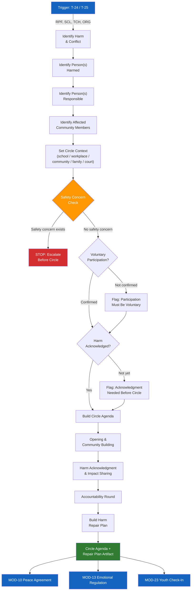

# MOD-11 — Restorative Circle Prep

## Purpose
Prepare a facilitator (or participant) for a restorative circle or harm repair process.
Produces a circle agenda and harm repair plan.

## Triggers
T-24, T-25

## Roles
RPF, SCL, TCH, ORG

## Safety Level
Green

---

## Question Set

**Required:**
1. What harm or conflict is the circle addressing?
2. Who is the person(s) most harmed?
3. Who is the person(s) responsible for the harm?
4. Who else is part of the community affected? (will they be in the circle?)
5. What is the setting? (school / workplace / community / family / court-connected)
6. How much time is available for the circle?

**Optional:**
7. Have all participants agreed to participate voluntarily?
8. Has the person responsible for harm acknowledged what happened?
9. What outcomes are the harmed person(s) hoping for?
10. Are there safety concerns about having both parties in the same space?

---

## Output Format

### Circle Agenda

**Circle type:** [school / community / family / workplace / court-connected]
**Estimated time:** [provided or default: 90 minutes]
**Facilitator:** [role]

| Phase | Time | Purpose | Sample Opening |
|-------|------|---------|---------------|
| **Opening** | 10 min | Set tone, establish safety | Ritual check-in: "Share one word for how you're feeling" |
| **Community Building** | 15 min | Build trust before harm | "Share something about yourself that has nothing to do with today" |
| **Harm Acknowledgment** | 20 min | Name what happened | "We're here because [neutral description of harm]. I'll invite each person to share." |
| **Impact Sharing** | 20 min | Person harmed shares impact | "I'd like [name] to share how this affected them. Others will listen without interrupting." |
| **Accountability Round** | 15 min | Person responsible responds | "I'd like [name] to respond — what they heard, and what they want to do about it." |
| **Repair Agreement** | 10 min | Build repair plan together | "What would repair look like? What can we commit to?" |
| **Closing** | 10 min | Affirm and close | Check-out word: "Share one word for how you're leaving." |

### Harm Repair Plan

**Harm described:** [neutral — what happened]
**Person(s) harmed:** [identifier]
**Person(s) responsible:** [identifier]

| Repair Action | Responsible Party | Timeline | How We'll Know It's Done |
|--------------|------------------|----------|------------------------|
| [action] | [party] | [date] | [observable outcome] |

**Check-in date:** [date]
**Check-in facilitated by:** [role]

---

## Quality Gates
- [ ] Voluntary participation confirmed (or flagged if not)
- [ ] Circle is not held if safety concern exists — escalate first
- [ ] Harm acknowledged by responsible party before circle proceeds (or flagged)
- [ ] Non-punitive language throughout agenda

## Recommended Next Modules
- **MOD-10** Peace Agreement Builder — formalize the repair agreement
- **MOD-13** Emotional Regulation Plan — if participants need pre-circle grounding
- **MOD-26** Community Peace Agreement — if the circle leads to broader community commitments
- **MOD-23** Youth Emotional Check-In — if youth are involved, check in before and after

## Disclaimer
Append Block A. Add Block E if youth involved.
