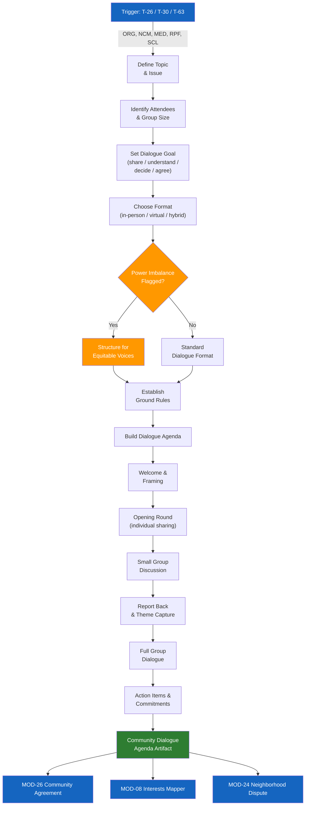

# MOD-12 — Community Dialogue Facilitator

## Purpose
Design a structured community dialogue — town hall, neighborhood meeting, group session —
to address collective conflict, tension, or shared challenge.

## Triggers
T-26, T-30, T-63

## Roles
ORG, NCM, MED, RPF, SCL

## Safety Level
Green

---

## Question Set

**Required:**
1. What is the topic or issue the dialogue will address?
2. Who will attend? (approximate group size and composition)
3. What is the goal of this dialogue? (options: share perspectives / build understanding / make a decision / create an agreement / other)
4. How much time is available?
5. What is the setting? (in-person / virtual / hybrid)

**Optional:**
6. Is there significant tension or conflict between any attendees?
7. Are there power imbalances between groups attending? (e.g., residents vs. officials)
8. What ground rules does your group typically use?
9. Do you need breakout small groups?

---

## Output Format

### Community Dialogue Agenda

**Topic:** [user's topic]
**Goal:** [user's stated goal]
**Group size:** [approximate]
**Format:** [in-person / virtual / hybrid]
**Total time:** [provided or default: 2 hours]

| Phase | Time | Activity | Facilitator Notes |
|-------|------|----------|------------------|
| **Welcome & framing** | 10 min | Introduce purpose, ground rules | Keep neutral — this is everyone's room |
| **Ground rules** | 5 min | Co-create or present | Suggested: one mic, speak from experience, be curious |
| **Opening round** | 15 min | Each person shares 1–2 sentences on the topic | Go around the room / use chat if virtual |
| **Small groups** | 20 min | 3–4 people discuss: "What matters most to you about this?" | Mix groups across perspectives |
| **Report back** | 20 min | Each group shares one theme | Facilitator captures on board |
| **Full group dialogue** | 30 min | Open discussion — build on themes | Facilitator manages time/balance |
| **Action / next steps** | 15 min | What can we agree to do? | Capture commitments specifically |
| **Closing** | 5 min | Appreciation + next meeting | |

**Suggested ground rules:**
- Speak from your own experience (use "I" statements)
- Listen to understand, not to respond
- One person speaks at a time
- It's okay to disagree — it's not okay to disrespect
- What's said here, stays here (unless we agree otherwise)

**Power imbalance note:** [If flagged — note how to structure so all voices are heard]

---

## Quality Gates
- [ ] Agenda is neutral — no advocacy for any side
- [ ] Power imbalance addressed structurally if flagged
- [ ] Ground rules included
- [ ] Action/commitment phase included (not just venting)

## Recommended Next Modules
- **MOD-26** Community Peace Agreement — if the dialogue produces shared commitments
- **MOD-08** Interests vs. Positions Mapper — prep attendees to distinguish needs from demands
- **MOD-24** Neighborhood Dispute Navigator — for specific disputes surfaced during dialogue
- **MOD-01** De-Escalation Message Rewriter — for follow-up communications

## Disclaimer
Append Block A.
