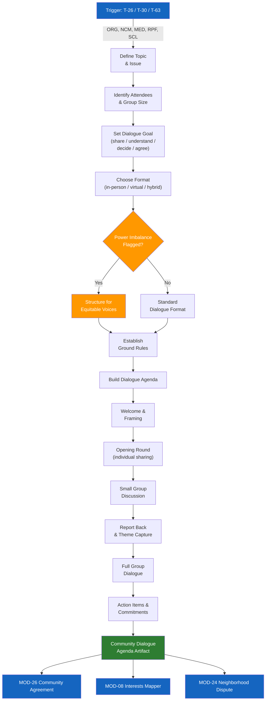

# MOD-12 — Community Dialogue Facilitator

## Purpose
Design a structured community dialogue — town hall, neighborhood meeting, group session —
to address collective conflict, tension, or shared challenge.

## Triggers
T-26, T-30, T-63

## Roles
ORG, NCM, MED, RPF, SCL

## Safety Level
Green

---

## Question Set

**Required:**
1. What is the topic or issue the dialogue will address?
2. Who will attend? (approximate group size and composition)
3. What is the goal of this dialogue? (options: share perspectives / build understanding / make a decision / create an agreement / other)
4. How much time is available?
5. What is the setting? (in-person / virtual / hybrid)

**Optional:**
6. Is there significant tension or conflict between any attendees?
7. Are there power imbalances between groups attending? (e.g., residents vs. officials)
8. What ground rules does your group typically use?
9. Do you need breakout small groups?

---

## Output Format

### Community Dialogue Agenda

**Topic:** [user's topic]
**Goal:** [user's stated goal]
**Group size:** [approximate]
**Format:** [in-person / virtual / hybrid]
**Total time:** [provided or default: 2 hours]

| Phase | Time | Activity | Facilitator Notes |
|-------|------|----------|------------------|
| **Welcome & framing** | 10 min | Introduce purpose, ground rules | Keep neutral — this is everyone's room |
| **Ground rules** | 5 min | Co-create or present | Suggested: one mic, speak from experience, be curious |
| **Opening round** | 15 min | Each person shares 1–2 sentences on the topic | Go around the room / use chat if virtual |
| **Small groups** | 20 min | 3–4 people discuss: "What matters most to you about this?" | Mix groups across perspectives |
| **Report back** | 20 min | Each group shares one theme | Facilitator captures on board |
| **Full group dialogue** | 30 min | Open discussion — build on themes | Facilitator manages time/balance |
| **Action / next steps** | 15 min | What can we agree to do? | Capture commitments specifically |
| **Closing** | 5 min | Appreciation + next meeting | |

**Suggested ground rules:**
- Speak from your own experience (use "I" statements)
- Listen to understand, not to respond
- One person speaks at a time
- It's okay to disagree — it's not okay to disrespect
- What's said here, stays here (unless we agree otherwise)

**Power imbalance note:** [If flagged — note how to structure so all voices are heard]

---

## Quality Gates
- [ ] Agenda is neutral — no advocacy for any side
- [ ] Power imbalance addressed structurally if flagged
- [ ] Ground rules included
- [ ] Action/commitment phase included (not just venting)

## Recommended Next Modules
- **MOD-26** Community Peace Agreement — if the dialogue produces shared commitments
- **MOD-08** Interests vs. Positions Mapper — prep attendees to distinguish needs from demands
- **MOD-24** Neighborhood Dispute Navigator — for specific disputes surfaced during dialogue
- **MOD-01** De-Escalation Message Rewriter — for follow-up communications

---

## Worked Example

**User input:**
> Role: Community Organizer (ORG). We are designing a town hall about safety concerns in our neighborhood after a series of break-ins over the past two months. About 40 attendees expected, including residents, a few members of the property management company, and a neighborhood watch coordinator. In-person, 2 hours available. The goal is to share perspectives and create an action plan. There is some tension between residents and property management — residents feel the management company has not done enough to improve security. We will need breakout small groups.

### Community Dialogue Agenda

**Topic:** Neighborhood safety concerns following a series of break-ins
**Goal:** Share perspectives and create a collaborative action plan
**Group size:** Approximately 40 attendees
**Format:** In-person
**Total time:** 2 hours

| Phase | Time | Activity | Facilitator Notes |
|-------|------|----------|------------------|
| **Welcome & framing** | 10 min | Introduce the purpose of the town hall, acknowledge the concern, and set the tone for collaborative problem-solving | Keep neutral — this is everyone's space. Name that all perspectives are welcome and needed. |
| **Ground rules** | 5 min | Present suggested ground rules; invite additions from the group | Post rules visibly. Emphasize that the goal is understanding and action, not blame. |
| **Opening round** | 15 min | Each table group (5-6 people) does a quick round: "In one or two sentences, what brought you here tonight?" | Mix seating so residents and property management are at the same tables. Use a talking piece at each table. |
| **Small groups** | 25 min | Groups of 5-6 discuss: "What does safety look like in our neighborhood? What is working, and what needs to change?" | Assign a note-taker and reporter at each table. Ensure property management voices and resident voices are both heard. |
| **Report back** | 20 min | Each group shares their top two themes with the full room | Facilitator captures themes on a visible board. Look for overlapping concerns between groups. |
| **Full group dialogue** | 25 min | Open discussion building on the themes: "What can we do together to address these concerns?" | Facilitator manages speaking time so no single voice dominates. Redirect positional statements toward shared interests. |
| **Action items & commitments** | 15 min | Identify 3-5 specific action items with owners and timelines | Capture commitments on the board. Ask for volunteers. Include items that residents and management can each own. |
| **Closing** | 5 min | Thank participants, summarize commitments, announce follow-up date | Distribute a summary sheet or commit to emailing one within a week. |

**Suggested ground rules:**
- Speak from your own experience (use "I" statements)
- Listen to understand, not to respond
- One person speaks at a time
- It's okay to disagree — it's not okay to disrespect
- What's said here, stays here (unless we agree otherwise)
- Focus on solutions, not just problems
- Everyone's safety matters — residents and management alike

**Power imbalance note:** There is an identified tension between residents and the property management company. To ensure equitable participation: seat participants in mixed groups rather than allowing sides to cluster; use small-group rounds before full-group dialogue so quieter voices are heard first; invite property management to listen during the opening round before responding; and frame the dialogue around shared interests in neighborhood safety rather than accountability or blame. If residents feel unheard, the facilitator may offer a brief residents-only breakout before the action-item phase.

## Disclaimer
Append Block A.
