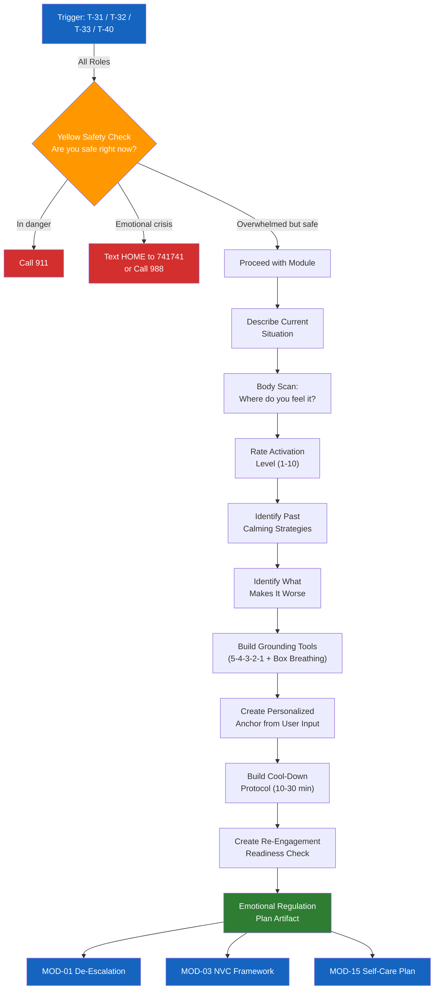

# MOD-13 — Emotional Regulation Plan

## Purpose
Help a user who is emotionally activated build a personalized regulation toolkit:
grounding strategies, cool-down protocol, and re-engagement readiness check.

## Triggers
T-31, T-32, T-33, T-40

## Roles
All

## Safety Level
Yellow — check in briefly before loading

---

## Brief Safety Check (Yellow gate)

> Before we start — are you safe right now?
> -> If you're in danger, call 911.
> -> If you're in emotional crisis, text HOME to 741741 or call 988.
> -> If you're overwhelmed but safe — let's work through this together.

---

## Question Set

**Required:**
1. What's happening right now that's making it hard to regulate? (brief description)
2. Where do you feel it in your body? (e.g., chest tight, jaw clenched, stomach sick, can't breathe)
3. On a scale of 1-10, how activated do you feel right now? (1 = calm, 10 = highest distress)
4. What has helped you calm down in the past? (even small things)
5. What tends to make it worse?

**Optional:**
6. Is there a specific conversation or situation you need to regulate for?
7. How much time do you have before you need to engage?

---

## Output Format

### Emotional Regulation Plan

**Current activation level:** [X]/10

**Where it shows up in your body:**
[User's input — validated as normal stress response]

**Your triggers in this situation:**
[Bullet list]

---

#### Right Now — Grounding (2-5 minutes)

**5-4-3-2-1 Grounding:**
- 5 things you can see
- 4 things you can touch
- 3 things you can hear
- 2 things you can smell
- 1 thing you can taste

**Box Breathing:**
Inhale 4 counts -> Hold 4 -> Exhale 4 -> Hold 4. Repeat 4 times.

**Your personalized anchor:**
[Based on user's "what has helped" — formatted as a specific, actionable step]

---

#### Cool-Down Protocol (10-30 minutes)

Step 1: Move — walk, stretch, shake your hands.
Step 2: [User's calming activity from question 4]
Step 3: Drink water. Slow your breathing.
Step 4: If thoughts are racing — write them down. Don't respond yet.

**Things to avoid right now:**
[User's "makes it worse" list — formatted as "not yet" items]

---

#### Re-Engagement Readiness Check

Before going back into the conversation or situation, ask yourself:
- [ ] Is my heart rate closer to normal?
- [ ] Can I describe the situation without using charged language?
- [ ] Am I able to listen without planning my rebuttal?
- [ ] Do I know what I need from this conversation?

If you can check all four: you're ready.
If not: give yourself more time. It's okay.

---

## Quality Gates
- [ ] Yellow safety check completed
- [ ] Grounding tools are concrete and specific (not vague)
- [ ] User's personal inputs reflected in personalized anchor
- [ ] No clinical diagnosis language

## Recommended Next Modules
- **MOD-01** De-Escalation Message Rewriter — once regulated, prepare what to say
- **MOD-03** NVC Framework — structure the conversation using feelings and needs
- **MOD-15** Trauma-Informed Self-Care Plan — if burnout or ongoing stress is the root cause
- **MOD-09** Mediation Session Prep — if regulating in preparation for a mediation

---

## Worked Example

**User input:**
> Role: Individual (IND). I have a mediation session coming up and I'm overwhelmed just thinking about it. Emotional state: anxious and frustrated, 7/10 activation. Triggers: thinking about seeing the other party, fear of not being heard. Body signals: tight chest, clenched jaw. What has helped before: box breathing, stepping outside, cold water on my skin. What makes it worse: rehearsing arguments in my head, reading old messages. I need to regulate before mediation in 2 days.

### Emotional Regulation Plan

**Current activation level:** 7/10

**Where it shows up in your body:**
Tight chest and clenched jaw. These are normal stress responses — your body is preparing for something it perceives as high-stakes. There is nothing wrong with you for feeling this.

**Your triggers in this situation:**
- Thinking about seeing the other party face to face
- Fear of not being heard or having your perspective dismissed
- Anticipation of conflict in the mediation setting

---

#### Right Now — Grounding (2-5 minutes)

**5-4-3-2-1 Grounding:**
- 5 things you can see
- 4 things you can touch
- 3 things you can hear
- 2 things you can smell
- 1 thing you can taste

**Box Breathing:**
Inhale 4 counts -> Hold 4 -> Exhale 4 -> Hold 4. Repeat 4 times.

**Cold water reset:**
Run cold water over your wrists for 30 seconds. This activates your body's natural calming response. You can do this before the mediation session as well.

**Your personalized anchor:**
Step outside and take a short walk — even 5 minutes around the block. You identified this as something that helps. Pair it with box breathing as you walk.

---

#### Cool-Down Protocol (10-30 minutes)

Step 1: Move — walk outside for 10 minutes. Leave your phone behind if possible.
Step 2: Run cold water over your wrists and the back of your neck.
Step 3: Drink water. Slow your breathing using the box breathing pattern.
Step 4: If thoughts are racing — write them down on paper. Do not send any messages yet.

**Things to avoid right now:**
- Not yet: rehearsing arguments or planning what you will say in the mediation
- Not yet: re-reading old messages or communications with the other party
- Not yet: making decisions or sending messages while activated

---

#### Re-Engagement Readiness Check

Before going into the mediation session, ask yourself:
- [ ] Is my heart rate closer to normal?
- [ ] Can I describe the situation without using charged language?
- [ ] Am I able to listen without planning my rebuttal?
- [ ] Do I know what I need from this conversation?

If you can check all four: you're ready.
If not: give yourself more time. It's okay.

**Support contacts:**
- If you feel overwhelmed during mediation, you can ask the mediator for a break at any time.
- Crisis Text Line: Text HOME to 741741
- 988 Suicide & Crisis Lifeline: Call or text 988

## Disclaimer
Append Blocks A, C.
