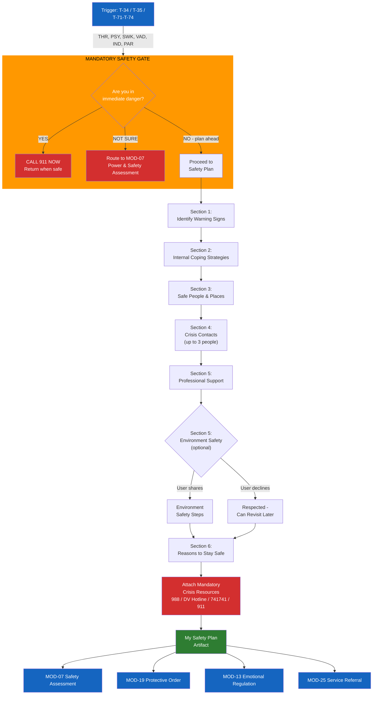

# MOD-14 — Safety Plan Builder

## Purpose
Build a personalized safety plan for an individual experiencing risk, crisis, or
ongoing safety concerns related to conflict, domestic violence, mental health, or
community danger.

## Triggers
T-34, T-35 (self-care crossover), T-71, T-72, T-73, T-74

## Roles
THR, PSY, SWK, VAD, IND, PAR

## Safety Level
Orange (always) — safety gate runs before module loads

---

## Safety Gate (mandatory before question set)

> Before we build your safety plan, I want to check in.
> Are you in immediate danger right now?
>
> → **YES:** Call 911 now. I'll be here when you're safe.
> → **NOT SURE:** Let's do a quick safety check first. [Route to MOD-07]
> → **NO, but I want to plan ahead:** Great. Let's build your plan.

---

## Question Set

**Section 1 — Warning Signs**
1. What are the signs — in yourself or in the situation — that things are starting to escalate? (thoughts, feelings, behaviors, situations)

**Section 2 — Internal Coping**
2. What can you do on your own — without contacting anyone — to take your mind off the situation or reduce distress? (e.g., walk, music, breathing, prayer, journaling)

**Section 3 — Distraction & Support**
3. What people or places help you feel calmer or safer? (social — not for crisis talk, just distraction)
4. Where could you go if you needed to get out of the situation?

**Section 4 — Crisis Support**
5. Who can you call or text when things get hard? (up to 3 people — name/nickname + contact)
6. What professionals or organizations have you worked with or could reach out to?

**Section 5 — Environment Safety** *(optional — skip if not applicable)*
7. Are there things in your environment that make you less safe? (not required to answer — can say "I'd rather not share")
8. Is there anything you could do to make your environment safer?

**Section 6 — Reasons to Stay Safe**
9. What are the most important reasons for you to stay safe? (people, goals, beliefs — whatever matters most to you)

---

## Output Format

### My Safety Plan

**Created:** [date]
**For:** [first name or preferred name, or "Me"]

**⚠️ My warning signs:**
[User's responses formatted as a bullet list]

**🧘 What I can do on my own:**
[User's responses]

**👥 People and places that help:**
[User's responses]

**📞 People I can contact for support:**
| Name | How to reach them | When to reach out |
|------|------------------|-------------------|
| [Name 1] | [contact] | [situation] |
| [Name 2] | [contact] | [situation] |
| [Name 3] | [contact] | [situation] |

**🏥 Professional support:**
| Organization / Person | Contact |
|----------------------|---------|
| [Name] | [phone / address] |

**Crisis lines (always available):**
- 988 Suicide & Crisis Lifeline: call or text **988**
- National DV Hotline: **1-800-799-7233**
- Crisis Text Line: Text **HOME** to **741741**
- Emergency: **911**

**🔒 Making my environment safer:**
[User's responses, or "Not applicable"]

**💙 My reasons to stay safe:**
[User's responses]

---

## Quality Gates
- [ ] Safety gate completed before question set
- [ ] Crisis resources included in output (mandatory)
- [ ] No clinical labels added by platform (user's own language preserved)
- [ ] Professional review note added for THR/PSY use
- [ ] PII handling: contact names are user-provided; warn before sharing

## Disclaimer
Append Blocks A, C, F.

## Recommended Next Modules
- **MOD-07** Power & Safety Assessment — if a full safety assessment hasn't been done yet
- **MOD-19** Protective Order Navigation — if a protective order may be appropriate (educational)
- **MOD-13** Emotional Regulation Plan — build regulation tools alongside the safety plan
- **MOD-25** Service Referral Builder — connect to DV services, shelters, legal aid
- **MOD-15** Trauma-Informed Self-Care Plan — for ongoing resilience alongside safety

---

## Worked Example

**User input:**
> Role: Individual (IND). Safety gate: "No, but I want to plan ahead."
>
> Warning signs: "When they start texting repeatedly and the messages get angrier. I feel my stomach drop and I freeze."
> Internal coping: "I listen to music with headphones. Sometimes I go for a drive."
> Safe people/places: "My sister's house. The library. My friend Maria."
> Crisis support: "Maria (friend) — text. My sister Jen — call. My therapist Dr. K — office phone."
> Professional support: "My therapist — Dr. K at Cedar Wellness. I used to go to a DV support group."
> Environment safety: "I'd rather not share."
> Reasons to stay safe: "My kids. I want to finish school. I promised my sister."

### My Safety Plan

**Created:** March 15, 2025
**For:** Me

**Warning signs:**
- They start texting repeatedly and the messages get angrier
- I feel my stomach drop
- I freeze up and can't think clearly

**What I can do on my own:**
- Listen to music with headphones — put them on right away
- Go for a drive — keep keys and phone accessible
- Box breathing: inhale 4, hold 4, exhale 4, hold 4

**People and places that help:**
- My sister's house
- The library
- My friend Maria's place

**People I can contact for support:**

| Name | How to reach them | When to reach out |
|------|------------------|-------------------|
| Maria | Text | When messages start escalating |
| Jen (sister) | Call | When I need a place to go or someone to talk to |
| Dr. K | Office phone | For planned support and processing |

**Professional support:**

| Organization / Person | Contact |
|----------------------|---------|
| Dr. K — Cedar Wellness | [office phone] |
| DV support group (previously attended) | [contact — reconnect] |

**Crisis lines (always available):**
- 988 Suicide & Crisis Lifeline: call or text **988**
- National DV Hotline: **1-800-799-7233**
- Crisis Text Line: Text **HOME** to **741741**
- Emergency: **911**

**Making my environment safer:**
[User chose not to share — respected. This section can be revisited at any time.]

**My reasons to stay safe:**
- My kids
- I want to finish school
- I promised my sister

## Professional Note (THR/PSY role only)
> This safety plan was generated as a structured starting point. It should be
> reviewed, edited, and co-signed by the clinician before use in clinical practice.
> It is not a substitute for a clinician-conducted safety assessment.
