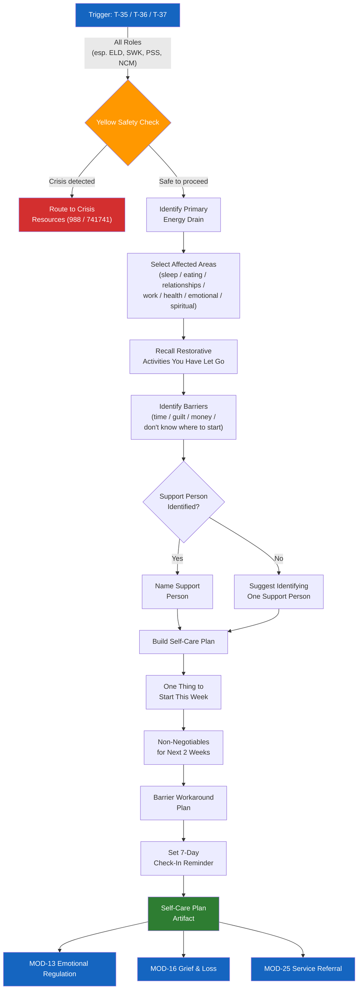

# MOD-15 — Trauma-Informed Self-Care Plan

## Purpose
Build a personalized self-care plan for someone experiencing ongoing stress, burnout,
or caregiver fatigue related to conflict or difficult circumstances.

## Triggers
T-35, T-36, T-37

## Roles
All — especially ELD, SWK, PSS, NCM

## Safety Level
Yellow

---

## Question Set

**Required:**
1. What's been draining your energy most? (brief description)
2. What areas of your life feel most affected? (check all that apply: sleep / eating / relationships / work / physical health / emotional health / spiritual/meaning)
3. What are 1-2 things that used to restore you that you've let go of?
4. What gets in the way of taking care of yourself? (time / guilt / money / don't know where to start / other)

**Optional:**
5. Who in your life supports you?
6. What does "feeling better" look like for you — even a little bit?

---

## Output Format

### Self-Care Plan

**Focus areas:**
[User's selected areas — normalized: "These are common impacts of prolonged stress."]

**What restores you (your own words):**
[User's input — framed as "coming back to what you know works"]

**One thing to start this week:**
[Smallest possible version of one restorative activity — realistic and specific]

**What to protect:**
[1-2 minimum non-negotiables for the next 2 weeks]

**Barrier plan:**
[User's stated barrier + one concrete workaround]

**Support:**
[User's support person(s) — or suggestion to identify one]

**Check-in with yourself:**
Set a reminder for [7 days from now]: "How am I doing compared to today?"

---

## Quality Gates
- [ ] Yellow safety check completed
- [ ] Plan is realistic — not aspirational overload
- [ ] User's own words and activities reflected
- [ ] No clinical diagnosis language

## Recommended Next Modules
- **MOD-13** Emotional Regulation Plan — for acute moments within ongoing burnout
- **MOD-16** Grief & Loss Navigation — if the burnout is connected to loss
- **MOD-25** Service Referral Builder — to find professional support
- **MOD-23** Youth Emotional Check-In — if caring for a youth who is also affected

---

## Worked Example

**User input:**
> Role: Elder/Caregiver (ELD). I'm caring for my parent who has dementia and my siblings can't agree on care decisions. Energy drain: constant caregiving with no breaks — I'm the only one nearby. Affected areas: sleep, relationships, emotional health. What used to restore me: gardening, reading before bed, calling a friend. Barrier: guilt about taking time for myself — it feels selfish when my parent needs me. Support: my sibling who lives out of state — they help by phone when they can. Feeling better would look like sleeping through the night and not feeling guilty for sitting down.

### Self-Care Plan

**Focus areas:**
Sleep, relationships, and emotional health. These are common impacts of prolonged caregiving stress. When you are the primary caregiver with limited relief, these areas are often the first to suffer — and recognizing that is an important step.

**What restores you (your own words):**
- Gardening — being outside and working with your hands
- Reading before bed — a quiet transition out of caregiver mode
- Calling a friend — connection with someone who sees you as more than a caregiver

These are things you already know work for you. The goal is to come back to them, even in small doses.

**One thing to start this week:**
Read for 10 minutes before bed — just 10 minutes. Keep a book on your nightstand so it is within reach. This is the smallest version of something that restores you, and it may help with sleep as well.

**What to protect (non-negotiables for the next 2 weeks):**
1. No caregiving tasks after 9:00 PM. After that time is yours, even if it is just sitting quietly.
2. One 15-minute phone call with your friend this week. Put it on the calendar now.

**Barrier plan:**
*Barrier:* Guilt about taking time for yourself — it feels selfish.
*Workaround:* You cannot pour from an empty cup, and your parent needs you to be well in order to continue providing care. Reframe rest as part of the caregiving plan, not a break from it. When guilt arises, try this: "Taking care of myself is part of taking care of my parent."

**Support:**
Your sibling who lives out of state. Consider asking them to take on one specific remote task (scheduling appointments, managing insurance calls, researching resources) so that your load is lighter in a concrete way. Even one task shifted can create breathing room.

**Check-in with yourself:**
Set a reminder for 7 days from today: "How am I doing compared to last week? Have I read before bed? Have I called my friend? Have I kept my 9 PM boundary?"

## Disclaimer
Append Blocks A, C.
