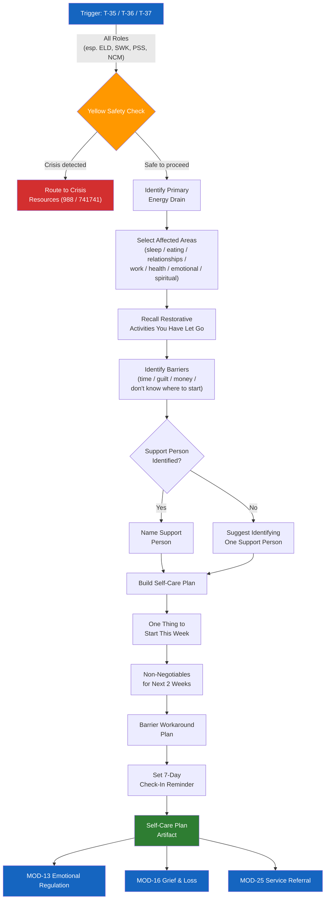

# MOD-15 — Trauma-Informed Self-Care Plan

## Purpose
Build a personalized self-care plan for someone experiencing ongoing stress, burnout,
or caregiver fatigue related to conflict or difficult circumstances.

## Triggers
T-35, T-36, T-37

## Roles
All — especially ELD, SWK, PSS, NCM

## Safety Level
Yellow

---

## Question Set

**Required:**
1. What's been draining your energy most? (brief description)
2. What areas of your life feel most affected? (check all that apply: sleep / eating / relationships / work / physical health / emotional health / spiritual/meaning)
3. What are 1-2 things that used to restore you that you've let go of?
4. What gets in the way of taking care of yourself? (time / guilt / money / don't know where to start / other)

**Optional:**
5. Who in your life supports you?
6. What does "feeling better" look like for you — even a little bit?

---

## Output Format

### Self-Care Plan

**Focus areas:**
[User's selected areas — normalized: "These are common impacts of prolonged stress."]

**What restores you (your own words):**
[User's input — framed as "coming back to what you know works"]

**One thing to start this week:**
[Smallest possible version of one restorative activity — realistic and specific]

**What to protect:**
[1-2 minimum non-negotiables for the next 2 weeks]

**Barrier plan:**
[User's stated barrier + one concrete workaround]

**Support:**
[User's support person(s) — or suggestion to identify one]

**Check-in with yourself:**
Set a reminder for [7 days from now]: "How am I doing compared to today?"

---

## Quality Gates
- [ ] Yellow safety check completed
- [ ] Plan is realistic — not aspirational overload
- [ ] User's own words and activities reflected
- [ ] No clinical diagnosis language

## Recommended Next Modules
- **MOD-13** Emotional Regulation Plan — for acute moments within ongoing burnout
- **MOD-16** Grief & Loss Navigation — if the burnout is connected to loss
- **MOD-25** Service Referral Builder — to find professional support
- **MOD-23** Youth Emotional Check-In — if caring for a youth who is also affected

## Disclaimer
Append Blocks A, C.
