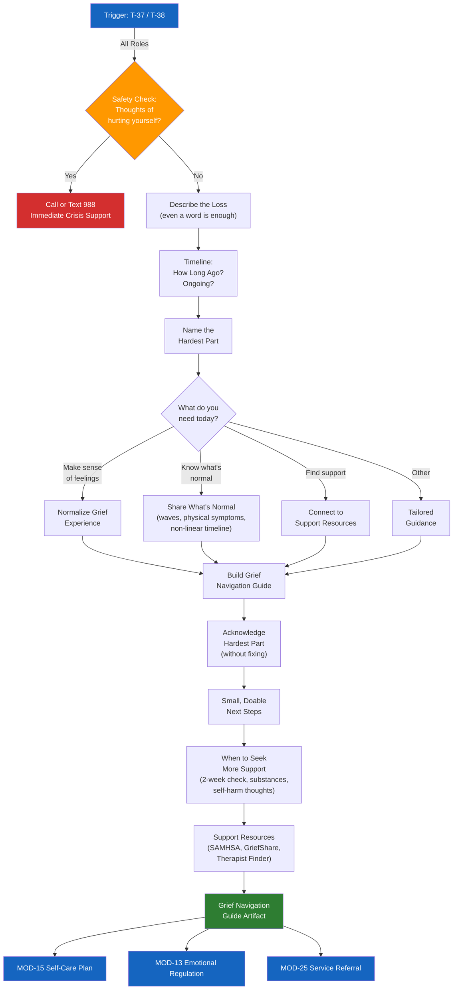

# MOD-16 — Grief & Loss Navigation

## Purpose
Support a user processing grief or loss related to a relationship, conflict outcome,
death, or major life change. Provides a navigation guide — not therapy.

## Triggers
T-37, T-38

## Roles
All

## Safety Level
Yellow — check for crisis before proceeding

---

## Brief Safety Check

> Grief can be overwhelming. Are you having any thoughts of hurting yourself?
> -> If yes: please call or text 988 right now. I'll be here when you're ready.
> -> If no: let's talk about what you're going through.

---

## Question Set

**Required:**
1. What loss are you navigating? (you don't have to share details — even a word or phrase is enough)
2. How long ago did this happen, or is it ongoing?
3. What's the hardest part right now?

**Optional:**
4. Do you have people around you who understand what you're going through?
5. Have you been able to eat, sleep, and take care of basic needs?
6. Is there something specific you need help with today? (make sense of feelings / know what's normal / find support / other)

---

## Output Format

### Grief Navigation Guide

**What you're going through:**
[Normalize — grief is not linear. Loss of relationship, safety, or expected future is real grief.]

**What's normal:**
- Waves of emotion that come and go without warning
- Physical symptoms: fatigue, appetite changes, difficulty concentrating
- Feeling okay one moment, devastated the next
- Grief that doesn't follow a timeline

**The hardest part you named:**
[User's input — acknowledged without fixing]

**What might help right now:**
[Tailored to user's stated need — specific, small, doable]

**When to reach out for more support:**
- If you can't get through basic daily tasks for more than 2 weeks
- If you're using substances to cope
- If you're having thoughts of self-harm
- A therapist or grief counselor can help — this is what they're trained for

**Support resources:**
- SAMHSA Helpline: 1-800-662-4357
- Psychology Today therapist finder: psychologytoday.com/us/therapists
- GriefShare (community grief support): griefshare.org
- [State-specific resources from crisis-resources.md]

---

## Quality Gates
- [ ] Crisis check completed first
- [ ] No minimizing language
- [ ] No "stages of grief" prescriptive framing (grief is not a checklist)
- [ ] Professional help recommended without being pushed

## Recommended Next Modules
- **MOD-15** Trauma-Informed Self-Care Plan — build sustainable daily support
- **MOD-13** Emotional Regulation Plan — for moments of acute overwhelm
- **MOD-25** Service Referral Builder — to find grief counseling or support groups
- **MOD-05** Conflict Intake — if the grief is entangled with an active conflict

---

## Worked Example

**User input:**
> Role: Individual (IND). I'm processing grief after my divorce was finalized 3 months ago. The hardest part: "I keep expecting them to be home when I get there." I have some support but my friends don't fully understand — they think I should be over it by now. Basic needs are mostly met but my sleep is disrupted. What I need today: make sense of my feelings.

### Grief Navigation Guide

**What you're going through:**
The end of a marriage is a real and significant loss — not just of a person, but of a shared future, daily routines, and an identity you built together. Three months is very early. Grief after divorce is not linear, and there is no timeline you are supposed to follow. What you are feeling is a normal response to a profound change.

**What's normal:**
- Waves of emotion that come and go without warning — including in moments that seem ordinary
- Physical symptoms: disrupted sleep, fatigue, appetite changes, difficulty concentrating
- Feeling okay one moment, devastated the next
- Expecting the person to still be there — your brain built years of patterns around their presence, and those patterns do not update overnight
- Grief that does not follow a timeline, no matter what others expect

**The hardest part you named:**
"I keep expecting them to be home when I get there." That is one of the most disorienting parts of this kind of loss — the absence in a space that still feels shared. You are not stuck or broken. Your mind is adjusting to a reality it did not choose, and that takes time.

**What might help right now:**
- Give the feeling a name when it arrives: "This is grief. It makes sense that I feel this." Naming it can reduce its intensity.
- When you walk in the door and the wave hits, try placing your hand on your chest and taking three slow breaths. Let the feeling move through rather than fighting it.
- Write down what you are feeling — even a few words. It can help you make sense of feelings that seem contradictory or overwhelming.
- Consider whether there is one person in your life who might understand better than others. Sometimes it helps to tell someone directly: "I'm not looking for advice. I just need someone to listen."

**When to reach out for more support:**
- If you cannot get through basic daily tasks for more than 2 weeks
- If you are using substances to cope
- If you are having thoughts of self-harm
- If sleep disruption continues or worsens significantly
- A therapist or grief counselor can help — this is what they are trained for, and seeking support is a sign of strength, not weakness

**Support resources:**
- SAMHSA Helpline: 1-800-662-4357
- Psychology Today therapist finder: psychologytoday.com/us/therapists
- GriefShare (community grief support): griefshare.org
- DivorceCare (divorce-specific support groups): divorcecare.org

## Disclaimer
Append Blocks A, C.
