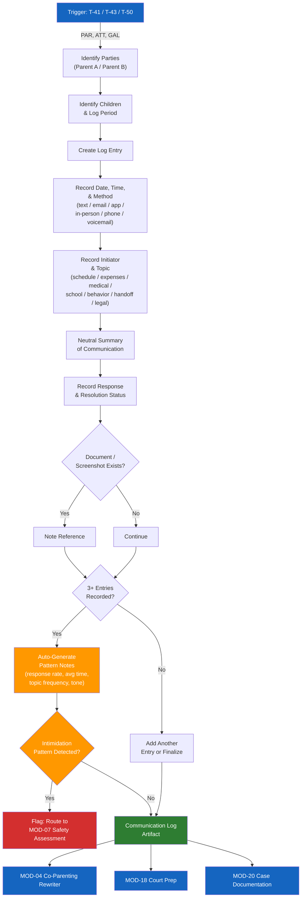

# MOD-17 — Parenting Plan Communication Log

## Purpose
Create a structured log of co-parenting communications for documentation, pattern
tracking, and court context. All entries are neutral and factual.

## Triggers
T-41 (partial), T-43, T-50

## Roles
PAR, ATT, GAL

## Safety Level
Green

---

## Question Set (per log entry)

**Required:**
1. Date and time of communication
2. Method (text / email / app / in-person / phone call / voicemail)
3. Who initiated? (you / other parent / third party)
4. Topic (schedule / expenses / medical / school / behavior / handoff / legal / other)
5. What was communicated? (neutral summary of what was said or requested)
6. What was the response (if any)?
7. Was the matter resolved? (yes / no / pending)

**Optional:**
8. Does a document, screenshot, or record exist? (yes / no — note reference)
9. Was a child present during this communication?
10. Was the tone of the communication (circle one): Calm / Tense / Hostile / No response

---

## Output Format

### Parenting Plan Communication Log

**Parties:** [Parent A] / [Parent B]
**Child(ren):** [Child] / [Child 1] / [Child 2]
**Log maintained by:** [Parent A / Parent B]
**Log period:** [start date] - [end date or "ongoing"]

| Date | Time | Method | Initiated By | Topic | Summary | Response | Resolved | Record Exists |
|------|------|--------|-------------|-------|---------|----------|----------|--------------|
| | | | | | | | | |

**Pattern notes** (auto-generated if 3+ entries):
- Response rate: [X of Y messages received a response]
- Average response time: [if trackable]
- Topics most frequent: [list]
- Tone pattern: [if consistently noted]

---

## Quality Gates
- [ ] All entries use neutral language — no characterizations
- [ ] [Parent A] / [Parent B] / [Child] placeholders used
- [ ] Tone noted as observation, not conclusion
- [ ] No legal conclusions drawn ("they violated the order") — only facts

## Recommended Next Modules
- **MOD-04** Co-Parenting Communication Rewriter — prepare messages before sending
- **MOD-18** Court Preparation Checklist — if preparing to present the log in court
- **MOD-20** Case Documentation Summary — compile the log into a case narrative
- **MOD-07** Power & Safety Assessment — if a pattern of intimidation emerges

---

## Worked Example

**User input:**
> Role: Parent (PAR). I need to log 3 co-parenting communications from the past 2 weeks. Entry 1: March 26, 3:15 PM, text from me to [Parent B] about a schedule change for Saturday pickup — tone was calm, [Parent B] agreed, resolved. Entry 2: April 2, 10:00 AM, email from me to [Parent B] about [Child]'s upcoming medical appointment and whether [Parent B] wants to attend — tone was tense, no response yet, pending. Entry 3: April 7, 6:45 PM, text from [Parent B] to me about [Child]'s school event — tone was hostile, [Parent B] accused me of not informing them sooner, unresolved. I have screenshots of entries 1 and 3.

### Parenting Plan Communication Log

**Parties:** [Parent A] / [Parent B]
**Child(ren):** [Child]
**Log maintained by:** [Parent A]
**Log period:** March 26 - April 7 (ongoing)

| Date | Time | Method | Initiated By | Topic | Summary | Response | Resolved | Record Exists |
|------|------|--------|-------------|-------|---------|----------|----------|--------------|
| Mar 26 | 3:15 PM | Text | [Parent A] | Schedule | [Parent A] requested change to Saturday pickup time due to a scheduling conflict. | [Parent B] agreed to the adjusted time. | Yes | Yes (screenshot) |
| Apr 2 | 10:00 AM | Email | [Parent A] | Medical | [Parent A] informed [Parent B] of upcoming medical appointment for [Child] and asked if [Parent B] would like to attend. | No response received. | Pending | No |
| Apr 7 | 6:45 PM | Text | [Parent B] | School | [Parent B] contacted [Parent A] about [Child]'s school event. [Parent B] stated they were not informed of the event in a timely manner. | [Parent A] has not yet responded. | No | Yes (screenshot) |

**Pattern notes:**
- Response rate: 1 of 2 messages sent by [Parent A] received a response from [Parent B]. The medical appointment email (Apr 2) remains unanswered after 5 days.
- Topics: Schedule (1), Medical (1), School (1) — varied topics across the log period.
- Tone pattern: Communications initiated by [Parent A] were noted as calm to tense. The communication initiated by [Parent B] was noted as hostile. There is a pattern of escalating tone over the two-week period, particularly around topics where timeliness of information sharing is involved.

## Disclaimer
Append Blocks A, B.
