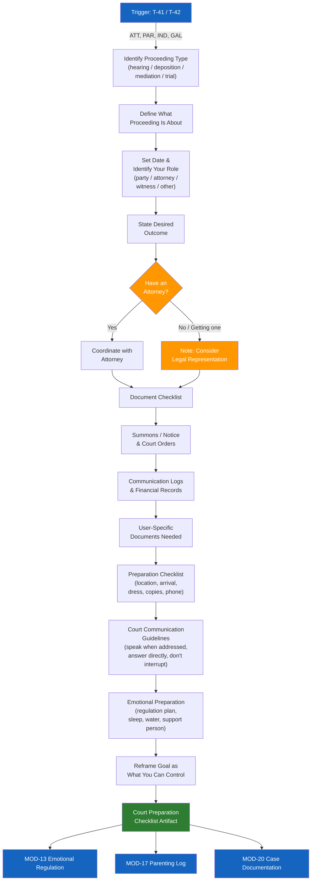

# MOD-18 — Court Preparation Checklist

## Purpose
Help a user (party or attorney) prepare for an upcoming court hearing,
deposition, or legal proceeding related to a conflict.

## Triggers
T-41, T-42

## Roles
ATT, PAR, IND, GAL

## Safety Level
Green

---

## Question Set

**Required:**
1. What type of proceeding? (hearing / deposition / mediation / trial / other)
2. What is the proceeding about?
3. When is it scheduled?
4. What is your role? (party / attorney / witness / other)
5. What outcome are you hoping for?

**Optional:**
6. Do you have an attorney? (yes / no / getting one)
7. What documents do you have? (list or describe)
8. What documents do you still need?
9. What witnesses (if any) will be involved?

---

## Output Format

### Court Preparation Checklist

**Proceeding type:** [type]
**Date:** [date]
**Your role:** [role]

#### Documents
- [ ] Summons / notice of hearing (confirm you have it)
- [ ] Any court orders currently in effect (bring copies)
- [ ] Communication log (if applicable)
- [ ] Financial records (if applicable to proceeding)
- [ ] [User's specific documents listed]
- [ ] Documents you still need: [user's list]

#### Preparation
- [ ] Know the courtroom location and parking
- [ ] Arrive 30 minutes early
- [ ] Dress professionally and neutrally
- [ ] Bring 3 copies of every document (yourself / opposing party / judge)
- [ ] Turn phone to silent before entering courtroom

#### Communication in Court
- [ ] Speak only when addressed by the judge or your attorney
- [ ] Answer questions directly and calmly — do not volunteer extra information
- [ ] If you don't understand a question, say "I don't understand the question" — don't guess
- [ ] Do not argue with opposing counsel — address the judge
- [ ] Do not interrupt

#### Emotional Preparation
- [ ] Review your regulation plan before the day (MOD-13)
- [ ] Eat and sleep the night before
- [ ] Bring water and something to hold (notebook, pen) if it helps
- [ ] Have a support person for the waiting room if allowed

#### Your goal for this proceeding:
[User's stated goal — reframed as what you can control, not what you can't]

---

## Quality Gates
- [ ] Checklist is specific to proceeding type
- [ ] Legal disclaimer included
- [ ] No legal advice given — procedural only

## Recommended Next Modules
- **MOD-13** Emotional Regulation Plan — build a regulation plan for the day of
- **MOD-17** Parenting Plan Communication Log — organize communication evidence
- **MOD-20** Case Documentation Summary — prepare a case narrative
- **MOD-01** De-Escalation Message Rewriter — if post-hearing communication is needed

## Disclaimer
Append Blocks A, B.
