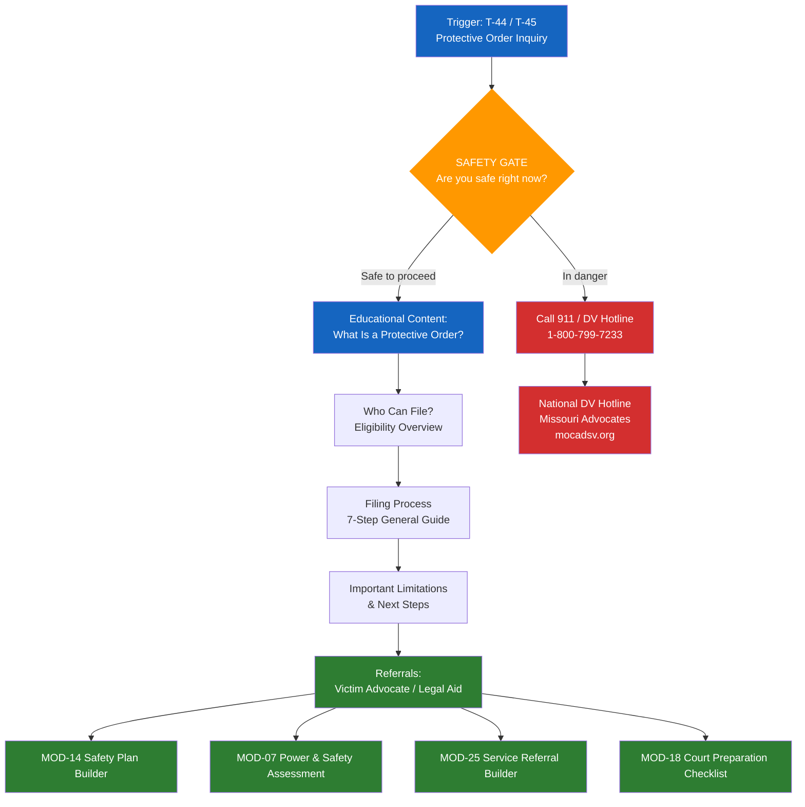

# MOD-19 — Protective Order Navigation (Educational Only)

## Purpose
Provide educational information about protective orders (also called restraining
orders or orders of protection) to help a user understand their options.
This module is EDUCATIONAL ONLY — not legal advice.

## Triggers
T-44, T-45

## Roles
IND, PAR, VAD — refer to ATT for legal representation

## Safety Level
Orange — safety gate runs first

---

## Safety Gate (mandatory)

> Before we talk about protective orders — are you safe right now?
> If you are in immediate danger, call 911.
> National DV Hotline: 1-800-799-7233 (24/7)

---

## Educational Content (Missouri Reference — localize for other states)

### What Is a Protective Order?
A protective order is a civil court order that can restrict another person's contact
with you or your children. In Missouri, there are two types:

- **Ex Parte Order of Protection:** Temporary order issued by a judge without
  the other party present. Can be issued the same day you file.
- **Full Order of Protection:** Issued after a court hearing where both parties
  can appear. Can last up to 1 year (or longer if renewed).

*Educational only. Laws vary by state and circumstance.*

### Who Can File?
In Missouri, you may be eligible to file if you have experienced:
- Domestic violence
- Stalking
- Sexual assault

You may file at your local circuit court.

### What Can a Protective Order Do?
Common provisions may include:
- Requiring the respondent to stay away from your home, workplace, or school
- Prohibiting contact by any means
- Temporarily granting custody of children
- Requiring the respondent to leave a shared residence

### The Filing Process (general)
1. Go to your local circuit court clerk's office
2. Complete the petition for order of protection (no filing fee in Missouri)
3. A judge reviews the ex parte petition — often the same day
4. If granted, the respondent is served
5. A hearing is scheduled (typically within 15 days)
6. At the hearing, both parties can present their case
7. The judge decides whether to issue a full order

### Important Limitations
- A protective order is a civil document — it does not guarantee physical safety
- Violation of a protective order is a criminal offense (but must be reported to police)
- Not all conflict situations qualify — a court decides eligibility

### Next Steps
- Contact a victim advocate or legal aid attorney for guidance specific to your situation
- Missouri victim advocates: statewide list at mocadsv.org
- Legal Services of Eastern Missouri: 314-534-4200

---

## Quality Gates
- [ ] Safety gate completed first
- [ ] All content explicitly framed as educational/informational
- [ ] No statement that user "qualifies" or "doesn't qualify" — that's a legal determination
- [ ] Referrals to legal aid and advocate included
- [ ] Missouri reference clearly labeled — note that laws vary by state

## Recommended Next Modules
- **MOD-14** Safety Plan Builder — build a personal safety plan alongside the legal process
- **MOD-07** Power & Safety Assessment — assess the full scope of safety concerns
- **MOD-25** Service Referral Builder — find DV advocates and legal aid in your area
- **MOD-18** Court Preparation Checklist — prepare for the protective order hearing

---

## Worked Example

**User input:**
> Role: Individual (IND). Safety gate response: "No, I am not in danger right now, but I want to understand my options."

### Protective Order — Educational Walkthrough

**Safety gate:** Completed. The user confirmed they are not in immediate danger and would like to learn about their options.

---

**What is a protective order?**
A protective order (sometimes called a restraining order or order of protection) is a civil court order that can restrict another person's contact with you or your children. In Missouri, there are two main types:

- **Ex Parte Order of Protection:** A temporary order that a judge can issue without the other party being present. It can often be issued the same day you file.
- **Full Order of Protection:** Issued after a court hearing where both parties have the opportunity to appear and present their case. A full order can last up to one year and may be renewed.

*Note: Laws vary by state. This information uses Missouri as a reference point.*

---

**Who can file?**
In Missouri, you may be eligible to file for a protective order if you have experienced:
- Domestic violence
- Stalking
- Sexual assault

You may file at your local circuit court. There is no filing fee in Missouri for orders of protection.

---

**What can a protective order do?**
Common provisions that a court may include in a protective order:
- Require the respondent to stay away from your home, workplace, or school
- Prohibit contact by phone, text, email, social media, or through third parties
- Temporarily grant custody of children
- Require the respondent to leave a shared residence

---

**The general filing process (7 steps):**

1. **Visit your local circuit court clerk's office.** You can go in person to request the paperwork. Some courts also make forms available online.
2. **Complete the petition for an order of protection.** The form asks you to describe the situation and what protections you are requesting. There is no filing fee in Missouri.
3. **A judge reviews the ex parte petition.** This often happens the same day. The judge decides whether to grant a temporary order based on your petition alone.
4. **If the temporary order is granted, the respondent is served.** Law enforcement delivers the order to the other party, informing them of the restrictions.
5. **A hearing is scheduled.** Typically within 15 days of the temporary order being issued.
6. **Both parties appear at the hearing.** Each party can present evidence, testimony, and witnesses. You may bring documentation, photos, messages, or other relevant materials.
7. **The judge decides whether to issue a full order of protection.** If granted, the full order replaces the temporary order and can last up to one year.

---

**Important limitations:**
- A protective order is a civil document — it does not guarantee physical safety on its own
- If the respondent violates the order, it is a criminal offense, but it must be reported to law enforcement
- Not all conflict situations qualify for a protective order — a court determines eligibility based on the circumstances
- A protective order does not resolve underlying disputes such as custody, property, or divorce — those are handled through separate legal processes

---

**Next steps and referrals:**
- **Contact a victim advocate** for guidance specific to your situation. Advocates can help you understand the process, prepare paperwork, and accompany you to court.
- **Missouri Coalition Against Domestic and Sexual Violence:** statewide directory at mocadsv.org
- **Legal Services of Eastern Missouri:** 314-534-4200 (free legal assistance for eligible individuals)
- **National Domestic Violence Hotline:** 1-800-799-7233 (available 24/7, confidential)

*This information is educational only and does not constitute legal advice. Every situation is different. An attorney or victim advocate can help you understand how the law applies to your specific circumstances.*

## Disclaimer
Append Blocks A, B, F.
