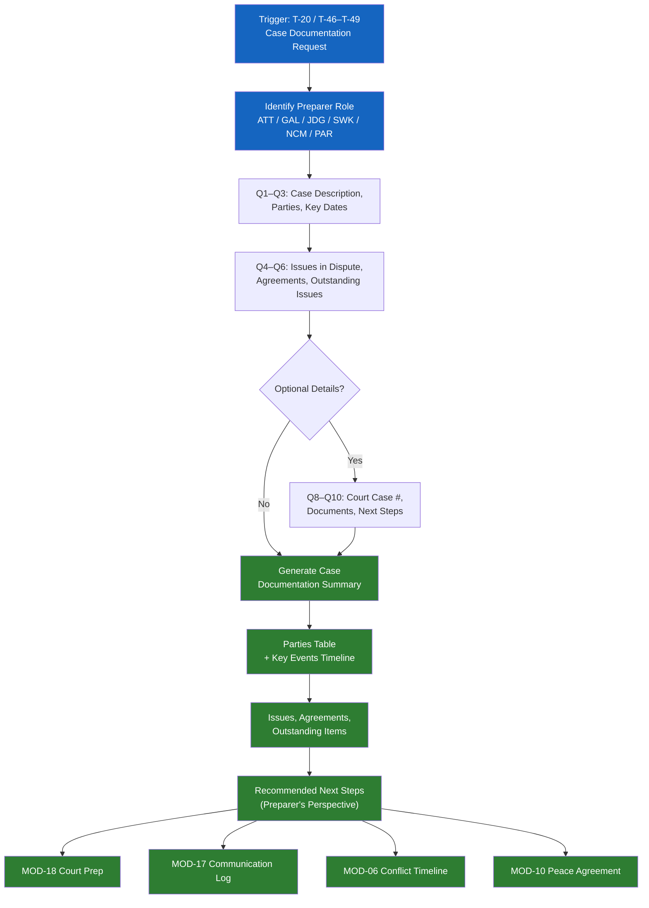

# MOD-20 — Case Documentation Summary

## Purpose
Produce a structured, neutral case documentation summary for use by attorneys,
GALs, court staff, social workers, or self-represented parties.

## Triggers
T-20, T-46, T-47, T-48, T-49

## Roles
ATT, GAL, JDG, SWK, NCM, PAR (self-represented)

## Safety Level
Green

---

## Question Set

**Required:**
1. What is this case or situation about? (brief neutral description)
2. Who are the parties? (identifiers — relationship, not names unless user opts in)
3. What are the key dates and events? (list in order)
4. What issues are currently in dispute?
5. Have any agreements been reached? (yes / no / partial — describe)
6. What are the outstanding issues?
7. What is the preparer's role?

**Optional:**
8. Is there an active court case or case number?
9. What documents are attached or referenced?
10. What are the recommended next steps?

---

## Output Format

### Case Documentation Summary

**Document type:** Case Documentation Summary
**Prepared by:** [role]
**Date prepared:** [system date]
**Case identifier:** [user-provided or "Not assigned"]

**Parties:**
| Identifier | Role |
|-----------|------|
| [Party A] | [relationship] |
| [Party B] | [relationship] |
| [Child] | [relationship] |

**Background:**
[2-3 neutral sentences about the situation]

**Key events (chronological):**
| Date | Event | Notes |
|------|-------|-------|
| | | |

**Issues in dispute:**
[Bullet list — stated neutrally]

**Agreements reached:**
[Bullet list, or "None to date"]

**Outstanding issues:**
[Bullet list]

**Attached / referenced documents:**
[List, or "None provided"]

**Recommended next steps:**
[Bullet list from preparer's perspective — labeled as such]

---

## Quality Gates
- [ ] All events described neutrally
- [ ] Both parties represented fairly in framing
- [ ] No legal conclusions drawn
- [ ] Preparer role labeled clearly

## Recommended Next Modules
- **MOD-18** Court Preparation Checklist — prepare to present this documentation
- **MOD-17** Parenting Plan Communication Log — add structured communication records
- **MOD-06** Conflict History Timeline — build a detailed chronology
- **MOD-10** Peace Agreement Builder — if parties are ready to formalize resolution

---

## Worked Example

**User input:**
> Role: Guardian ad Litem (GAL). This is a custody case involving two parents ([Parent A] and [Parent B]) who are in disagreement about primary residence for their two children ([Child 1], age 10, and [Child 2], age 7). Over the past 6 months there have been 4 key events. The parents have reached a partial agreement on a holiday schedule, but weekday custody remains in dispute. There is no active court case number yet. No documents attached at this time. I recommend the parents attempt mediation for the weekday custody issue and that a child specialist be consulted regarding the children's preferences and adjustment.

### Case Documentation Summary

**Document type:** Case Documentation Summary
**Prepared by:** Guardian ad Litem (GAL)
**Date prepared:** 2026-04-09
**Case identifier:** Not assigned

**Parties:**

| Identifier | Role |
|-----------|------|
| [Parent A] | Parent — requesting primary weekday residence |
| [Parent B] | Parent — requesting primary weekday residence |
| [Child 1] | Child, age 10 |
| [Child 2] | Child, age 7 |

**Background:**
[Parent A] and [Parent B] are separating and have been unable to agree on primary weekday residence for their two children. Both parents are seeking primary custody during the school week. The family has been in this process for approximately six months. A partial agreement has been reached regarding holiday and vacation time, but the weekday arrangement remains unresolved.

**Key events (chronological):**

| Date | Event | Notes |
|------|-------|-------|
| October 2025 | [Parent A] moved to a separate residence within the same school district | Children remained in the family home with [Parent B] during the transition |
| December 2025 | Parents reached a partial agreement on holiday and school-break schedule | Agreement covers winter break, spring break, summer, and major holidays |
| February 2026 | Informal weekday arrangement broke down after scheduling disagreements | Both parents reported difficulty coordinating pickups and transitions |
| March 2026 | GAL appointed to represent the children's interests | Initial interviews with both parents and both children completed |

**Issues in dispute:**
- Which parent will have primary weekday residence during the school year
- Transportation and transition logistics for school days
- Decision-making authority on school-related matters (enrollment, extracurriculars)

**Agreements reached:**
- Holiday and school-break schedule (partial agreement reached December 2025): alternating major holidays, split winter and spring breaks, four weeks each during summer
- Both parents agree the children should remain in their current school
- Both parents agree to maintain open communication about the children's health and school performance

**Outstanding issues:**
- Primary weekday residence during the school year
- Weekday evening and overnight schedule
- Transportation responsibility for school drop-off and pickup
- How to handle schedule changes or unexpected conflicts

**Attached / referenced documents:**
None provided

**Recommended next steps (from GAL's perspective):**
- Refer parents to mediation (MOD-09) specifically focused on the weekday custody arrangement
- Consult a child specialist to assess the children's preferences, adjustment, and any concerns about transitions
- Develop a proposed weekday schedule with specific days, times, and transition procedures for the court's consideration
- Schedule a follow-up GAL interview with the children in 30 days to assess ongoing adjustment
- If mediation does not produce an agreement within 60 days, prepare a formal GAL recommendation for the court

## Disclaimer
Append Blocks A, B.
