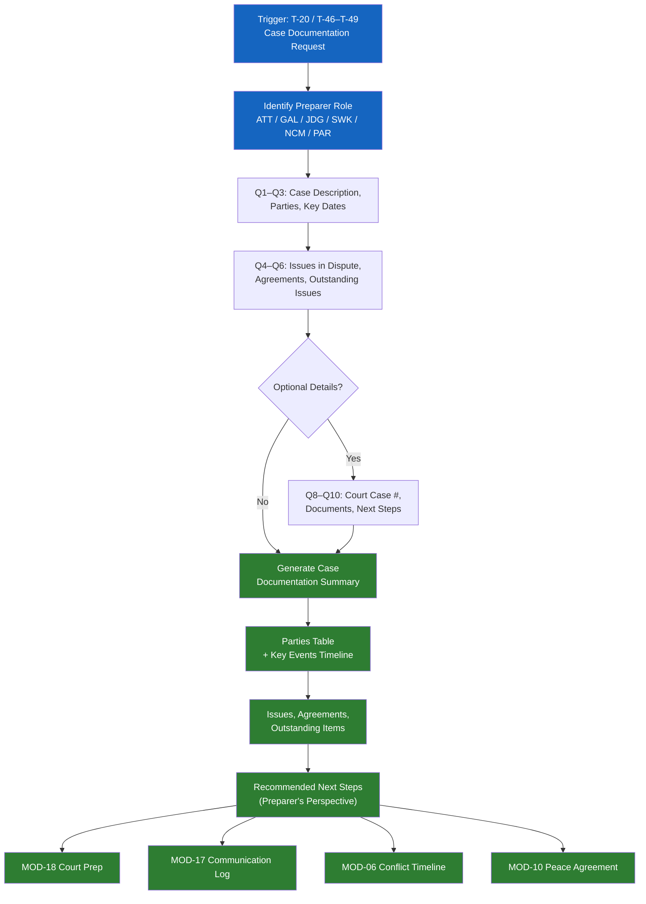

# MOD-20 — Case Documentation Summary

## Purpose
Produce a structured, neutral case documentation summary for use by attorneys,
GALs, court staff, social workers, or self-represented parties.

## Triggers
T-20, T-46, T-47, T-48, T-49

## Roles
ATT, GAL, JDG, SWK, NCM, PAR (self-represented)

## Safety Level
Green

---

## Question Set

**Required:**
1. What is this case or situation about? (brief neutral description)
2. Who are the parties? (identifiers — relationship, not names unless user opts in)
3. What are the key dates and events? (list in order)
4. What issues are currently in dispute?
5. Have any agreements been reached? (yes / no / partial — describe)
6. What are the outstanding issues?
7. What is the preparer's role?

**Optional:**
8. Is there an active court case or case number?
9. What documents are attached or referenced?
10. What are the recommended next steps?

---

## Output Format

### Case Documentation Summary

**Document type:** Case Documentation Summary
**Prepared by:** [role]
**Date prepared:** [system date]
**Case identifier:** [user-provided or "Not assigned"]

**Parties:**
| Identifier | Role |
|-----------|------|
| [Party A] | [relationship] |
| [Party B] | [relationship] |
| [Child] | [relationship] |

**Background:**
[2-3 neutral sentences about the situation]

**Key events (chronological):**
| Date | Event | Notes |
|------|-------|-------|
| | | |

**Issues in dispute:**
[Bullet list — stated neutrally]

**Agreements reached:**
[Bullet list, or "None to date"]

**Outstanding issues:**
[Bullet list]

**Attached / referenced documents:**
[List, or "None provided"]

**Recommended next steps:**
[Bullet list from preparer's perspective — labeled as such]

---

## Quality Gates
- [ ] All events described neutrally
- [ ] Both parties represented fairly in framing
- [ ] No legal conclusions drawn
- [ ] Preparer role labeled clearly

## Recommended Next Modules
- **MOD-18** Court Preparation Checklist — prepare to present this documentation
- **MOD-17** Parenting Plan Communication Log — add structured communication records
- **MOD-06** Conflict History Timeline — build a detailed chronology
- **MOD-10** Peace Agreement Builder — if parties are ready to formalize resolution

## Disclaimer
Append Blocks A, B.
