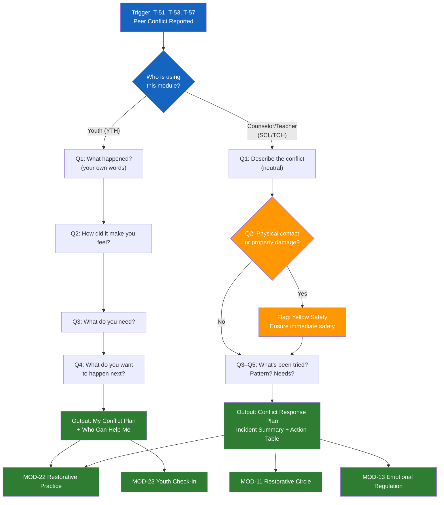

# MOD-21 — Peer Conflict Resolution Guide

## Purpose
Help a student, school counselor, or educator navigate peer conflict using
restorative, developmentally appropriate approaches.

## Triggers
T-51, T-52, T-53, T-57

## Roles
YTH, SCL, TCH

## Safety Level
Green / Yellow if bullying or physical contact involved

---

## Question Set

**For Youth (YTH role — simplified):**
1. What happened? (tell me in your own words)
2. How did it make you feel?
3. What do you need to feel better about this?
4. What do you want to happen next?

**For SCL/TCH role:**
1. Describe the conflict. (neutral — what happened, when, who was involved)
2. Was there physical contact or property damage?
3. What has already been tried?
4. Is this an ongoing pattern or a new incident?
5. What does each student need from a resolution?

---

## Output Format

### For Youth — My Conflict Plan

**What happened (my version):**
[User's words — validated]

**How I feel:**
[Feeling words — normalized]

**What I need:**
[User's stated need — affirmed]

**My next step:**
[One concrete action — e.g., "Talk to my counselor," "Ask for a mediation," "Write it down"]

**Who can help me:**
- My school counselor
- A trusted teacher or adult
- A parent or guardian
- [Other named by youth]

---

### For SCL/TCH — Conflict Response Plan

**Incident summary:** [neutral]
**Parties involved:** [Student A / Student B / Group]
**Type:** [verbal / physical / cyberbullying / property / social exclusion / other]
**Pattern:** [new incident / ongoing / escalating]

**Recommended response:**

| Step | Action | Who | When |
|------|--------|-----|------|
| 1 | Separate parties, ensure immediate safety | Staff | Immediately |
| 2 | Individual check-ins with each student | Counselor | Same day |
| 3 | Notify parents/guardians | Admin | Within 24 hours |
| 4 | [Restorative circle / mediated conversation / other] | [Facilitator] | [Timeline] |
| 5 | Follow-up check-in | Counselor | 1 week |

**What each student needs:**
- Student A: [user's input or "to be determined in check-in"]
- Student B: [user's input or "to be determined in check-in"]

---

## Quality Gates
- [ ] Youth voice respected and centered
- [ ] Physical safety confirmed before resolution process
- [ ] Parent/guardian notification noted if applicable
- [ ] Non-punitive framing unless safety requires discipline

## Recommended Next Modules
- **MOD-22** School Restorative Practice Template — for formal restorative process
- **MOD-23** Youth Emotional Check-In — check in with affected students
- **MOD-11** Restorative Circle Prep — for a full restorative circle
- **MOD-13** Emotional Regulation Plan — help students with emotional activation

## Disclaimer
Append Block A. Add Block E for SCL/TCH if child welfare concern.
