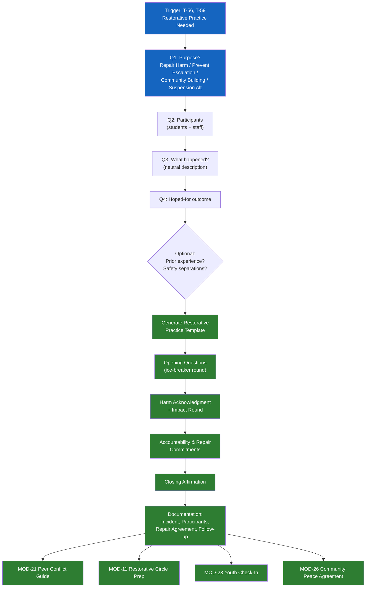

# MOD-22 — School Restorative Practice Template

## Purpose
Produce a structured restorative practice template for school use:
classroom conflict, suspension alternative, or community-building.

## Triggers
T-56, T-59

## Roles
SCL, TCH

## Safety Level
Green

---

## Question Set

**Required:**
1. What is the purpose of this restorative practice? (repair harm / prevent escalation / community building / suspension alternative)
2. Who will participate? (number of students, staff involved)
3. What happened? (neutral description)
4. What outcome is hoped for?

**Optional:**
5. Has a restorative circle been used at this school before?
6. Are there any students who should not be in the same room? (for scheduling)

---

## Output Format

### School Restorative Practice Template

**Purpose:** [type]
**Grade level:** [if provided]
**Estimated time:** [30 / 60 / 90 minutes]

**Opening questions (choose 1-2):**
- "Share your name and one thing you're looking forward to this week."
- "How are you feeling today — use a color or weather to describe it."
- "What does respect mean to you?"

**Harm acknowledgment prompt (if applicable):**
- "In your own words, can you tell us what happened and how it affected others?"

**Impact round:**
- "How did this situation affect you?"
- "What has been hardest about it?"

**Accountability and repair:**
- "What do you think would help make this right?"
- "What are you willing to commit to going forward?"

**Closing affirmation:**
- "What's one thing you're taking away from today?"
- "What's one thing you appreciate about someone in this circle?"

**Documentation:**
- Incident: [brief neutral description]
- Date of circle: [date]
- Facilitator: [role]
- Participants: [Student A, Student B, Counselor, etc.]
- Repair agreement: [if reached — see MOD-10 / MOD-11 for full agreement]
- Follow-up date: [date]

---

## Quality Gates
- [ ] Non-punitive framing throughout
- [ ] All participants' safety confirmed
- [ ] Age-appropriate language
- [ ] Documentation captures agreements for follow-up

## Recommended Next Modules
- **MOD-21** Peer Conflict Resolution Guide — for the individual student follow-up
- **MOD-11** Restorative Circle Prep — for a more formal restorative process
- **MOD-23** Youth Emotional Check-In — post-circle check-in with students
- **MOD-26** Community Peace Agreement — if the class wants to formalize norms

---

## Worked Example

**User input:**
> Role: Teacher (TCH). Purpose: repair harm. A classroom incident occurred where one student took another student's belongings and denied it. 5 students involved — 2 directly (the student who took the item and the student whose item was taken) and 3 witnesses. Grade level: 6. Estimated time: 30 minutes. The school has used restorative circles before. No students need to be separated.

### School Restorative Practice Template

**Purpose:** Repair harm
**Grade level:** 6
**Estimated time:** 30 minutes

**Participants:** [Student A] (student whose belongings were taken), [Student B] (student who took the belongings), [Student C], [Student D], [Student E] (witnesses), [Teacher] (facilitator)

**Opening questions (choose 1-2):**
- "Share your name and one word for how you're feeling right now."
- "What does respect mean to you?"

**Harm acknowledgment prompt:**
- "In your own words, can you tell us what happened and how it affected others?"
- "[Student B], without needing to defend yourself, can you describe what happened from your perspective?"
- "[Student A], can you share what happened from your perspective?"

**Impact round:**
- "[Student A]: How did this situation affect you?"
- "[Student A]: What has been the hardest part about it?"
- "[Student C], [Student D], [Student E]: How did this situation affect you or the classroom?"
- "[Student B]: How do you think this affected others?"

**Accountability and repair:**
- "[Student B]: What do you think would help make this right?"
- "[Student A]: What would you need in order to feel like this has been addressed?"
- "What are you each willing to commit to going forward?"
- "How can the group support both [Student A] and [Student B] after today?"

**Closing affirmation:**
- "What is one thing you are taking away from today?"
- "What is one thing you appreciate about someone in this circle?"

**Documentation:**
- Incident: One student took another student's belongings and denied doing so. The incident was witnessed by three classmates.
- Date of circle: [date]
- Facilitator: [Teacher]
- Participants: [Student A], [Student B], [Student C], [Student D], [Student E]
- Repair agreement: [To be completed after circle — e.g., [Student B] agrees to return the item and offer a direct apology to [Student A]. Both students agree to a check-in with [Teacher] in one week. See MOD-10 / MOD-11 for full agreement template if needed.]
- Follow-up date: [one week from circle date]

## Disclaimer
Append Block A.
