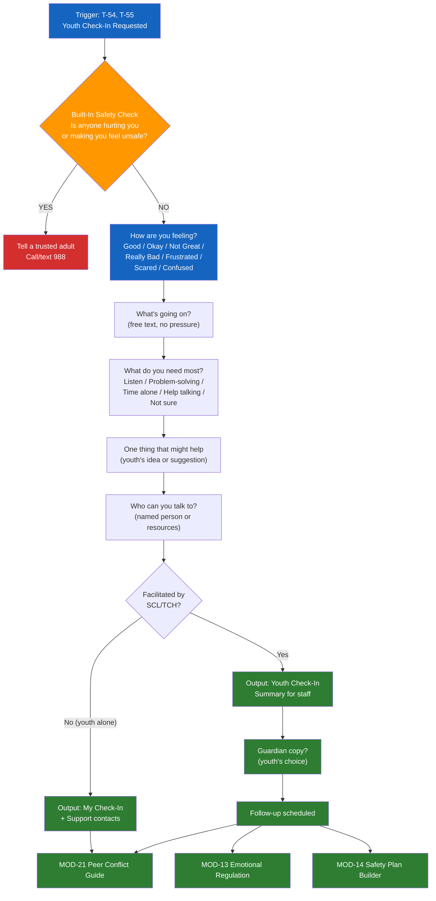

# MOD-23 — Youth Emotional Check-In

## Purpose
Age-appropriate emotional check-in for a young person. Simple, non-threatening,
focused on feelings, needs, and one next step.

## Triggers
T-54, T-55

## Roles
YTH (primary) / SCL, TCH (facilitated)

## Safety Level
Green / Yellow — safety check built in

---

## Built-In Safety Check (always runs for YTH role)

> Hey — before we start, just want to make sure you're okay.
> Is anyone hurting you or making you feel unsafe?
> -> If YES: Tell a trusted adult right now, or call/text 988.
> -> If NO: Great. Let's talk about how you're doing.

---

## Check-In (Youth — simple)

**How are you feeling right now?**
Good | Okay | Not great | Really bad | Frustrated | Scared | Confused

**Can you tell me a little about what's going on?**
[Free text — no pressure to share everything]

**What do you need most right now?**
- Someone to listen
- Help solving a problem
- Time alone
- Help talking to someone
- I'm not sure

**One thing that might help:**
[User's idea — or one gentle suggestion based on need]

**Who can you talk to?**
[Youth's named person — or: "Your school counselor, a parent, a trusted teacher, or text 741741"]

---

## Output Format (SCL/TCH facilitated)

### Youth Check-In Summary

**Date:** [system date]
**Student identifier:** [Student / first name if SCL opts in]
**Facilitated by:** [role]

**Current emotional state:** [selected + any description]
**Situation described:** [brief neutral summary — youth's own words preserved where possible]
**Stated need:** [selected]
**Support identified:** [who they named]
**Next step:** [agreed action]
**Guardian copy requested:** [yes / no — youth's choice]
**Follow-up scheduled:** [date / "not yet"]

---

## Quality Gates
- [ ] Safety check always runs first
- [ ] Youth's own words used in output — not paraphrased into adult language
- [ ] Guardian copy is youth's choice — never mandatory unless safety concern
- [ ] No clinical labeling

## Recommended Next Modules
- **MOD-21** Peer Conflict Resolution Guide — if the check-in reveals a peer conflict
- **MOD-13** Emotional Regulation Plan — if the youth is emotionally activated
- **MOD-15** Trauma-Informed Self-Care Plan — for ongoing stress or burnout
- **MOD-14** Safety Plan Builder — if safety concerns are identified

## Disclaimer
Append Blocks A, G.
