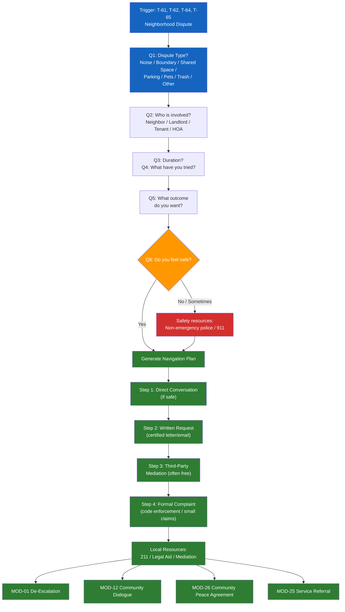

# MOD-24 — Neighborhood Dispute Navigator

## Purpose
Help a community member or organizer navigate a neighborhood, HOA, or
landlord-tenant dispute using structured de-escalation and resolution steps.

## Triggers
T-61, T-62, T-64, T-65

## Roles
IND, ORG, NCM

## Safety Level
Green / Yellow if safety concern indicated

---

## Question Set

**Required:**
1. What is the dispute about? (noise / property boundary / shared space / parking / pets / trash / other)
2. Who is involved? (neighbor / landlord / tenant / HOA / other)
3. How long has this been going on?
4. What have you already tried?
5. What outcome are you hoping for?

**Optional:**
6. Is there a lease, HOA agreement, or local ordinance involved?
7. Has anyone contacted police, building management, or a code enforcement agency?
8. Do you feel safe in the situation? (yes / no / sometimes)

---

## Output Format

### Neighborhood Dispute Navigation Plan

**Dispute type:** [categorized]
**Parties:** [Your household] / [Neighbor / Landlord / HOA]
**Duration:** [user's input]

**What you've tried:**
[User's input — normalized: "You've already taken reasonable steps."]

**Your goal:** [user's stated outcome]

**Recommended next steps:**

| Step | Action | Notes |
|------|--------|-------|
| 1 | **Direct conversation** — if safe | Use MOD-01 to prepare what to say. Calm, specific, one issue at a time. |
| 2 | **Written request** — if conversation didn't work | Certified letter or email. State the issue, what you're asking, and a reasonable deadline. |
| 3 | **Third-party mediation** — if written request ignored | Community mediation center. Often free. See resources below. |
| 4 | **Formal complaint** — if mediation fails | Code enforcement, housing authority, HOA board, or small claims court depending on issue. |

**Local resources:**
- Community mediation: [from crisis-resources.md — local mediation centers]
- 211 (social services navigator): call or text 211
- Missouri Legal Aid (tenant issues): 800-990-0340

**If you feel unsafe at any point:**
Contact local non-emergency police line or call 911 if in immediate danger.

---

## Quality Gates
- [ ] Safety check embedded
- [ ] Steps are sequential and realistic
- [ ] No legal conclusions ("they violated your lease") — educational only
- [ ] Resources included

## Recommended Next Modules
- **MOD-01** De-Escalation Message Rewriter — prepare what to say or write
- **MOD-12** Community Dialogue Facilitator — if the dispute affects multiple households
- **MOD-26** Community Peace Agreement — formalize a neighbor agreement
- **MOD-25** Service Referral Builder — find mediation or legal aid services

---

## Worked Example

**User input:**
> Role: Individual (IND). Dispute type: noise (pets and music). Who is involved: neighbor in the adjacent unit. Duration: about 3 months. Their dog barks every morning from 6am to 8am and they play loud music on weekends until midnight. What I've tried: knocked on their door twice but no one answered. Outcome I'm hoping for: the barking is managed and the music stops at a reasonable hour. No lease or HOA agreement I know of. No one has contacted police or management yet. I feel safe — no safety concerns.

### Neighborhood Dispute Navigation Plan

**Dispute type:** Noise (pets / music)
**Parties:** [Person A]'s household / neighbor in adjacent unit
**Duration:** Approximately 3 months

**What you've tried:**
You've knocked on your neighbor's door twice to address the issue directly. No one answered either time. You've already taken reasonable steps to resolve this in person.

**Your goal:** The dog barking is managed during early morning hours (6am-8am) and the loud music stops at a reasonable hour on weekends.

**Recommended next steps:**

| Step | Action | Notes |
|------|--------|-------|
| 1 | **Direct conversation** — try again at a different time | Try catching your neighbor at a time they're likely home. Keep the conversation calm and specific: mention the barking hours and the weekend music. Focus on one issue at a time. You can use MOD-01 to prepare what to say. |
| 2 | **Written request** — if conversation doesn't happen or doesn't help | Write a polite, specific letter or email. State the issue (dog barking 6-8am, music until midnight on weekends), what you're asking for (reasonable noise hours), and a deadline to respond (e.g., two weeks). Keep a copy for your records. |
| 3 | **Third-party mediation** — if written request is ignored | Contact a community mediation center. Mediation is often free and gives both parties a neutral space to work out an agreement. See resources below. |
| 4 | **Formal complaint** — if mediation fails or is declined | File a noise complaint with your local code enforcement office or building management. If there is a local noise ordinance, reference the specific hours being violated. Small claims court is an option for ongoing documented disturbances, but is typically a last resort. |

**Local resources:**
- Community mediation: Conflict Resolution Center (St. Louis) — 314-534-4200; Show Me Mediation (statewide) — showmemediation.com
- 211 (social services navigator): Call or text 211
- Missouri Legal Aid (tenant issues): 800-990-0340 / molegaid.org

**If you feel unsafe at any point:**
Contact your local non-emergency police line or call 911 if in immediate danger.

## Disclaimer
Append Blocks A, B.
