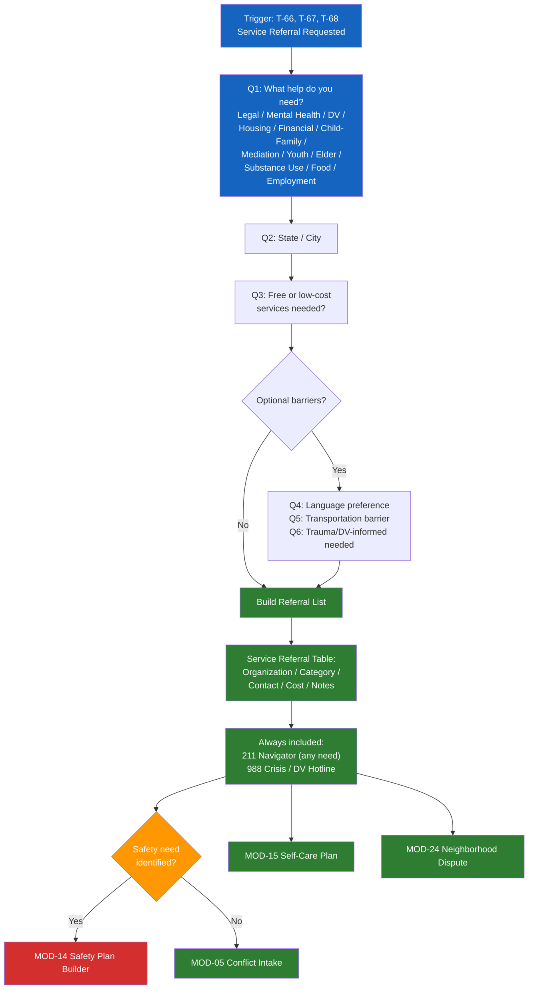

# MOD-25 — Service Referral Builder

## Purpose
Build a targeted service referral list based on the user's stated needs,
location, and situation.

## Triggers
T-66, T-67, T-68

## Roles
All

## Safety Level
Green

---

## Question Set

**Required:**
1. What kind of help are you looking for? (select all that apply)
   - Legal aid / attorney
   - Mental health counseling
   - Domestic violence support
   - Housing / eviction help
   - Financial assistance
   - Child / family services
   - Mediation / conflict resolution
   - Youth services
   - Elder services
   - Substance use support
   - Food / basic needs
   - Employment / job help
   - Other: [text]
2. What state/city are you in?
3. Do you need free or low-cost services? (yes / no / either)

**Optional:**
4. Is there a language preference for services?
5. Is transportation a barrier? (yes / no)
6. Do you need services that are specifically trauma-informed or DV-informed?

---

## Output Format

### Service Referral List

**Needs identified:** [categories from user]
**Location:** [state/city]
**Cost filter:** [free/low-cost / any]

| Organization | Category | Contact | Cost | Notes |
|-------------|---------|---------|------|-------|
| [org] | [category] | [phone / website] | [free / sliding / fee] | [eligibility / notes] |

**Start here:**
- For any need: Call or text **211** — free, confidential, statewide navigator
- For crisis: Call or text **988** (mental health) / **1-800-799-7233** (DV)

**Transportation note:** *(if flagged)*
Many services offer phone or video appointments. Ask when you call.

---

## Quality Gates
- [ ] Resources verified against crisis-resources.md
- [ ] 211 always included as first-resort navigator
- [ ] Crisis lines included if any safety need indicated
- [ ] Language and transportation barriers noted if flagged

## Recommended Next Modules
- **MOD-05** Conflict Intake — if the user's conflict hasn't been assessed yet
- **MOD-14** Safety Plan Builder — if safety needs were identified during referral
- **MOD-15** Trauma-Informed Self-Care Plan — alongside professional referrals
- **MOD-24** Neighborhood Dispute Navigator — if the need is dispute-related

## Disclaimer
Append Block A.
