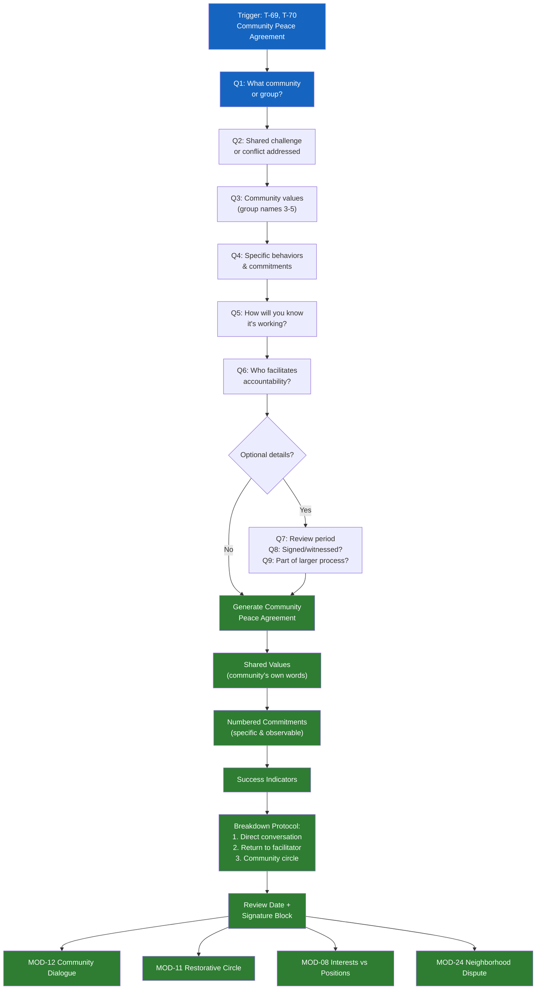

# MOD-26 — Community Peace Agreement

## Purpose
Build a community-level peace agreement establishing shared norms, commitments,
and accountability structures for a group, neighborhood, or organization.

## Triggers
T-69, T-70

## Roles
ORG, NCM, MED, RPF

## Safety Level
Green

---

## Question Set

**Required:**
1. What community or group is this agreement for?
2. What shared challenge or conflict does this agreement address?
3. What values does this community want to uphold? (ask group to name 3-5)
4. What specific behaviors or commitments will each member/party make?
5. How will you know if the agreement is working?
6. Who will facilitate accountability if the agreement isn't kept?

**Optional:**
7. How long should this agreement be in effect before review?
8. Will this be signed or witnessed?
9. Is this part of a broader restorative or mediation process?

---

## Output Format

### Community Peace Agreement

**Community / Group:** [name or description]
**Date:** [system date]
**Facilitated by:** [role]

**Context:**
[2-3 neutral sentences about what brought this community to this agreement]

**Our shared values:**
[Bullet list — community's own words]

**We agree to:**
[Numbered list of specific, observable commitments]

**How we'll know it's working:**
[User's indicators — specific and observable]

**If the agreement breaks down:**
Step 1: [direct conversation between parties]
Step 2: [return to facilitator for check-in]
Step 3: [community circle / mediation]

**Review date:** [date]

**Signed / acknowledged by:**
[Signature or acknowledgment block — roles, not names, unless group opts in]

---

## Quality Gates
- [ ] Values are community's own words — not imposed
- [ ] Commitments are specific and observable
- [ ] Accountability structure defined
- [ ] Review date set

## Recommended Next Modules
- **MOD-12** Community Dialogue Facilitator — if the group needs a dialogue before agreeing
- **MOD-11** Restorative Circle Prep — if harm repair is part of the process
- **MOD-08** Interests vs. Positions Mapper — to ensure the agreement reflects true needs
- **MOD-24** Neighborhood Dispute Navigator — for specific disputes within the community

---

## Worked Example

**User input:**
> Role: Community Organizer (ORG). Community: an apartment complex with 20 units. Shared challenges: conflicts over parking (people taking assigned spots), shared laundry room use (leaving clothes in machines for hours, not cleaning up), and noise after 10pm. Values the community wants to uphold: respect, consideration, safety, community. Commitments: specific behaviors around parking, laundry hours, and quiet hours. Success indicators: fewer complaints to building management and residents greeting each other. Accountability: building manager and a resident committee of 3 volunteers. Review period: 90 days. Will be posted in common area, not signed individually. This is not part of a broader restorative process.

### Community Peace Agreement

**Community / Group:** [Apartment Complex Name] — 20-unit residential community
**Date:** April 9, 2026
**Facilitated by:** Community Organizer (ORG)

**Context:**
Residents of [Apartment Complex Name] have experienced ongoing friction around three shared concerns: parking, laundry room use, and noise levels after 10pm. These issues have led to increased complaints to building management and tension between neighbors. This agreement was developed through a community conversation where residents identified shared values and agreed on practical commitments to improve daily life in the building.

**Our shared values:**
- **Respect** — We treat each other and shared spaces with care.
- **Consideration** — We think about how our actions affect our neighbors.
- **Safety** — Everyone deserves to feel safe and comfortable in their home.
- **Community** — We are neighbors, and we choose to look out for one another.

**We agree to:**
1. **Parking:** Residents will use only their assigned parking spot. If a guest needs parking, the resident will direct them to designated visitor spaces. If a resident notices their spot is taken, they will contact building management rather than confronting the other party directly.
2. **Laundry room:** Residents will remove their laundry from machines within 30 minutes of the cycle completing. The laundry room will be available for use from 7am to 9pm daily. Residents will wipe down machines after use and dispose of lint and trash.
3. **Quiet hours:** Residents will observe quiet hours from 10pm to 7am. During quiet hours, music, television, and conversations will be kept at a volume that does not carry into neighboring units. Gatherings that may generate noise will be communicated to adjacent neighbors in advance when possible.
4. **Shared spaces:** Common areas (hallways, lobby, laundry room) will be left clean after use. Residents will report maintenance needs to building management promptly.
5. **Communication:** When a concern arises, residents will first attempt a respectful, direct conversation. If that is not comfortable or does not resolve the issue, residents will contact building management or a member of the resident committee.

**How we'll know it's working:**
- Fewer noise, parking, and laundry complaints submitted to building management over the next 90 days
- Residents report feeling more comfortable in shared spaces
- Residents greeting each other in hallways and common areas
- The resident committee receives fewer unresolved disputes

**If the agreement breaks down:**
Step 1: The residents involved will have a direct, respectful conversation about the specific concern.
Step 2: If the direct conversation does not resolve the issue, either resident may bring the concern to the building manager or a resident committee member for a check-in.
Step 3: If the concern persists, the resident committee will convene a community circle to revisit the relevant commitment and discuss adjustments.

**Review date:** July 8, 2026 (90 days from agreement date)

**Signed / acknowledged by:**
This agreement is acknowledged by the residents of [Apartment Complex Name] and will be posted in the common area on the first floor. It is not individually signed but represents a shared commitment made during the community conversation on April 9, 2026. The building manager and three resident committee volunteers will serve as points of contact for accountability and support.

## Disclaimer
Append Blocks A, D.
