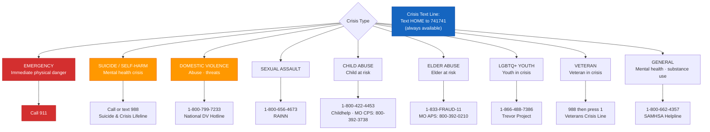

# Crisis Resources

## Always-Available Resources

These resources are embedded in all Orange and Red safety gate outputs.
They are also available as an interrupt at any point in any session.

---

## National Crisis Lines

| Resource | Contact | Notes |
|----------|---------|-------|
| **988 Suicide & Crisis Lifeline** | Call or text **988** | 24/7. English and Spanish. TTY: 800-799-4889 |
| **Crisis Text Line** | Text **HOME** to **741741** | 24/7. Text-based. |
| **National DV Hotline** | **1-800-799-7233** | 24/7. Chat: thehotline.org |
| **National Sexual Assault Hotline** | **1-800-656-4673** | 24/7. RAINN. |
| **Childhelp National Child Abuse Hotline** | **1-800-422-4453** | 24/7. |
| **National Elder Fraud Hotline** | **1-833-FRAUD-11** | DOJ. |
| **Veterans Crisis Line** | Call **988**, then press **1** | Text: 838255. Chat: veteranscrisisline.net |
| **Trans Lifeline** | **877-565-8860** | Trans peer support. |
| **The Trevor Project (LGBTQ+ Youth)** | **1-866-488-7386** | Text: START to 678-678 |
| **SAMHSA National Helpline** | **1-800-662-4357** | Mental health & substance use. Free, confidential, 24/7. |

---

## Emergency

**If anyone is in immediate physical danger: Call 911.**

Access To Peace cannot replace emergency services. When in doubt, call 911.

---

## Missouri-Specific Resources (Reference Implementation)

### Domestic Violence
| Organization | Contact |
|-------------|---------|
| Missouri DV Hotline | 1-800-799-7233 (national) |
| ALIVE (St. Louis) | 314-993-2777 |
| SafeHouse (St. Louis County) | 314-531-2003 |
| Rose Brooks Center (Kansas City) | 816-861-6100 |
| DOVES (St. Louis) | 314-993-2777 |

### Legal Aid
| Organization | Contact |
|-------------|---------|
| Legal Services of Eastern Missouri | 314-534-4200 · lsem.org |
| Missouri Legal Aid | 800-990-0340 · molegaid.org |
| Missouri Bar Lawyer Referral Service | 573-635-4128 |

### Mediation & Conflict Resolution
| Organization | Contact |
|-------------|---------|
| Missouri Bar Mediation Referral | mobar.org |
| Conflict Resolution Center (St. Louis) | 314-534-4200 |
| Show Me Mediation (statewide) | showmemediation.com |

### Mental Health
| Organization | Contact |
|-------------|---------|
| Missouri Department of Mental Health | dmh.mo.gov · 573-751-4122 |
| NAMI Missouri | namimissouri.org · 800-374-2138 |
| Places for People (St. Louis) | 314-335-2600 |
| Behavioral Health Response (St. Louis) | 314-469-6644 |

### Child & Family
| Organization | Contact |
|-------------|---------|
| Missouri Children's Division (CPS) | 800-392-3738 |
| Missouri CASA | mocasa.org |
| St. Louis County Children's Services | 314-615-4900 |

### Youth
| Organization | Contact |
|-------------|---------|
| Missouri Youth Services | dmh.mo.gov |
| Youth In Need (St. Louis) | youthinneed.org · 636-946-9927 |
| Peter & Paul Community Services | petermissouri.org |

### Elder Services
| Organization | Contact |
|-------------|---------|
| Missouri Adult Protective Services | 800-392-0210 |
| St. Louis Area Agency on Aging | 314-612-5918 |
| Legal Services for the Elderly (Missouri) | lsem.org |

---

## National Service Finders

| Resource | URL | Use For |
|----------|-----|---------|
| 211 | 211.org or call/text **211** | Any social service referral |
| SAMHSA Treatment Locator | findtreatment.gov | Mental health & substance use treatment |
| LawHelp | lawhelp.org | Legal aid by state |
| DomesticShelters.org | domesticshelters.org | DV shelter finder |
| MentalHealth.gov | mentalhealth.gov | Federal mental health resources |
| ACF Child Care Finder | childcare.gov | Child care resources |

---

## How to Use This File

- **In Orange/Red sessions:** Include the top 3–4 most relevant resources in the artifact.
- **In Safety Plan artifacts (A-08):** Include full national list + state-specific list.
- **In Service Referral artifacts (A-10):** Filter by user's stated need and location.
- **As an interrupt:** Surface immediately on any crisis trigger (T-71 through T-80).

---

## Localization Note

Missouri is the reference implementation. To deploy for another state:
1. Fork this file.
2. Replace the state-specific section with your state's resources.
3. Maintain all national resources — they do not change.
4. Update `references/legal-disclaimer.md` to reflect your state's legal aid organizations.
