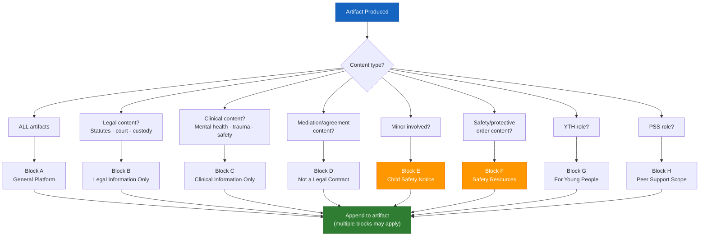

# Legal & Clinical Disclaimer Reference

## Standard Disclaimer Blocks

Append the appropriate block to every artifact based on content type.
Multiple blocks may apply. Never omit when applicable.

---

## Block A — General Platform Disclaimer
*Append to all artifacts.*

> **About This Tool**
> Access To Peace is a documentation and support tool. It is not a substitute for
> emergency services, legal advice, or licensed clinical care. Content generated
> by this platform is for informational and organizational purposes only.

---

## Block B — Legal Content Disclaimer
*Append to any artifact that references legal concepts, statutes, court processes,
protective orders, custody, or parenting plans.*

> **Legal Information Only**
> This content is for educational and informational purposes only. It does not
> constitute legal advice and does not create an attorney-client relationship.
> Laws vary by state and circumstance. For legal advice specific to your situation,
> consult a licensed attorney in your jurisdiction.
>
> Missouri legal aid: Legal Services of Eastern Missouri — 314-534-4200 · lsem.org
> Missouri Bar Referral: 573-635-4128 · mobar.org

---

## Block C — Clinical Content Disclaimer
*Append to any artifact that references mental health, trauma, safety planning,
grief, emotional regulation, or clinical concepts.*

> **Clinical Information Only**
> This content is for informational and support purposes only. It is not a
> diagnosis, treatment plan, or substitute for licensed clinical care. If you
> are experiencing a mental health crisis, contact the 988 Suicide & Crisis
> Lifeline (call or text 988) or go to your nearest emergency room.
>
> For ongoing mental health support, consult a licensed mental health professional.
> SAMHSA National Helpline: 1-800-662-4357 (free, confidential, 24/7)

---

## Block D — Mediation & Agreement Disclaimer
*Append to all peace agreement and mediation artifacts.*

> **Not a Legal Contract**
> This document is a good-faith agreement for organizational purposes. It is not
> a legally binding contract unless reviewed, modified, and executed with the
> assistance of qualified legal counsel. For binding parenting plans, custody
> orders, or settlement agreements, work with a licensed attorney and file
> through the appropriate court.

---

## Block E — Child Safety Disclaimer
*Append to any artifact involving a minor.*

> **Child Safety Notice**
> If a child is in immediate danger, call 911. To report suspected child abuse
> or neglect in Missouri, call the Missouri Children's Division Hotline:
> 1-800-392-3738 (24/7). This platform does not report to or communicate
> with child protective services.

---

## Block F — Protective Order / Safety Disclaimer
*Append to MOD-07, MOD-14, MOD-19 artifacts.*

> **Safety Resources**
> If you are in immediate danger, call 911.
> National Domestic Violence Hotline: 1-800-799-7233 (24/7) · thehotline.org
> 988 Suicide & Crisis Lifeline: Call or text 988
> Crisis Text Line: Text HOME to 741741
>
> Protective order laws and processes vary by state. The information in this
> document is educational only. Consult a licensed attorney or victim advocate
> for guidance specific to your situation.

---

## Block G — Youth / Minor Disclaimer
*Append to all YTH-role artifacts.*

> **For Young People**
> This tool is designed to support you, not get you in trouble. What you share
> here is used only to help you. If you're in danger, please tell a trusted
> adult or call 988. A simplified summary of this document can be shared with
> a parent, guardian, or school counselor — but only if you choose to share it.

---

## Block H — Peer Support Disclaimer
*Append to PSS-role artifacts.*

> **Peer Support Scope**
> This content is created with the support of a peer support context. Peer support
> is a valuable complement to professional care, not a replacement for it. For
> clinical diagnosis or treatment, connect with a licensed mental health professional.

---

## Disclaimer Appendix by Module

| Module | Required Disclaimer Blocks |
|--------|--------------------------|
| MOD-01 De-escalation Rewriter | A |
| MOD-03 NVC Framework | A |
| MOD-04 Co-Parenting Rewriter | A, D |
| MOD-05 Conflict Intake | A |
| MOD-06 Conflict Timeline | A |
| MOD-07 Power & Safety Assessment | A, F |
| MOD-09 Mediation Session Prep | A, D |
| MOD-10 Peace Agreement Builder | A, B, D |
| MOD-11 Restorative Circle | A |
| MOD-13 Emotional Regulation | A, C |
| MOD-14 Safety Plan | A, C, F |
| MOD-15 Self-Care Plan | A, C |
| MOD-16 Grief & Loss | A, C |
| MOD-17 Parenting Plan Log | A, B |
| MOD-18 Court Prep | A, B |
| MOD-19 Protective Order Nav | A, B, F |
| MOD-20 Case Documentation | A, B |
| MOD-21 Peer Conflict | A |
| MOD-22 School Restorative | A |
| MOD-23 Youth Check-In | A, G |
| MOD-24 Neighborhood Dispute | A |
| MOD-25 Service Referral | A |
| MOD-26 Community Peace Agreement | A, D |
