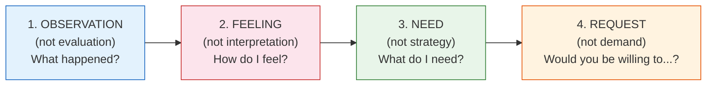
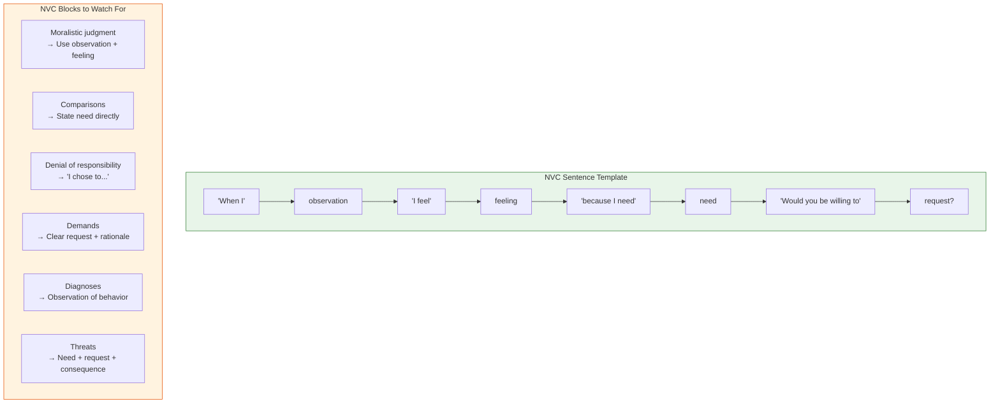

# Nonviolent Communication (NVC) Framework

## Foundation

Based on Marshall Rosenberg's Nonviolent Communication methodology.
*Rosenberg, M. B. (2003). Nonviolent Communication: A Language of Life. PuddleDancer Press.*

NVC is used throughout Access To Peace as the default communication rewriting framework.
It is particularly central to MOD-03, MOD-01, and MOD-04.

---

## The Four Components of NVC

### 1. Observation (not evaluation)
State what you observe — what was actually said or done — without interpretation or judgment.

| Evaluative (avoid) | Observational (use) |
|--------------------|---------------------|
| "You're always late." | "The last three pickups were 20–30 minutes after the agreed time." |
| "You're being controlling." | "I received seven messages between 10pm and midnight last Tuesday." |
| "You don't care about the kids." | "The school called twice this week and I was the only one who responded." |

### 2. Feeling (not interpretation)
State how you feel — an actual emotion — without blaming the other person for causing it.

**Feeling words (use):** sad, worried, frustrated, scared, confused, hurt, lonely, overwhelmed, relieved, hopeful, disappointed, anxious

**Not feeling words (avoid — these are interpretations):** attacked, manipulated, abandoned, betrayed, ignored, disrespected, controlled, dismissed

| Interpretation (avoid) | Feeling (use) |
|------------------------|--------------|
| "I feel manipulated." | "I feel frustrated and confused." |
| "I feel attacked." | "I feel scared and hurt." |
| "I feel ignored." | "I feel lonely and worried." |

### 3. Need (not strategy)
State the underlying need — the universal human value — without demanding a specific action.

**Universal needs:** safety, security, respect, autonomy, connection, understanding, clarity, fairness, rest, support, consistency, trust, belonging, meaning, peace

| Strategy (avoid) | Need (use) |
|-----------------|-----------|
| "You need to text me back within an hour." | "I need consistency and clear communication." |
| "You can't talk to me that way." | "I need to feel respected in our communication." |
| "Stop scheduling things without asking me." | "I need to feel included in decisions that affect the children." |

### 4. Request (not demand)
Make a clear, specific, positive, actionable request. Requests can be declined.
Demands cannot. If it can't be declined, it's a demand.

| Demand (avoid) | Request (use) |
|----------------|--------------|
| "You have to respond within 2 hours." | "Would you be willing to respond to logistical messages within 24 hours?" |
| "Stop being hostile." | "Would you be willing to keep messages focused on the kids' schedule?" |
| "You need to communicate better." | "Can we agree to use [co-parenting app] for all scheduling?" |

---

## NVC Sentence Templates

### Full NVC Statement:
> "When I [observation], I feel [feeling], because I need [need].
> Would you be willing to [request]?"

### Shortened (for messages):
> "When [observation], I feel [feeling] and would appreciate [request]."

### For co-parenting (child-centered framing):
> "For [Child]'s routine, I'm hoping we can [request].
> When [observation], it's hard for [Child] to [impact]."

---

## Empathy Receiving (listening side)

When helping a user prepare to listen to another party, use:

> "What did you observe?"
> "What are they feeling?"
> "What do they need?"
> "What are they asking for?"

This reframes the other party from "enemy" to "person with unmet needs" —
which is the foundation of de-escalation and agreement-building.

---

## NVC Blocks to Watch For

If a user's draft contains any of these, flag and offer NVC rewrite:

| Block | What it does | NVC alternative |
|-------|-------------|-----------------|
| Moralistic judgment | Labels the person, not the behavior | Observation + feeling |
| Comparisons | "Other parents don't..." | State your need directly |
| Denial of responsibility | "I had to..." "You made me..." | "I chose to... because I needed..." |
| Demands | "You must..." "You better..." | Clear request + rationale |
| Diagnoses | "You're a narcissist..." | Observation of specific behavior |
| Threats | "If you don't... I'll..." | Need + request + consequence (if legal) |

---

## Application in Access To Peace Modules

| Module | NVC Application |
|--------|----------------|
| MOD-01 De-escalation Rewriter | Full NVC rewrite of user's draft |
| MOD-03 NVC Framework | Direct teaching + script building |
| MOD-04 Co-Parenting Rewriter | Child-centered NVC framing |
| MOD-08 Interests vs. Positions | NVC needs identification |
| MOD-09 Mediation Session Prep | NVC opening statement prep |
| MOD-02 Active Listening | Empathy receiving component |
