# Role Reference

## 20 Roles Across 6 Pods

```mermaid
graph TD
    PLATFORM["Access To Peace\n20 Roles · 6 Pods"]

    PLATFORM --> P1["Pod 1\nIndividual & Family"]
    PLATFORM --> P2["Pod 2\nMediation & Conflict"]
    PLATFORM --> P3["Pod 3\nMental Health"]
    PLATFORM --> P4["Pod 4\nLegal & Court"]
    PLATFORM --> P5["Pod 5\nSchool & Youth"]
    PLATFORM --> P6["Pod 6\nCommunity & Nonprofit"]

    P1 --> IND["IND\nIndividual"]
    P1 --> PAR["PAR\nParent"]
    P1 --> YTH["YTH\nYouth/Teen"]
    P1 --> ELD["ELD\nElder/Caregiver"]

    P2 --> MED["MED\nMediator"]
    P2 --> ARB["ARB\nArbitrator"]
    P2 --> CCH["CCH\nConflict Coach"]
    P2 --> RPF["RPF\nRestorative Facilitator"]

    P3 --> THR["THR\nTherapist"]
    P3 --> PSY["PSY\nPsychiatrist"]
    P3 --> SWK["SWK\nSocial Worker"]
    P3 --> PSS["PSS\nPeer Support"]

    P4 --> ATT["ATT\nAttorney"]
    P4 --> GAL["GAL\nGuardian ad Litem"]
    P4 --> JDG["JDG\nJudge/Court Staff"]
    P4 --> VAD["VAD\nVictim Advocate"]

    P5 --> SCL["SCL\nSchool Counselor"]
    P5 --> TCH["TCH\nTeacher/Admin"]

    P6 --> ORG["ORG\nCommunity Organizer"]
    P6 --> NCM["NCM\nCase Manager"]

    style P1 fill:#e3f2fd,stroke:#1565c0
    style P2 fill:#e8f5e9,stroke:#2e7d32
    style P3 fill:#fce4ec,stroke:#c62828
    style P4 fill:#fff3e0,stroke:#e65100
    style P5 fill:#f3e5f5,stroke:#6a1b9a
    style P6 fill:#e0f2f1,stroke:#00695c
    style PLATFORM fill:#1565c0,stroke:#0d47a1,color:#fff
```

---

## Pod 1 — Individual & Family

### IND — Individual (Self-Help)
- **Description:** Anyone navigating a personal conflict without professional representation.
- **Language mode:** Plain language. Help text always shown. Trauma-informed framing.
- **Default modules:** MOD-05, MOD-01, MOD-13
- **Key artifacts:** Conflict Intake Summary, Rewritten Message, Emotional Regulation Plan
- **Safety assumption:** May be in distress. Yellow gate on first session.
- **Special rules:** Never use legal or clinical jargon without plain-language explanation.

### PAR — Parent (Co-Parenting)
- **Description:** A parent navigating communication and logistics with a co-parent.
- **Language mode:** Plain language. Child-centered framing always.
- **Default modules:** MOD-04, MOD-17, MOD-05
- **Key artifacts:** Co-Parenting Rewritten Message, Communication Log, Conflict Intake
- **Safety assumption:** May involve child safety concerns. Escalate if child harm indicated.
- **Special rules:** All artifacts use [Parent A] / [Parent B] / [Child] placeholders unless user opts in to named version.

### YTH — Youth / Teen
- **Description:** A young person (under 18) navigating peer, family, or school conflict.
- **Language mode:** Age-appropriate, simplified, emoji-friendly section labels.
- **Default modules:** MOD-23, MOD-21, MOD-13
- **Key artifacts:** Emotional Check-In, Peer Conflict Plan, Regulation Plan
- **Safety assumption:** Guardian copy auto-generated. Mandatory safety gate on every session.
- **Special rules:** Never produce content that could be used against the youth by another party. If abuse is indicated, surface MOD-07 and crisis resources immediately.

### ELD — Elder / Caregiver
- **Description:** An older adult or primary caregiver managing family tension, estate conflict, or caregiver burnout.
- **Language mode:** Plain language. Compassionate, unhurried tone.
- **Default modules:** MOD-05, MOD-15, MOD-25
- **Key artifacts:** Conflict Intake, Self-Care Plan, Service Referral
- **Safety assumption:** May involve elder abuse indicators. Surface MOD-07 if detected.

---

## Pod 2 — Mediation & Conflict Resolution

### MED — Mediator
- **Description:** A trained mediator preparing for or conducting a session.
- **Language mode:** Professional. Full field depth. Neutral sourcing required.
- **Default modules:** MOD-09, MOD-10, MOD-08
- **Key artifacts:** Mediation Prep Sheet, Peace Agreement Draft, Interests Map
- **Special rules:** Output must be process-neutral. Never indicate which party is "right."

### ARB — Arbitrator
- **Description:** An arbitrator preparing for or conducting a hearing.
- **Language mode:** Professional/legal. Full field depth.
- **Default modules:** MOD-09, MOD-20
- **Key artifacts:** Hearing Prep Sheet, Case Documentation Summary

### CCH — Conflict Coach
- **Description:** A coach working with an individual or team on conflict skills.
- **Language mode:** Coaching tone. Empowering, forward-focused.
- **Default modules:** MOD-08, MOD-02, MOD-03
- **Key artifacts:** Interests Map, Active Listening Guide, NVC Communication Script

### RPF — Restorative Practices Facilitator
- **Description:** A facilitator running restorative circles or harm repair processes.
- **Language mode:** Restorative, community-centered. Non-punitive.
- **Default modules:** MOD-11, MOD-12, MOD-26
- **Key artifacts:** Circle Agenda, Community Dialogue Guide, Peace Agreement

---

## Pod 3 — Mental Health & Clinical

### THR — Therapist / Counselor
- **Description:** A licensed mental health clinician supporting a client in conflict.
- **Language mode:** Clinical professional. Full depth. Evidence-based framing preferred.
- **Default modules:** MOD-14, MOD-13, MOD-15
- **Key artifacts:** Safety Plan, Regulation Plan, Self-Care Plan
- **Special rules:** Safety plan outputs follow standard clinical safety plan structure. Always recommend professional review before using with active clients.

### PSY — Psychiatrist / Prescriber
- **Description:** A prescribing clinician supporting a patient with crisis or medication context.
- **Language mode:** Clinical/medical professional.
- **Default modules:** MOD-14, MOD-07
- **Key artifacts:** Safety Plan, Safety Assessment
- **Special rules:** No dosing, no medication recommendations. Educational framing only.

### SWK — Social Worker
- **Description:** A social worker navigating case management, client conflict, or service access.
- **Language mode:** Clinical/support professional.
- **Default modules:** MOD-25, MOD-14, MOD-05
- **Key artifacts:** Service Referral, Safety Plan, Conflict Intake

### PSS — Peer Support Specialist
- **Description:** A lived-experience peer supporter helping someone in distress or conflict.
- **Language mode:** Warm, peer-to-peer. Non-clinical.
- **Default modules:** MOD-13, MOD-02, MOD-15
- **Key artifacts:** Regulation Plan, Active Listening Guide, Self-Care Plan
- **Special rules:** Always recommend professional escalation for clinical concerns.

---

## Pod 4 — Legal & Court

### ATT — Family Law Attorney
- **Description:** An attorney representing a party in a family law matter.
- **Language mode:** Legal professional. Full depth. Court-neutral required.
- **Default modules:** MOD-17, MOD-20, MOD-18
- **Key artifacts:** Communication Log, Case Documentation, Court Prep Checklist
- **Special rules:** All outputs are for attorney review only. Never represent as legal advice.

### GAL — Guardian ad Litem
- **Description:** A court-appointed advocate focused on the best interests of the child.
- **Language mode:** Legal/child-welfare professional. Child-centered always.
- **Default modules:** MOD-20, MOD-17, MOD-07
- **Key artifacts:** Case Documentation, Communication Log, Safety Assessment

### JDG — Judge / Court Staff
- **Description:** A judicial officer or court staff needing neutral summaries or compliance tracking.
- **Language mode:** Formal, neutral, concise.
- **Default modules:** MOD-20, MOD-06
- **Key artifacts:** Case Documentation Summary, Conflict Timeline

### VAD — Victim Advocate
- **Description:** An advocate supporting a victim or survivor navigating the legal system.
- **Language mode:** Trauma-informed. Empowering. Plain language.
- **Default modules:** MOD-14, MOD-07, MOD-19
- **Key artifacts:** Safety Plan, Safety Assessment, Protective Order Navigation Guide

---

## Pod 5 — School & Youth Programs

### SCL — School Counselor
- **Description:** A school counselor supporting student conflict, mental wellness, or family communication.
- **Language mode:** School-appropriate. Student-centered.
- **Default modules:** MOD-21, MOD-22, MOD-23
- **Key artifacts:** Peer Conflict Plan, Restorative Practice Template, Youth Check-In

### TCH — Teacher / Administrator
- **Description:** A teacher or school administrator responding to classroom or campus conflict.
- **Language mode:** Professional educator. Practical, procedural.
- **Default modules:** MOD-22, MOD-21
- **Key artifacts:** Restorative Practice Template, Peer Conflict Plan

---

## Pod 6 — Community & Nonprofit

### ORG — Community Organizer
- **Description:** An organizer facilitating neighborhood or community dispute resolution.
- **Language mode:** Community-centered. Inclusive. Non-partisan.
- **Default modules:** MOD-24, MOD-12, MOD-26
- **Key artifacts:** Neighborhood Dispute Plan, Dialogue Agenda, Community Peace Agreement

### NCM — Nonprofit Case Manager
- **Description:** A case manager helping clients navigate conflict and access services.
- **Language mode:** Support professional. Warm, practical.
- **Default modules:** MOD-25, MOD-05, MOD-13
- **Key artifacts:** Service Referral, Conflict Intake, Regulation Plan
