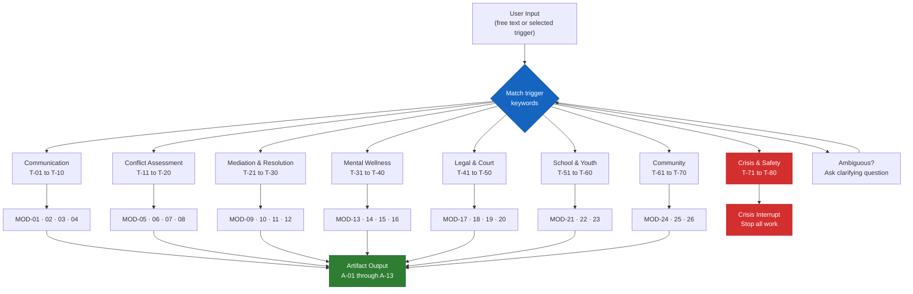
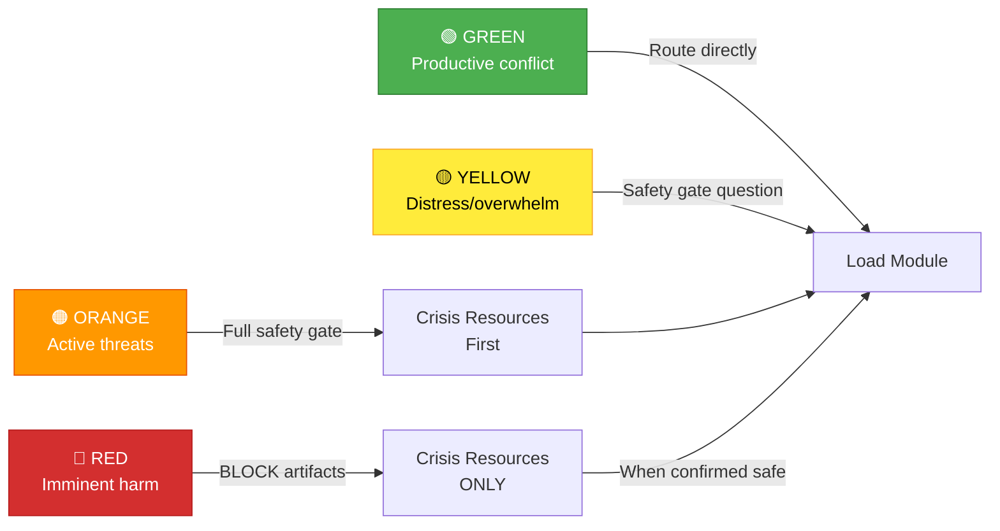
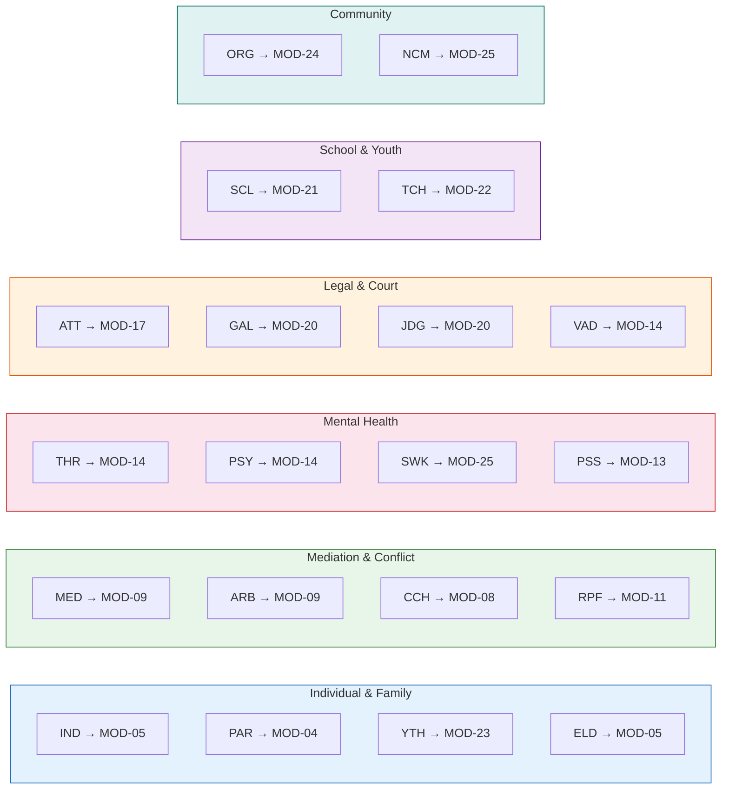

# Routing Reference

## Trigger → Module → Artifact

Every session routes through this table. Match the user's trigger (free text or selected)
to the closest module. If ambiguous, ask one clarifying question before routing.

---

## Routing Table

| Trigger Keywords | Safety Level | Module | Primary Artifact |
|-----------------|-------------|--------|-----------------|
| "help with a conflict," "argument," "dispute" | Green | MOD-05 Conflict Intake | Conflict Intake Summary |
| "message rewrite," "how do I say this," "help me respond" | Green | MOD-01 De-escalation Rewriter | Rewritten Message (3 versions) |
| "co-parenting message," "text my ex," "email the other parent" | Green | MOD-04 Co-Parenting Rewriter | Court-neutral rewritten message |
| "mediation," "preparing for mediation," "mediation session" | Green | MOD-09 Mediation Session Prep | Mediation Prep Sheet |
| "peace agreement," "write an agreement," "resolution document" | Green | MOD-10 Peace Agreement Builder | Peace Agreement Draft |
| "restorative circle," "circle practice," "harm repair" | Green | MOD-11 Restorative Circle Prep | Circle Agenda + Harm Repair Plan |
| "community dispute," "neighbor conflict," "HOA conflict" | Green | MOD-24 Neighborhood Dispute | Dispute Navigation Plan |
| "school conflict," "student fight," "bullying" | Green | MOD-21 Peer Conflict Guide | Peer Conflict Resolution Plan |
| "emotional regulation," "can't calm down," "overwhelmed" | Yellow | MOD-13 Emotional Regulation | Regulation Plan + Grounding Tools |
| "safety plan," "I don't feel safe," "need a safety plan" | Orange | MOD-14 Safety Plan Builder | Personalized Safety Plan |
| "court prep," "going to court," "hearing preparation" | Green | MOD-18 Court Prep Checklist | Court Preparation Checklist |
| "parenting plan," "custody communication," "visitation log" | Green | MOD-17 Parenting Plan Log | Communication Log |
| "I'm scared," "they threatened me," "I'm afraid" | Orange | MOD-07 Power & Safety Assessment | Safety Assessment + Resources |
| "protect myself," "protective order," "restraining order" | Orange | MOD-19 Protective Order Nav | Educational Navigation Guide |
| "grief," "loss," "someone died," "I'm grieving" | Yellow | MOD-16 Grief & Loss | Grief Navigation Plan |
| "self-care," "I'm burned out," "caregiver stress" | Yellow | MOD-15 Self-Care Plan | Trauma-Informed Self-Care Plan |
| "referral," "resources," "where can I get help" | Green | MOD-25 Service Referral | Service Referral List |
| "document this," "keep a record," "case summary" | Green | MOD-20 Case Documentation | Case Documentation Summary |
| "community dialogue," "town hall," "group facilitation" | Green | MOD-12 Community Dialogue | Dialogue Agenda + Facilitation Guide |
| "interests," "what do they really want," "underlying needs" | Green | MOD-08 Interests vs. Positions | Interests Map |
| "listening," "how to listen," "they won't hear me" | Green | MOD-02 Active Listening | Active Listening Guide |
| "nonviolent communication," "NVC," "feelings and needs" | Green | MOD-03 NVC Framework | NVC Communication Script |
| "youth check-in," "how are you feeling," "teen support" | Green/Yellow | MOD-23 Youth Check-In | Emotional Check-In Summary |
| "school restorative," "restorative practice at school" | Green | MOD-22 School Restorative | Restorative Practice Template |
| "conflict timeline," "history of conflict," "pattern of behavior" | Green | MOD-06 Conflict Timeline | Conflict History Timeline |
| "community agreement," "group norms," "collective peace" | Green | MOD-26 Community Peace Agreement | Community Peace Agreement |

---

## Safety Level Definitions

| Level | Meaning | Action |
|-------|---------|--------|
| **Green** | No harm indicators. Productive conflict. | Route directly. |
| **Yellow** | Distress, overwhelm, fear implied. | Ask safety gate question before routing. |
| **Orange** | Active threat language, safety concern. | Run full safety gate. Offer crisis resources first. |
| **Red** | Emergency, imminent harm, active crisis. | Block artifact work. Crisis resources only. |

---

## Ambiguous Trigger Protocol

If the user's trigger matches multiple modules OR contains no clear keyword:

1. Ask: *"Can you tell me a little more about what's happening? For example, are you trying
   to write a message, prepare for mediation, make a safety plan, or something else?"*
2. Map their answer to the routing table.
3. Confirm role before loading module.

---

## Role → Default Module Mapping

When a role is identified but no trigger is given, start here:

| Role | Default Module |
|------|---------------|
| Individual (IND) | MOD-05 Conflict Intake |
| Parent (PAR) | MOD-04 Co-Parenting Rewriter |
| Youth (YTH) | MOD-23 Youth Check-In |
| Elder (ELD) | MOD-05 Conflict Intake |
| Mediator (MED) | MOD-09 Mediation Session Prep |
| Arbitrator (ARB) | MOD-09 Mediation Session Prep |
| Conflict Coach (CCH) | MOD-08 Interests vs. Positions |
| Restorative Facilitator (RPF) | MOD-11 Restorative Circle Prep |
| Therapist (THR) | MOD-14 Safety Plan Builder |
| Psychiatrist (PSY) | MOD-14 Safety Plan Builder |
| Social Worker (SWK) | MOD-25 Service Referral |
| Peer Support (PSS) | MOD-13 Emotional Regulation |
| Attorney (ATT) | MOD-17 Parenting Plan Log |
| GAL (GAL) | MOD-20 Case Documentation |
| Judge/Court (JDG) | MOD-20 Case Documentation |
| Victim Advocate (VAD) | MOD-14 Safety Plan Builder |
| School Counselor (SCL) | MOD-21 Peer Conflict Guide |
| Teacher/Admin (TCH) | MOD-22 School Restorative |
| Community Organizer (ORG) | MOD-24 Neighborhood Dispute |
| Nonprofit Case Manager (NCM) | MOD-25 Service Referral |
